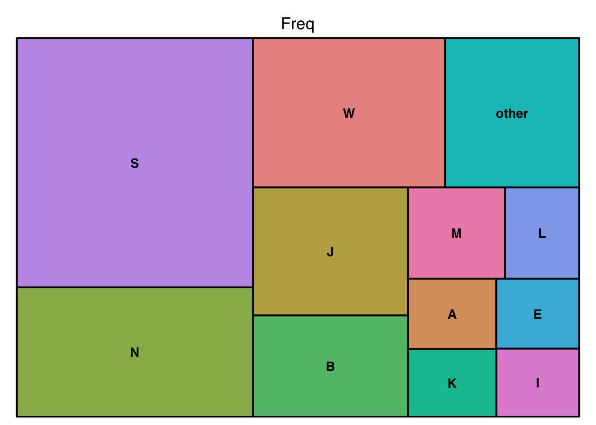
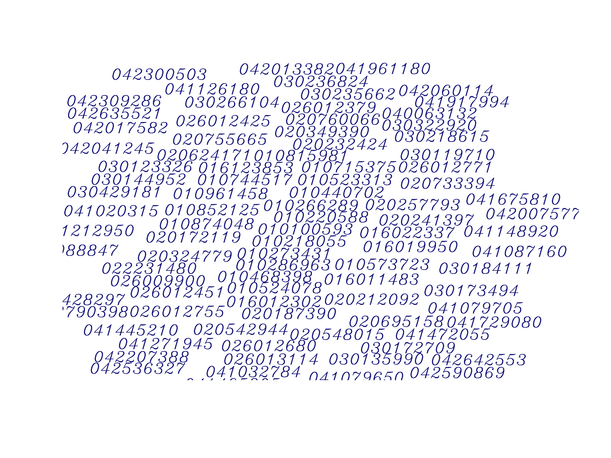

<br>


<br><br>


## Logical


```{.r .cell-code}
# dgf.logical <- dgf[14:15,  ]
create_all_sections( dgf.log )
```


 


::::: {.parent} 

::: {.div1} 

#### F9_05_UBIZ_IMCOME_OVER_LIMIT_X

::: 

::: {.div2} 

**LABEL**: F9_05_UBIZ_IMCOME_OVER_LIMIT_X


::: 

::: {.div3} 

**DATA TYPE**: logical


::: 

::: {.div4} 

**DESCRIPTION**: Had unrelated business gross income of $1,000 or more [x]


::: 

::: {.div17} 

**PROPERTIES**: 

<table>
 <thead>
  <tr>
   <th style="text-align:left;"> STAT </th>
   <th style="text-align:right;"> VAL </th>
   <th style="text-align:right;"> PER </th>
  </tr>
 </thead>
<tbody>
  <tr>
   <td style="text-align:left;"> Rows </td>
   <td style="text-align:right;"> 25000 </td>
   <td style="text-align:right;">  </td>
  </tr>
  <tr>
   <td style="text-align:left;"> Distinct </td>
   <td style="text-align:right;"> 2 </td>
   <td style="text-align:right;">  </td>
  </tr>
  <tr>
   <td style="text-align:left;"> Most Common Value </td>
   <td style="text-align:right;"> N </td>
   <td style="text-align:right;"> (86%) </td>
  </tr>
  <tr>
   <td style="text-align:left;"> Zero </td>
   <td style="text-align:right;"> 0 </td>
   <td style="text-align:right;"> (0%) </td>
  </tr>
  <tr>
   <td style="text-align:left;"> All Empty </td>
   <td style="text-align:right;"> 0 </td>
   <td style="text-align:right;"> (0%) </td>
  </tr>
  <tr>
   <td style="text-align:left;"> Missing/NA </td>
   <td style="text-align:right;"> 0 </td>
   <td style="text-align:right;"> (0%) </td>
  </tr>
  <tr>
   <td style="text-align:left;"> Infinite </td>
   <td style="text-align:right;"> 0 </td>
   <td style="text-align:right;"> (0%) </td>
  </tr>
</tbody>
</table> 


::: 

::: {.div18} 

**VALUES**: 

<table>
 <thead>
  <tr>
   <th style="text-align:left;"> Value </th>
   <th style="text-align:right;"> Frequency </th>
  </tr>
 </thead>
<tbody>
  <tr>
   <td style="text-align:left;"> N </td>
   <td style="text-align:right;"> 21550 </td>
  </tr>
  <tr>
   <td style="text-align:left;"> Y </td>
   <td style="text-align:right;"> 3450 </td>
  </tr>
</tbody>
</table> 


::: 

::: {.div19} 

**BOOLPLOT**: 

{width=672}


::: 

:::::  


 


::::: {.parent} 

::: {.div1} 

#### OUTNCCS

::: 

::: {.div2} 

**LABEL**: OUTNCCS


::: 

::: {.div3} 

**DATA TYPE**: logical


::: 

::: {.div4} 

**DESCRIPTION**: Out of Scope flag


::: 

::: {.div17} 

**PROPERTIES**: 

<table>
 <thead>
  <tr>
   <th style="text-align:left;"> STAT </th>
   <th style="text-align:right;"> VAL </th>
   <th style="text-align:right;"> PER </th>
  </tr>
 </thead>
<tbody>
  <tr>
   <td style="text-align:left;"> Rows </td>
   <td style="text-align:right;"> 25000 </td>
   <td style="text-align:right;">  </td>
  </tr>
  <tr>
   <td style="text-align:left;"> Distinct </td>
   <td style="text-align:right;"> 3 </td>
   <td style="text-align:right;">  </td>
  </tr>
  <tr>
   <td style="text-align:left;"> Most Common Value </td>
   <td style="text-align:right;"> IN </td>
   <td style="text-align:right;"> (100%) </td>
  </tr>
  <tr>
   <td style="text-align:left;"> Zero </td>
   <td style="text-align:right;"> 0 </td>
   <td style="text-align:right;"> (0%) </td>
  </tr>
  <tr>
   <td style="text-align:left;"> All Empty </td>
   <td style="text-align:right;"> 0 </td>
   <td style="text-align:right;"> (0%) </td>
  </tr>
  <tr>
   <td style="text-align:left;"> Missing/NA </td>
   <td style="text-align:right;"> 2361 </td>
   <td style="text-align:right;"> (9.4%) </td>
  </tr>
  <tr>
   <td style="text-align:left;"> Infinite </td>
   <td style="text-align:right;"> 0 </td>
   <td style="text-align:right;"> (0%) </td>
  </tr>
</tbody>
</table> 


::: 

::: {.div18} 

**VALUES**: 

<table>
 <thead>
  <tr>
   <th style="text-align:left;"> Value </th>
   <th style="text-align:right;"> Frequency </th>
  </tr>
 </thead>
<tbody>
  <tr>
   <td style="text-align:left;"> IN </td>
   <td style="text-align:right;"> 22600 </td>
  </tr>
  <tr>
   <td style="text-align:left;"> NA </td>
   <td style="text-align:right;"> 2361 </td>
  </tr>
  <tr>
   <td style="text-align:left;"> OUT </td>
   <td style="text-align:right;"> 39 </td>
  </tr>
</tbody>
</table> 


::: 

::: {.div19} 

**BOOLPLOT**: 

{width=672}


::: 

:::::  


## Factor


```{.r .cell-code}
# dgf.factor <- dgf[6:13,  ]
create_all_sections( dgf.fact )
```


 


::::: {.parent} 

::: {.div1} 

#### SUBSECCD

::: 

::: {.div2} 

**LABEL**: SUBSECCD


::: 

::: {.div3} 

**DATA TYPE**: factor


::: 

::: {.div4} 

**DESCRIPTION**: IRS subsection code


::: 

::: {.div14} 

**PROPERTIES**: 

<table>
 <thead>
  <tr>
   <th style="text-align:left;"> STAT </th>
   <th style="text-align:right;"> VAL </th>
   <th style="text-align:right;"> PER </th>
  </tr>
 </thead>
<tbody>
  <tr>
   <td style="text-align:left;"> Rows </td>
   <td style="text-align:right;"> 25000 </td>
   <td style="text-align:right;">  </td>
  </tr>
  <tr>
   <td style="text-align:left;"> Distinct </td>
   <td style="text-align:right;"> 23 </td>
   <td style="text-align:right;">  </td>
  </tr>
  <tr>
   <td style="text-align:left;"> Most Common Value </td>
   <td style="text-align:right;"> 6 </td>
   <td style="text-align:right;"> (26%) </td>
  </tr>
  <tr>
   <td style="text-align:left;"> Zero </td>
   <td style="text-align:right;"> 0 </td>
   <td style="text-align:right;"> (0%) </td>
  </tr>
  <tr>
   <td style="text-align:left;"> All Empty </td>
   <td style="text-align:right;"> 0 </td>
   <td style="text-align:right;"> (0%) </td>
  </tr>
  <tr>
   <td style="text-align:left;"> Missing/NA </td>
   <td style="text-align:right;"> 0 </td>
   <td style="text-align:right;"> (0%) </td>
  </tr>
  <tr>
   <td style="text-align:left;"> Infinite </td>
   <td style="text-align:right;"> 0 </td>
   <td style="text-align:right;"> (0%) </td>
  </tr>
</tbody>
</table> 


::: 

::: {.div15} 

**MOST COMMON VALUES**: 

<table>
 <thead>
  <tr>
   <th style="text-align:left;"> Value </th>
   <th style="text-align:right;"> Frequency </th>
  </tr>
 </thead>
<tbody>
  <tr>
   <td style="text-align:left;"> 6 </td>
   <td style="text-align:right;"> 6391 </td>
  </tr>
  <tr>
   <td style="text-align:left;"> 4 </td>
   <td style="text-align:right;"> 4936 </td>
  </tr>
  <tr>
   <td style="text-align:left;"> 7 </td>
   <td style="text-align:right;"> 3571 </td>
  </tr>
  <tr>
   <td style="text-align:left;"> 5 </td>
   <td style="text-align:right;"> 3449 </td>
  </tr>
  <tr>
   <td style="text-align:left;"> 8 </td>
   <td style="text-align:right;"> 1479 </td>
  </tr>
  <tr>
   <td style="text-align:left;"> 19 </td>
   <td style="text-align:right;"> 1459 </td>
  </tr>
</tbody>
</table> 


::: 

::: {.div16} 

**TREEMAP**: 

{width=672}


::: 

:::::  


 


::::: {.parent} 

::: {.div1} 

#### BMF_ACTIV1

::: 

::: {.div2} 

**LABEL**: BMF_ACTIV1


::: 

::: {.div3} 

**DATA TYPE**: factor


::: 

::: {.div4} 

**DESCRIPTION**: IRS Activity Code 1


::: 

::: {.div14} 

**PROPERTIES**: 

<table>
 <thead>
  <tr>
   <th style="text-align:left;"> STAT </th>
   <th style="text-align:right;"> VAL </th>
   <th style="text-align:right;"> PER </th>
  </tr>
 </thead>
<tbody>
  <tr>
   <td style="text-align:left;"> Rows </td>
   <td style="text-align:right;"> 25000 </td>
   <td style="text-align:right;">  </td>
  </tr>
  <tr>
   <td style="text-align:left;"> Distinct </td>
   <td style="text-align:right;"> 230 </td>
   <td style="text-align:right;">  </td>
  </tr>
  <tr>
   <td style="text-align:left;"> Most Common Value </td>
   <td style="text-align:right;"> 0 </td>
   <td style="text-align:right;"> (25%) </td>
  </tr>
  <tr>
   <td style="text-align:left;"> Zero </td>
   <td style="text-align:right;"> 5807 </td>
   <td style="text-align:right;"> (23.2%) </td>
  </tr>
  <tr>
   <td style="text-align:left;"> All Empty </td>
   <td style="text-align:right;"> 0 </td>
   <td style="text-align:right;"> (0%) </td>
  </tr>
  <tr>
   <td style="text-align:left;"> Missing/NA </td>
   <td style="text-align:right;"> 1887 </td>
   <td style="text-align:right;"> (7.5%) </td>
  </tr>
  <tr>
   <td style="text-align:left;"> Infinite </td>
   <td style="text-align:right;"> 0 </td>
   <td style="text-align:right;"> (0%) </td>
  </tr>
</tbody>
</table> 


::: 

::: {.div15} 

**MOST COMMON VALUES**: 

<table>
 <thead>
  <tr>
   <th style="text-align:left;"> Value </th>
   <th style="text-align:right;"> Frequency </th>
  </tr>
 </thead>
<tbody>
  <tr>
   <td style="text-align:left;"> 0 </td>
   <td style="text-align:right;"> 5807 </td>
  </tr>
  <tr>
   <td style="text-align:left;"> 263 </td>
   <td style="text-align:right;"> 1782 </td>
  </tr>
  <tr>
   <td style="text-align:left;"> 200 </td>
   <td style="text-align:right;"> 1648 </td>
  </tr>
  <tr>
   <td style="text-align:left;"> 907 </td>
   <td style="text-align:right;"> 1212 </td>
  </tr>
  <tr>
   <td style="text-align:left;"> 36 </td>
   <td style="text-align:right;"> 1054 </td>
  </tr>
  <tr>
   <td style="text-align:left;"> 279 </td>
   <td style="text-align:right;"> 998 </td>
  </tr>
</tbody>
</table> 


::: 

::: {.div16} 

**TREEMAP**: 

{width=672}


::: 

:::::  


 


::::: {.parent} 

::: {.div1} 

#### NTMAJ12

::: 

::: {.div2} 

**LABEL**: NTMAJ12


::: 

::: {.div3} 

**DATA TYPE**: factor


::: 

::: {.div4} 

**DESCRIPTION**: NTEE major group (12)


::: 

::: {.div14} 

**PROPERTIES**: 

<table>
 <thead>
  <tr>
   <th style="text-align:left;"> STAT </th>
   <th style="text-align:right;"> VAL </th>
   <th style="text-align:right;"> PER </th>
  </tr>
 </thead>
<tbody>
  <tr>
   <td style="text-align:left;"> Rows </td>
   <td style="text-align:right;"> 25000 </td>
   <td style="text-align:right;">  </td>
  </tr>
  <tr>
   <td style="text-align:left;"> Distinct </td>
   <td style="text-align:right;"> 12 </td>
   <td style="text-align:right;">  </td>
  </tr>
  <tr>
   <td style="text-align:left;"> Most Common Value </td>
   <td style="text-align:right;"> PU </td>
   <td style="text-align:right;"> (37%) </td>
  </tr>
  <tr>
   <td style="text-align:left;"> Zero </td>
   <td style="text-align:right;"> 0 </td>
   <td style="text-align:right;"> (0%) </td>
  </tr>
  <tr>
   <td style="text-align:left;"> All Empty </td>
   <td style="text-align:right;"> 0 </td>
   <td style="text-align:right;"> (0%) </td>
  </tr>
  <tr>
   <td style="text-align:left;"> Missing/NA </td>
   <td style="text-align:right;"> 0 </td>
   <td style="text-align:right;"> (0%) </td>
  </tr>
  <tr>
   <td style="text-align:left;"> Infinite </td>
   <td style="text-align:right;"> 0 </td>
   <td style="text-align:right;"> (0%) </td>
  </tr>
</tbody>
</table> 


::: 

::: {.div15} 

**MOST COMMON VALUES**: 

<table>
 <thead>
  <tr>
   <th style="text-align:left;"> Value </th>
   <th style="text-align:right;"> Frequency </th>
  </tr>
 </thead>
<tbody>
  <tr>
   <td style="text-align:left;"> PU </td>
   <td style="text-align:right;"> 9128 </td>
  </tr>
  <tr>
   <td style="text-align:left;"> HU </td>
   <td style="text-align:right;"> 7955 </td>
  </tr>
  <tr>
   <td style="text-align:left;"> MU </td>
   <td style="text-align:right;"> 2480 </td>
  </tr>
  <tr>
   <td style="text-align:left;"> ED </td>
   <td style="text-align:right;"> 1528 </td>
  </tr>
  <tr>
   <td style="text-align:left;"> UN </td>
   <td style="text-align:right;"> 1524 </td>
  </tr>
  <tr>
   <td style="text-align:left;"> HE </td>
   <td style="text-align:right;"> 994 </td>
  </tr>
</tbody>
</table> 


::: 

::: {.div16} 

**TREEMAP**: 

{width=672}


::: 

:::::  


 


::::: {.parent} 

::: {.div1} 

#### NTEE1

::: 

::: {.div2} 

**LABEL**: NTEE1


::: 

::: {.div3} 

**DATA TYPE**: factor


::: 

::: {.div4} 

**DESCRIPTION**: NTEE major group


::: 

::: {.div14} 

**PROPERTIES**: 

<table>
 <thead>
  <tr>
   <th style="text-align:left;"> STAT </th>
   <th style="text-align:right;"> VAL </th>
   <th style="text-align:right;"> PER </th>
  </tr>
 </thead>
<tbody>
  <tr>
   <td style="text-align:left;"> Rows </td>
   <td style="text-align:right;"> 25000 </td>
   <td style="text-align:right;">  </td>
  </tr>
  <tr>
   <td style="text-align:left;"> Distinct </td>
   <td style="text-align:right;"> 27 </td>
   <td style="text-align:right;">  </td>
  </tr>
  <tr>
   <td style="text-align:left;"> Most Common Value </td>
   <td style="text-align:right;"> S </td>
   <td style="text-align:right;"> (25%) </td>
  </tr>
  <tr>
   <td style="text-align:left;"> Zero </td>
   <td style="text-align:right;"> 0 </td>
   <td style="text-align:right;"> (0%) </td>
  </tr>
  <tr>
   <td style="text-align:left;"> All Empty </td>
   <td style="text-align:right;"> 0 </td>
   <td style="text-align:right;"> (0%) </td>
  </tr>
  <tr>
   <td style="text-align:left;"> Missing/NA </td>
   <td style="text-align:right;"> 1497 </td>
   <td style="text-align:right;"> (6%) </td>
  </tr>
  <tr>
   <td style="text-align:left;"> Infinite </td>
   <td style="text-align:right;"> 0 </td>
   <td style="text-align:right;"> (0%) </td>
  </tr>
</tbody>
</table> 


::: 

::: {.div15} 

**MOST COMMON VALUES**: 

<table>
 <thead>
  <tr>
   <th style="text-align:left;"> Value </th>
   <th style="text-align:right;"> Frequency </th>
  </tr>
 </thead>
<tbody>
  <tr>
   <td style="text-align:left;"> S </td>
   <td style="text-align:right;"> 5817 </td>
  </tr>
  <tr>
   <td style="text-align:left;"> N </td>
   <td style="text-align:right;"> 3018 </td>
  </tr>
  <tr>
   <td style="text-align:left;"> W </td>
   <td style="text-align:right;"> 2835 </td>
  </tr>
  <tr>
   <td style="text-align:left;"> Y </td>
   <td style="text-align:right;"> 2480 </td>
  </tr>
  <tr>
   <td style="text-align:left;"> J </td>
   <td style="text-align:right;"> 1961 </td>
  </tr>
  <tr>
   <td style="text-align:left;"> B </td>
   <td style="text-align:right;"> 1552 </td>
  </tr>
</tbody>
</table> 


::: 

::: {.div16} 

**TREEMAP**: 

{width=672}


::: 

:::::  


 


::::: {.parent} 

::: {.div1} 

#### NTEEFINAL

::: 

::: {.div2} 

**LABEL**: NTEEFINAL


::: 

::: {.div3} 

**DATA TYPE**: factor


::: 

::: {.div4} 

**DESCRIPTION**: NA


::: 

::: {.div14} 

**PROPERTIES**: 

<table>
 <thead>
  <tr>
   <th style="text-align:left;"> STAT </th>
   <th style="text-align:right;"> VAL </th>
   <th style="text-align:right;"> PER </th>
  </tr>
 </thead>
<tbody>
  <tr>
   <td style="text-align:left;"> Rows </td>
   <td style="text-align:right;"> 25000 </td>
   <td style="text-align:right;">  </td>
  </tr>
  <tr>
   <td style="text-align:left;"> Distinct </td>
   <td style="text-align:right;"> 654 </td>
   <td style="text-align:right;">  </td>
  </tr>
  <tr>
   <td style="text-align:left;"> Most Common Value </td>
   <td style="text-align:right;"> S41 </td>
   <td style="text-align:right;"> (8%) </td>
  </tr>
  <tr>
   <td style="text-align:left;"> Zero </td>
   <td style="text-align:right;"> 0 </td>
   <td style="text-align:right;"> (0%) </td>
  </tr>
  <tr>
   <td style="text-align:left;"> All Empty </td>
   <td style="text-align:right;"> 0 </td>
   <td style="text-align:right;"> (0%) </td>
  </tr>
  <tr>
   <td style="text-align:left;"> Missing/NA </td>
   <td style="text-align:right;"> 1497 </td>
   <td style="text-align:right;"> (6%) </td>
  </tr>
  <tr>
   <td style="text-align:left;"> Infinite </td>
   <td style="text-align:right;"> 0 </td>
   <td style="text-align:right;"> (0%) </td>
  </tr>
</tbody>
</table> 


::: 

::: {.div15} 

**MOST COMMON VALUES**: 

<table>
 <thead>
  <tr>
   <th style="text-align:left;"> Value </th>
   <th style="text-align:right;"> Frequency </th>
  </tr>
 </thead>
<tbody>
  <tr>
   <td style="text-align:left;"> S41 </td>
   <td style="text-align:right;"> 1947 </td>
  </tr>
  <tr>
   <td style="text-align:left;"> J40 </td>
   <td style="text-align:right;"> 1815 </td>
  </tr>
  <tr>
   <td style="text-align:left;"> W30 </td>
   <td style="text-align:right;"> 1582 </td>
  </tr>
  <tr>
   <td style="text-align:left;"> S80 </td>
   <td style="text-align:right;"> 1515 </td>
  </tr>
  <tr>
   <td style="text-align:left;"> N50 </td>
   <td style="text-align:right;"> 1088 </td>
  </tr>
  <tr>
   <td style="text-align:left;"> M24 </td>
   <td style="text-align:right;"> 810 </td>
  </tr>
</tbody>
</table> 


::: 

::: {.div16} 

**TREEMAP**: 

{width=672}


::: 

:::::  


 


::::: {.parent} 

::: {.div1} 

#### NTEESRC

::: 

::: {.div2} 

**LABEL**: NTEESRC


::: 

::: {.div3} 

**DATA TYPE**: factor


::: 

::: {.div4} 

**DESCRIPTION**: NA


::: 

::: {.div14} 

**PROPERTIES**: 

<table>
 <thead>
  <tr>
   <th style="text-align:left;"> STAT </th>
   <th style="text-align:right;"> VAL </th>
   <th style="text-align:right;"> PER </th>
  </tr>
 </thead>
<tbody>
  <tr>
   <td style="text-align:left;"> Rows </td>
   <td style="text-align:right;"> 25000 </td>
   <td style="text-align:right;">  </td>
  </tr>
  <tr>
   <td style="text-align:left;"> Distinct </td>
   <td style="text-align:right;"> 16 </td>
   <td style="text-align:right;">  </td>
  </tr>
  <tr>
   <td style="text-align:left;"> Most Common Value </td>
   <td style="text-align:right;"> BEST </td>
   <td style="text-align:right;"> (53%) </td>
  </tr>
  <tr>
   <td style="text-align:left;"> Zero </td>
   <td style="text-align:right;"> 0 </td>
   <td style="text-align:right;"> (0%) </td>
  </tr>
  <tr>
   <td style="text-align:left;"> All Empty </td>
   <td style="text-align:right;"> 0 </td>
   <td style="text-align:right;"> (0%) </td>
  </tr>
  <tr>
   <td style="text-align:left;"> Missing/NA </td>
   <td style="text-align:right;"> 1378 </td>
   <td style="text-align:right;"> (5.5%) </td>
  </tr>
  <tr>
   <td style="text-align:left;"> Infinite </td>
   <td style="text-align:right;"> 0 </td>
   <td style="text-align:right;"> (0%) </td>
  </tr>
</tbody>
</table> 


::: 

::: {.div15} 

**MOST COMMON VALUES**: 

<table>
 <thead>
  <tr>
   <th style="text-align:left;"> Value </th>
   <th style="text-align:right;"> Frequency </th>
  </tr>
 </thead>
<tbody>
  <tr>
   <td style="text-align:left;"> BEST </td>
   <td style="text-align:right;"> 12410 </td>
  </tr>
  <tr>
   <td style="text-align:left;"> WORD </td>
   <td style="text-align:right;"> 4000 </td>
  </tr>
  <tr>
   <td style="text-align:left;"> NEW </td>
   <td style="text-align:right;"> 2621 </td>
  </tr>
  <tr>
   <td style="text-align:left;"> IRS </td>
   <td style="text-align:right;"> 2540 </td>
  </tr>
  <tr>
   <td style="text-align:left;"> SOI </td>
   <td style="text-align:right;"> 855 </td>
  </tr>
  <tr>
   <td style="text-align:left;"> ZZ </td>
   <td style="text-align:right;"> 454 </td>
  </tr>
</tbody>
</table> 


::: 

::: {.div16} 

**TREEMAP**: 

{width=672}


::: 

:::::  


 


::::: {.parent} 

::: {.div1} 

#### DEDUCTCD

::: 

::: {.div2} 

**LABEL**: DEDUCTCD


::: 

::: {.div3} 

**DATA TYPE**: factor


::: 

::: {.div4} 

**DESCRIPTION**: IRS Deductibility code


::: 

::: {.div14} 

**PROPERTIES**: 

<table>
 <thead>
  <tr>
   <th style="text-align:left;"> STAT </th>
   <th style="text-align:right;"> VAL </th>
   <th style="text-align:right;"> PER </th>
  </tr>
 </thead>
<tbody>
  <tr>
   <td style="text-align:left;"> Rows </td>
   <td style="text-align:right;"> 25000 </td>
   <td style="text-align:right;">  </td>
  </tr>
  <tr>
   <td style="text-align:left;"> Distinct </td>
   <td style="text-align:right;"> 5 </td>
   <td style="text-align:right;">  </td>
  </tr>
  <tr>
   <td style="text-align:left;"> Most Common Value </td>
   <td style="text-align:right;"> 2 </td>
   <td style="text-align:right;"> (80%) </td>
  </tr>
  <tr>
   <td style="text-align:left;"> Zero </td>
   <td style="text-align:right;"> 685 </td>
   <td style="text-align:right;"> (2.7%) </td>
  </tr>
  <tr>
   <td style="text-align:left;"> All Empty </td>
   <td style="text-align:right;"> 0 </td>
   <td style="text-align:right;"> (0%) </td>
  </tr>
  <tr>
   <td style="text-align:left;"> Missing/NA </td>
   <td style="text-align:right;"> 1887 </td>
   <td style="text-align:right;"> (7.5%) </td>
  </tr>
  <tr>
   <td style="text-align:left;"> Infinite </td>
   <td style="text-align:right;"> 0 </td>
   <td style="text-align:right;"> (0%) </td>
  </tr>
</tbody>
</table> 


::: 

::: {.div15} 

**MOST COMMON VALUES**: 

<table>
 <thead>
  <tr>
   <th style="text-align:left;"> Value </th>
   <th style="text-align:right;"> Frequency </th>
  </tr>
 </thead>
<tbody>
  <tr>
   <td style="text-align:left;"> 2 </td>
   <td style="text-align:right;"> 18494 </td>
  </tr>
  <tr>
   <td style="text-align:left;"> 1 </td>
   <td style="text-align:right;"> 3932 </td>
  </tr>
  <tr>
   <td style="text-align:left;"> 0 </td>
   <td style="text-align:right;"> 685 </td>
  </tr>
  <tr>
   <td style="text-align:left;"> 4 </td>
   <td style="text-align:right;"> 2 </td>
  </tr>
</tbody>
</table> 


::: 

::: {.div16} 

**TREEMAP**: 

{width=672}


::: 

:::::  


 


::::: {.parent} 

::: {.div1} 

#### OUTREAS

::: 

::: {.div2} 

**LABEL**: OUTREAS


::: 

::: {.div3} 

**DATA TYPE**: factor


::: 

::: {.div4} 

**DESCRIPTION**: Reason why out of scope


::: 

::: {.div14} 

**PROPERTIES**: 

<table>
 <thead>
  <tr>
   <th style="text-align:left;"> STAT </th>
   <th style="text-align:right;"> VAL </th>
   <th style="text-align:right;"> PER </th>
  </tr>
 </thead>
<tbody>
  <tr>
   <td style="text-align:left;"> Rows </td>
   <td style="text-align:right;"> 25000 </td>
   <td style="text-align:right;">  </td>
  </tr>
  <tr>
   <td style="text-align:left;"> Distinct </td>
   <td style="text-align:right;"> 5 </td>
   <td style="text-align:right;">  </td>
  </tr>
  <tr>
   <td style="text-align:left;"> Most Common Value </td>
   <td style="text-align:right;"> NA </td>
   <td style="text-align:right;"> (NaN%) </td>
  </tr>
  <tr>
   <td style="text-align:left;"> Zero </td>
   <td style="text-align:right;"> 0 </td>
   <td style="text-align:right;"> (0%) </td>
  </tr>
  <tr>
   <td style="text-align:left;"> All Empty </td>
   <td style="text-align:right;"> 0 </td>
   <td style="text-align:right;"> (0%) </td>
  </tr>
  <tr>
   <td style="text-align:left;"> Missing/NA </td>
   <td style="text-align:right;"> 24961 </td>
   <td style="text-align:right;"> (99.8%) </td>
  </tr>
  <tr>
   <td style="text-align:left;"> Infinite </td>
   <td style="text-align:right;"> 0 </td>
   <td style="text-align:right;"> (0%) </td>
  </tr>
</tbody>
</table> 


::: 

::: {.div15} 

**MOST COMMON VALUES**: 

<table>
 <thead>
  <tr>
   <th style="text-align:left;"> Value </th>
   <th style="text-align:right;"> Frequency </th>
  </tr>
 </thead>
<tbody>
  <tr>
   <td style="text-align:left;"> T </td>
   <td style="text-align:right;"> 15 </td>
  </tr>
  <tr>
   <td style="text-align:left;"> F </td>
   <td style="text-align:right;"> 12 </td>
  </tr>
  <tr>
   <td style="text-align:left;"> S </td>
   <td style="text-align:right;"> 11 </td>
  </tr>
  <tr>
   <td style="text-align:left;"> N </td>
   <td style="text-align:right;"> 1 </td>
  </tr>
</tbody>
</table> 


::: 

::: {.div16} 

**TREEMAP**: 

{width=672}


::: 

:::::  


 


::::: {.parent} 

::: {.div1} 

#### F9_00_TAX_PERIOD_END_DATE

::: 

::: {.div2} 

**LABEL**: F9_00_TAX_PERIOD_END_DATE


::: 

::: {.div3} 

**DATA TYPE**: factor


::: 

::: {.div4} 

**DESCRIPTION**: Tax period end date


::: 

::: {.div14} 

**PROPERTIES**: 

<table>
 <thead>
  <tr>
   <th style="text-align:left;"> STAT </th>
   <th style="text-align:right;"> VAL </th>
   <th style="text-align:right;"> PER </th>
  </tr>
 </thead>
<tbody>
  <tr>
   <td style="text-align:left;"> Rows </td>
   <td style="text-align:right;"> 25000 </td>
   <td style="text-align:right;">  </td>
  </tr>
  <tr>
   <td style="text-align:left;"> Distinct </td>
   <td style="text-align:right;"> 47 </td>
   <td style="text-align:right;">  </td>
  </tr>
  <tr>
   <td style="text-align:left;"> Most Common Value </td>
   <td style="text-align:right;"> 2019-12 </td>
   <td style="text-align:right;"> (40%) </td>
  </tr>
  <tr>
   <td style="text-align:left;"> Zero </td>
   <td style="text-align:right;"> 0 </td>
   <td style="text-align:right;"> (0%) </td>
  </tr>
  <tr>
   <td style="text-align:left;"> All Empty </td>
   <td style="text-align:right;"> 0 </td>
   <td style="text-align:right;"> (0%) </td>
  </tr>
  <tr>
   <td style="text-align:left;"> Missing/NA </td>
   <td style="text-align:right;"> 0 </td>
   <td style="text-align:right;"> (0%) </td>
  </tr>
  <tr>
   <td style="text-align:left;"> Infinite </td>
   <td style="text-align:right;"> 0 </td>
   <td style="text-align:right;"> (0%) </td>
  </tr>
</tbody>
</table> 


::: 

::: {.div15} 

**MOST COMMON VALUES**: 

<table>
 <thead>
  <tr>
   <th style="text-align:left;"> Value </th>
   <th style="text-align:right;"> Frequency </th>
  </tr>
 </thead>
<tbody>
  <tr>
   <td style="text-align:left;"> 2019-12 </td>
   <td style="text-align:right;"> 9884 </td>
  </tr>
  <tr>
   <td style="text-align:left;"> 2018-12 </td>
   <td style="text-align:right;"> 3477 </td>
  </tr>
  <tr>
   <td style="text-align:left;"> 2019-06 </td>
   <td style="text-align:right;"> 2064 </td>
  </tr>
  <tr>
   <td style="text-align:left;"> 2017-12 </td>
   <td style="text-align:right;"> 1626 </td>
  </tr>
  <tr>
   <td style="text-align:left;"> 2020-06 </td>
   <td style="text-align:right;"> 1312 </td>
  </tr>
  <tr>
   <td style="text-align:left;"> 2018-06 </td>
   <td style="text-align:right;"> 840 </td>
  </tr>
</tbody>
</table> 


::: 

::: {.div16} 

**TREEMAP**: 

{width=672}


::: 

:::::  


 


::::: {.parent} 

::: {.div1} 

#### F9_00_TAX_PERIOD_END_DATE_PY

::: 

::: {.div2} 

**LABEL**: F9_00_TAX_PERIOD_END_DATE_PY


::: 

::: {.div3} 

**DATA TYPE**: factor


::: 

::: {.div4} 

**DESCRIPTION**: Tax period end date - prior year


::: 

::: {.div14} 

**PROPERTIES**: 

<table>
 <thead>
  <tr>
   <th style="text-align:left;"> STAT </th>
   <th style="text-align:right;"> VAL </th>
   <th style="text-align:right;"> PER </th>
  </tr>
 </thead>
<tbody>
  <tr>
   <td style="text-align:left;"> Rows </td>
   <td style="text-align:right;"> 25000 </td>
   <td style="text-align:right;">  </td>
  </tr>
  <tr>
   <td style="text-align:left;"> Distinct </td>
   <td style="text-align:right;"> 47 </td>
   <td style="text-align:right;">  </td>
  </tr>
  <tr>
   <td style="text-align:left;"> Most Common Value </td>
   <td style="text-align:right;"> 2018-12 </td>
   <td style="text-align:right;"> (45%) </td>
  </tr>
  <tr>
   <td style="text-align:left;"> Zero </td>
   <td style="text-align:right;"> 0 </td>
   <td style="text-align:right;"> (0%) </td>
  </tr>
  <tr>
   <td style="text-align:left;"> All Empty </td>
   <td style="text-align:right;"> 0 </td>
   <td style="text-align:right;"> (0%) </td>
  </tr>
  <tr>
   <td style="text-align:left;"> Missing/NA </td>
   <td style="text-align:right;"> 4344 </td>
   <td style="text-align:right;"> (17.4%) </td>
  </tr>
  <tr>
   <td style="text-align:left;"> Infinite </td>
   <td style="text-align:right;"> 0 </td>
   <td style="text-align:right;"> (0%) </td>
  </tr>
</tbody>
</table> 


::: 

::: {.div15} 

**MOST COMMON VALUES**: 

<table>
 <thead>
  <tr>
   <th style="text-align:left;"> Value </th>
   <th style="text-align:right;"> Frequency </th>
  </tr>
 </thead>
<tbody>
  <tr>
   <td style="text-align:left;"> 2018-12 </td>
   <td style="text-align:right;"> 9298 </td>
  </tr>
  <tr>
   <td style="text-align:left;"> 2017-12 </td>
   <td style="text-align:right;"> 3002 </td>
  </tr>
  <tr>
   <td style="text-align:left;"> 2018-06 </td>
   <td style="text-align:right;"> 1767 </td>
  </tr>
  <tr>
   <td style="text-align:left;"> 2019-06 </td>
   <td style="text-align:right;"> 1060 </td>
  </tr>
  <tr>
   <td style="text-align:left;"> 2018-09 </td>
   <td style="text-align:right;"> 744 </td>
  </tr>
  <tr>
   <td style="text-align:left;"> 2017-06 </td>
   <td style="text-align:right;"> 539 </td>
  </tr>
</tbody>
</table> 


::: 

::: {.div16} 

**TREEMAP**: 

{width=672}


::: 

:::::  


 


::::: {.parent} 

::: {.div1} 

#### F9_00_TAX_ACCPER

::: 

::: {.div2} 

**LABEL**: F9_00_TAX_ACCPER


::: 

::: {.div3} 

**DATA TYPE**: factor


::: 

::: {.div4} 

**DESCRIPTION**: Tax period end date


::: 

::: {.div14} 

**PROPERTIES**: 

<table>
 <thead>
  <tr>
   <th style="text-align:left;"> STAT </th>
   <th style="text-align:right;"> VAL </th>
   <th style="text-align:right;"> PER </th>
  </tr>
 </thead>
<tbody>
  <tr>
   <td style="text-align:left;"> Rows </td>
   <td style="text-align:right;"> 25000 </td>
   <td style="text-align:right;">  </td>
  </tr>
  <tr>
   <td style="text-align:left;"> Distinct </td>
   <td style="text-align:right;"> 12 </td>
   <td style="text-align:right;">  </td>
  </tr>
  <tr>
   <td style="text-align:left;"> Most Common Value </td>
   <td style="text-align:right;"> 12 </td>
   <td style="text-align:right;"> (60%) </td>
  </tr>
  <tr>
   <td style="text-align:left;"> Zero </td>
   <td style="text-align:right;"> 0 </td>
   <td style="text-align:right;"> (0%) </td>
  </tr>
  <tr>
   <td style="text-align:left;"> All Empty </td>
   <td style="text-align:right;"> 0 </td>
   <td style="text-align:right;"> (0%) </td>
  </tr>
  <tr>
   <td style="text-align:left;"> Missing/NA </td>
   <td style="text-align:right;"> 0 </td>
   <td style="text-align:right;"> (0%) </td>
  </tr>
  <tr>
   <td style="text-align:left;"> Infinite </td>
   <td style="text-align:right;"> 0 </td>
   <td style="text-align:right;"> (0%) </td>
  </tr>
</tbody>
</table> 


::: 

::: {.div15} 

**MOST COMMON VALUES**: 

<table>
 <thead>
  <tr>
   <th style="text-align:left;"> Value </th>
   <th style="text-align:right;"> Frequency </th>
  </tr>
 </thead>
<tbody>
  <tr>
   <td style="text-align:left;"> 12 </td>
   <td style="text-align:right;"> 14987 </td>
  </tr>
  <tr>
   <td style="text-align:left;"> 06 </td>
   <td style="text-align:right;"> 4578 </td>
  </tr>
  <tr>
   <td style="text-align:left;"> 09 </td>
   <td style="text-align:right;"> 1251 </td>
  </tr>
  <tr>
   <td style="text-align:left;"> 03 </td>
   <td style="text-align:right;"> 849 </td>
  </tr>
  <tr>
   <td style="text-align:left;"> 05 </td>
   <td style="text-align:right;"> 796 </td>
  </tr>
  <tr>
   <td style="text-align:left;"> 08 </td>
   <td style="text-align:right;"> 688 </td>
  </tr>
</tbody>
</table> 


::: 

::: {.div16} 

**TREEMAP**: 

{width=672}


::: 

:::::  


## Numeric 


```{.r .cell-code}
# dgf.num <- dgf[22:27,  ]
create_all_sections( dgf.num )
```


 


::::: {.parent} 

::: {.div1} 

#### COUNTY_FIPS

::: 

::: {.div2} 

**LABEL**: COUNTY_FIPS


::: 

::: {.div3} 

**DATA TYPE**: numeric


::: 

::: {.div4} 

**DESCRIPTION**: State + County FIPS code


::: 

::: {.div5} 

**PROPERTIES**: 

<table>
 <thead>
  <tr>
   <th style="text-align:left;"> STAT </th>
   <th style="text-align:right;"> VAL </th>
   <th style="text-align:right;"> PER </th>
  </tr>
 </thead>
<tbody>
  <tr>
   <td style="text-align:left;"> Rows </td>
   <td style="text-align:right;"> 25000 </td>
   <td style="text-align:right;">  </td>
  </tr>
  <tr>
   <td style="text-align:left;"> Distinct </td>
   <td style="text-align:right;"> 2411 </td>
   <td style="text-align:right;">  </td>
  </tr>
  <tr>
   <td style="text-align:left;"> Most Common Value </td>
   <td style="text-align:right;"> NA </td>
   <td style="text-align:right;"> (NaN%) </td>
  </tr>
  <tr>
   <td style="text-align:left;"> Zero </td>
   <td style="text-align:right;"> 0 </td>
   <td style="text-align:right;"> (0%) </td>
  </tr>
  <tr>
   <td style="text-align:left;"> All Empty </td>
   <td style="text-align:right;"> 0 </td>
   <td style="text-align:right;"> (0%) </td>
  </tr>
  <tr>
   <td style="text-align:left;"> Missing/NA </td>
   <td style="text-align:right;"> 2389 </td>
   <td style="text-align:right;"> (9.6%) </td>
  </tr>
  <tr>
   <td style="text-align:left;"> Infinite </td>
   <td style="text-align:right;"> 0 </td>
   <td style="text-align:right;"> (0%) </td>
  </tr>
</tbody>
</table> 


::: 

::: {.div7} 

**STATS**: 

<table>
 <thead>
  <tr>
   <th style="text-align:left;"> STAT </th>
   <th style="text-align:right;"> VAL </th>
  </tr>
 </thead>
<tbody>
  <tr>
   <td style="text-align:left;"> Minimum </td>
   <td style="text-align:right;"> 1,001 </td>
  </tr>
  <tr>
   <td style="text-align:left;"> Q - 05 </td>
   <td style="text-align:right;"> 6,019 </td>
  </tr>
  <tr>
   <td style="text-align:left;"> Q - 25 </td>
   <td style="text-align:right;"> 17,027 </td>
  </tr>
  <tr>
   <td style="text-align:left;"> Median </td>
   <td style="text-align:right;"> 27,163 </td>
  </tr>
  <tr>
   <td style="text-align:left;"> Mean </td>
   <td style="text-align:right;"> 28,405.45 </td>
  </tr>
  <tr>
   <td style="text-align:left;"> Q - 75 </td>
   <td style="text-align:right;"> 41,051 </td>
  </tr>
  <tr>
   <td style="text-align:left;"> Q - 95 </td>
   <td style="text-align:right;"> 53,033 </td>
  </tr>
  <tr>
   <td style="text-align:left;"> Maximum </td>
   <td style="text-align:right;"> 78,030 </td>
  </tr>
  <tr>
   <td style="text-align:left;"> Skew </td>
   <td style="text-align:right;"> -0.01 </td>
  </tr>
</tbody>
</table> 


::: 

::: {.div8} 

**HIST**: 

{width=768}


::: 

::: {.div9} 

**DATA PREVIEW**: 

<table class="table" style="margin-left: auto; margin-right: auto;">
<tbody>
  <tr>
   <td style="text-align:left;border-left:1px solid;border-right:1px solid;border: 1px solid black;"> 26125 </td>
   <td style="text-align:left;border-left:1px solid;border-right:1px solid;border: 1px solid black;"> 19153 </td>
  </tr>
  <tr>
   <td style="text-align:left;border-left:1px solid;border-right:1px solid;border: 1px solid black;"> 6073 </td>
   <td style="text-align:left;border-left:1px solid;border-right:1px solid;border: 1px solid black;"> 34003 </td>
  </tr>
  <tr>
   <td style="text-align:left;border-left:1px solid;border-right:1px solid;border: 1px solid black;"> 42101 </td>
   <td style="text-align:left;border-left:1px solid;border-right:1px solid;border: 1px solid black;"> 48201 </td>
  </tr>
  <tr>
   <td style="text-align:left;border-left:1px solid;border-right:1px solid;border: 1px solid black;"> 26163 </td>
   <td style="text-align:left;border-left:1px solid;border-right:1px solid;border: 1px solid black;"> 39035 </td>
  </tr>
  <tr>
   <td style="text-align:left;border-left:1px solid;border-right:1px solid;border: 1px solid black;"> 4013 </td>
   <td style="text-align:left;border-left:1px solid;border-right:1px solid;border: 1px solid black;"> 6059 </td>
  </tr>
  <tr>
   <td style="text-align:left;border-left:1px solid;border-right:1px solid;border: 1px solid black;"> 48113 </td>
   <td style="text-align:left;border-left:1px solid;border-right:1px solid;border: 1px solid black;"> 39049 </td>
  </tr>
  <tr>
   <td style="text-align:left;border-left:1px solid;border-right:1px solid;border: 1px solid black;"> 36059 </td>
   <td style="text-align:left;border-left:1px solid;border-right:1px solid;border: 1px solid black;"> 36061 </td>
  </tr>
  <tr>
   <td style="text-align:left;border-left:1px solid;border-right:1px solid;border: 1px solid black;"> 18097 </td>
   <td style="text-align:left;border-left:1px solid;border-right:1px solid;border: 1px solid black;"> 6001 </td>
  </tr>
  <tr>
   <td style="text-align:left;border-left:1px solid;border-right:1px solid;border: 1px solid black;"> 25027 </td>
   <td style="text-align:left;border-left:1px solid;border-right:1px solid;border: 1px solid black;"> 6037 </td>
  </tr>
  <tr>
   <td style="text-align:left;border-left:1px solid;border-right:1px solid;border: 1px solid black;"> 36103 </td>
   <td style="text-align:left;border-left:1px solid;border-right:1px solid;border: 1px solid black;"> 42003 </td>
  </tr>
</tbody>
</table> 


::: 

:::::  


 


::::: {.parent} 

::: {.div1} 

#### CEO_CENSUSTRACT

::: 

::: {.div2} 

**LABEL**: CEO_CENSUSTRACT


::: 

::: {.div3} 

**DATA TYPE**: numeric


::: 

::: {.div4} 

**DESCRIPTION**: Census tract


::: 

::: {.div5} 

**PROPERTIES**: 

<table>
 <thead>
  <tr>
   <th style="text-align:left;"> STAT </th>
   <th style="text-align:right;"> VAL </th>
   <th style="text-align:right;"> PER </th>
  </tr>
 </thead>
<tbody>
  <tr>
   <td style="text-align:left;"> Rows </td>
   <td style="text-align:right;"> 25000 </td>
   <td style="text-align:right;">  </td>
  </tr>
  <tr>
   <td style="text-align:left;"> Distinct </td>
   <td style="text-align:right;"> 14265 </td>
   <td style="text-align:right;">  </td>
  </tr>
  <tr>
   <td style="text-align:left;"> Most Common Value </td>
   <td style="text-align:right;"> NA </td>
   <td style="text-align:right;"> (NaN%) </td>
  </tr>
  <tr>
   <td style="text-align:left;"> Zero </td>
   <td style="text-align:right;"> 0 </td>
   <td style="text-align:right;"> (0%) </td>
  </tr>
  <tr>
   <td style="text-align:left;"> All Empty </td>
   <td style="text-align:right;"> 0 </td>
   <td style="text-align:right;"> (0%) </td>
  </tr>
  <tr>
   <td style="text-align:left;"> Missing/NA </td>
   <td style="text-align:right;"> 3110 </td>
   <td style="text-align:right;"> (12.4%) </td>
  </tr>
  <tr>
   <td style="text-align:left;"> Infinite </td>
   <td style="text-align:right;"> 0 </td>
   <td style="text-align:right;"> (0%) </td>
  </tr>
</tbody>
</table> 


::: 

::: {.div7} 

**STATS**: 

<table>
 <thead>
  <tr>
   <th style="text-align:left;"> STAT </th>
   <th style="text-align:right;"> VAL </th>
  </tr>
 </thead>
<tbody>
  <tr>
   <td style="text-align:left;"> Minimum </td>
   <td style="text-align:right;"> 1,001,020,500 </td>
  </tr>
  <tr>
   <td style="text-align:left;"> Q - 05 </td>
   <td style="text-align:right;"> 6,029,003,250 </td>
  </tr>
  <tr>
   <td style="text-align:left;"> Q - 25 </td>
   <td style="text-align:right;"> 17,031,320,100 </td>
  </tr>
  <tr>
   <td style="text-align:left;"> Median </td>
   <td style="text-align:right;"> 28,012,950,350 </td>
  </tr>
  <tr>
   <td style="text-align:left;"> Mean </td>
   <td style="text-align:right;"> 28,488,147,053 </td>
  </tr>
  <tr>
   <td style="text-align:left;"> Q - 75 </td>
   <td style="text-align:right;"> 41,051,008,202 </td>
  </tr>
  <tr>
   <td style="text-align:left;"> Q - 95 </td>
   <td style="text-align:right;"> 53,033,008,055 </td>
  </tr>
  <tr>
   <td style="text-align:left;"> Maximum </td>
   <td style="text-align:right;"> 5.6043e+10 </td>
  </tr>
  <tr>
   <td style="text-align:left;"> Skew </td>
   <td style="text-align:right;"> -0.02 </td>
  </tr>
</tbody>
</table> 


::: 

::: {.div8} 

**HIST**: 

{width=768}


::: 

::: {.div9} 

**DATA PREVIEW**: 

<table class="table" style="margin-left: auto; margin-right: auto;">
<tbody>
  <tr>
   <td style="text-align:left;border-left:1px solid;border-right:1px solid;border: 1px solid black;"> 48453000102 </td>
   <td style="text-align:left;border-left:1px solid;border-right:1px solid;border: 1px solid black;"> 36061016100 </td>
  </tr>
  <tr>
   <td style="text-align:left;border-left:1px solid;border-right:1px solid;border: 1px solid black;"> 6073020809 </td>
   <td style="text-align:left;border-left:1px solid;border-right:1px solid;border: 1px solid black;"> 11001010100 </td>
  </tr>
  <tr>
   <td style="text-align:left;border-left:1px solid;border-right:1px solid;border: 1px solid black;"> 11001006202 </td>
   <td style="text-align:left;border-left:1px solid;border-right:1px solid;border: 1px solid black;"> 6075061500 </td>
  </tr>
  <tr>
   <td style="text-align:left;border-left:1px solid;border-right:1px solid;border: 1px solid black;"> 48113020300 </td>
   <td style="text-align:left;border-left:1px solid;border-right:1px solid;border: 1px solid black;"> 51510201900 </td>
  </tr>
  <tr>
   <td style="text-align:left;border-left:1px solid;border-right:1px solid;border: 1px solid black;"> 11001010700 </td>
   <td style="text-align:left;border-left:1px solid;border-right:1px solid;border: 1px solid black;"> 18097391000 </td>
  </tr>
  <tr>
   <td style="text-align:left;border-left:1px solid;border-right:1px solid;border: 1px solid black;"> 17031320100 </td>
   <td style="text-align:left;border-left:1px solid;border-right:1px solid;border: 1px solid black;"> 28049010500 </td>
  </tr>
  <tr>
   <td style="text-align:left;border-left:1px solid;border-right:1px solid;border: 1px solid black;"> 350 </td>
   <td style="text-align:left;border-left:1px solid;border-right:1px solid;border: 1px solid black;"> 6085512100 </td>
  </tr>
  <tr>
   <td style="text-align:left;border-left:1px solid;border-right:1px solid;border: 1px solid black;"> 11001005900 </td>
   <td style="text-align:left;border-left:1px solid;border-right:1px solid;border: 1px solid black;"> 22033003501 </td>
  </tr>
  <tr>
   <td style="text-align:left;border-left:1px solid;border-right:1px solid;border: 1px solid black;"> 48453001100 </td>
   <td style="text-align:left;border-left:1px solid;border-right:1px solid;border: 1px solid black;"> 42003191100 </td>
  </tr>
  <tr>
   <td style="text-align:left;border-left:1px solid;border-right:1px solid;border: 1px solid black;"> 48201531700 </td>
   <td style="text-align:left;border-left:1px solid;border-right:1px solid;border: 1px solid black;"> 6075011700 </td>
  </tr>
</tbody>
</table> 


::: 

:::::  


 


::::: {.parent} 

::: {.div1} 

#### F9_08_REV_TOT_TOT

::: 

::: {.div2} 

**LABEL**: F9_08_REV_TOT_TOT


::: 

::: {.div3} 

**DATA TYPE**: numeric


::: 

::: {.div4} 

**DESCRIPTION**: Total revenue - total


::: 

::: {.div5} 

**PROPERTIES**: 

<table>
 <thead>
  <tr>
   <th style="text-align:left;"> STAT </th>
   <th style="text-align:right;"> VAL </th>
   <th style="text-align:right;"> PER </th>
  </tr>
 </thead>
<tbody>
  <tr>
   <td style="text-align:left;"> Rows </td>
   <td style="text-align:right;"> 25000 </td>
   <td style="text-align:right;">  </td>
  </tr>
  <tr>
   <td style="text-align:left;"> Distinct </td>
   <td style="text-align:right;"> 23817 </td>
   <td style="text-align:right;">  </td>
  </tr>
  <tr>
   <td style="text-align:left;"> Most Common Value </td>
   <td style="text-align:right;"> 0 </td>
   <td style="text-align:right;"> (2%) </td>
  </tr>
  <tr>
   <td style="text-align:left;"> Zero </td>
   <td style="text-align:right;"> 413 </td>
   <td style="text-align:right;"> (1.7%) </td>
  </tr>
  <tr>
   <td style="text-align:left;"> All Empty </td>
   <td style="text-align:right;"> 0 </td>
   <td style="text-align:right;"> (0%) </td>
  </tr>
  <tr>
   <td style="text-align:left;"> Missing/NA </td>
   <td style="text-align:right;"> 0 </td>
   <td style="text-align:right;"> (0%) </td>
  </tr>
  <tr>
   <td style="text-align:left;"> Infinite </td>
   <td style="text-align:right;"> 0 </td>
   <td style="text-align:right;"> (0%) </td>
  </tr>
</tbody>
</table> 


::: 

::: {.div7} 

**STATS**: 

<table>
 <thead>
  <tr>
   <th style="text-align:left;"> STAT </th>
   <th style="text-align:right;"> VAL </th>
  </tr>
 </thead>
<tbody>
  <tr>
   <td style="text-align:left;"> Minimum </td>
   <td style="text-align:right;"> -61,467,591 </td>
  </tr>
  <tr>
   <td style="text-align:left;"> Q - 05 </td>
   <td style="text-align:right;"> 3,359.8 </td>
  </tr>
  <tr>
   <td style="text-align:left;"> Q - 25 </td>
   <td style="text-align:right;"> 51,012.5 </td>
  </tr>
  <tr>
   <td style="text-align:left;"> Median </td>
   <td style="text-align:right;"> 130,545 </td>
  </tr>
  <tr>
   <td style="text-align:left;"> Mean </td>
   <td style="text-align:right;"> 3,740,777 </td>
  </tr>
  <tr>
   <td style="text-align:left;"> Q - 75 </td>
   <td style="text-align:right;"> 441,954.5 </td>
  </tr>
  <tr>
   <td style="text-align:left;"> Q - 95 </td>
   <td style="text-align:right;"> 6,355,357 </td>
  </tr>
  <tr>
   <td style="text-align:left;"> Maximum </td>
   <td style="text-align:right;"> 4,178,522,311 </td>
  </tr>
  <tr>
   <td style="text-align:left;"> Skew </td>
   <td style="text-align:right;"> 44.03 </td>
  </tr>
</tbody>
</table> 


::: 

::: {.div8} 

**HIST**: 

{width=768}


::: 

::: {.div9} 

**DATA PREVIEW**: 

<table class="table" style="margin-left: auto; margin-right: auto;">
<tbody>
  <tr>
   <td style="text-align:left;border-left:1px solid;border-right:1px solid;border: 1px solid black;"> 1500 </td>
   <td style="text-align:left;border-left:1px solid;border-right:1px solid;border: 1px solid black;"> 19611 </td>
  </tr>
  <tr>
   <td style="text-align:left;border-left:1px solid;border-right:1px solid;border: 1px solid black;"> 1800 </td>
   <td style="text-align:left;border-left:1px solid;border-right:1px solid;border: 1px solid black;"> 50 </td>
  </tr>
  <tr>
   <td style="text-align:left;border-left:1px solid;border-right:1px solid;border: 1px solid black;"> 48000 </td>
   <td style="text-align:left;border-left:1px solid;border-right:1px solid;border: 1px solid black;"> 4125 </td>
  </tr>
  <tr>
   <td style="text-align:left;border-left:1px solid;border-right:1px solid;border: 1px solid black;"> 600 </td>
   <td style="text-align:left;border-left:1px solid;border-right:1px solid;border: 1px solid black;"> 5000 </td>
  </tr>
  <tr>
   <td style="text-align:left;border-left:1px solid;border-right:1px solid;border: 1px solid black;"> 25500 </td>
   <td style="text-align:left;border-left:1px solid;border-right:1px solid;border: 1px solid black;"> 26873 </td>
  </tr>
  <tr>
   <td style="text-align:left;border-left:1px solid;border-right:1px solid;border: 1px solid black;"> 1000 </td>
   <td style="text-align:left;border-left:1px solid;border-right:1px solid;border: 1px solid black;"> 5400 </td>
  </tr>
  <tr>
   <td style="text-align:left;border-left:1px solid;border-right:1px solid;border: 1px solid black;"> 10000 </td>
   <td style="text-align:left;border-left:1px solid;border-right:1px solid;border: 1px solid black;"> 4 </td>
  </tr>
  <tr>
   <td style="text-align:left;border-left:1px solid;border-right:1px solid;border: 1px solid black;"> 100 </td>
   <td style="text-align:left;border-left:1px solid;border-right:1px solid;border: 1px solid black;"> 2000 </td>
  </tr>
  <tr>
   <td style="text-align:left;border-left:1px solid;border-right:1px solid;border: 1px solid black;"> 101225 </td>
   <td style="text-align:left;border-left:1px solid;border-right:1px solid;border: 1px solid black;"> 9465 </td>
  </tr>
  <tr>
   <td style="text-align:left;border-left:1px solid;border-right:1px solid;border: 1px solid black;"> 1e+05 </td>
   <td style="text-align:left;border-left:1px solid;border-right:1px solid;border: 1px solid black;"> 575 </td>
  </tr>
</tbody>
</table> 


::: 

:::::  


 


::::: {.parent} 

::: {.div1} 

#### F9_10_ASSET_TOT_BOY

::: 

::: {.div2} 

**LABEL**: F9_10_ASSET_TOT_BOY


::: 

::: {.div3} 

**DATA TYPE**: numeric


::: 

::: {.div4} 

**DESCRIPTION**: Total assets - beginning of year


::: 

::: {.div5} 

**PROPERTIES**: 

<table>
 <thead>
  <tr>
   <th style="text-align:left;"> STAT </th>
   <th style="text-align:right;"> VAL </th>
   <th style="text-align:right;"> PER </th>
  </tr>
 </thead>
<tbody>
  <tr>
   <td style="text-align:left;"> Rows </td>
   <td style="text-align:right;"> 25000 </td>
   <td style="text-align:right;">  </td>
  </tr>
  <tr>
   <td style="text-align:left;"> Distinct </td>
   <td style="text-align:right;"> 20195 </td>
   <td style="text-align:right;">  </td>
  </tr>
  <tr>
   <td style="text-align:left;"> Most Common Value </td>
   <td style="text-align:right;"> 0 </td>
   <td style="text-align:right;"> (13%) </td>
  </tr>
  <tr>
   <td style="text-align:left;"> Zero </td>
   <td style="text-align:right;"> 3011 </td>
   <td style="text-align:right;"> (12%) </td>
  </tr>
  <tr>
   <td style="text-align:left;"> All Empty </td>
   <td style="text-align:right;"> 0 </td>
   <td style="text-align:right;"> (0%) </td>
  </tr>
  <tr>
   <td style="text-align:left;"> Missing/NA </td>
   <td style="text-align:right;"> 1377 </td>
   <td style="text-align:right;"> (5.5%) </td>
  </tr>
  <tr>
   <td style="text-align:left;"> Infinite </td>
   <td style="text-align:right;"> 0 </td>
   <td style="text-align:right;"> (0%) </td>
  </tr>
</tbody>
</table> 


::: 

::: {.div7} 

**STATS**: 

<table>
 <thead>
  <tr>
   <th style="text-align:left;"> STAT </th>
   <th style="text-align:right;"> VAL </th>
  </tr>
 </thead>
<tbody>
  <tr>
   <td style="text-align:left;"> Minimum </td>
   <td style="text-align:right;"> -69,049 </td>
  </tr>
  <tr>
   <td style="text-align:left;"> Q - 05 </td>
   <td style="text-align:right;"> 0 </td>
  </tr>
  <tr>
   <td style="text-align:left;"> Q - 25 </td>
   <td style="text-align:right;"> 31,558.5 </td>
  </tr>
  <tr>
   <td style="text-align:left;"> Median </td>
   <td style="text-align:right;"> 169,734 </td>
  </tr>
  <tr>
   <td style="text-align:left;"> Mean </td>
   <td style="text-align:right;"> 11,116,959 </td>
  </tr>
  <tr>
   <td style="text-align:left;"> Q - 75 </td>
   <td style="text-align:right;"> 729,844.5 </td>
  </tr>
  <tr>
   <td style="text-align:left;"> Q - 95 </td>
   <td style="text-align:right;"> 13,488,117 </td>
  </tr>
  <tr>
   <td style="text-align:left;"> Maximum </td>
   <td style="text-align:right;"> 11,226,543,829 </td>
  </tr>
  <tr>
   <td style="text-align:left;"> Skew </td>
   <td style="text-align:right;"> 41.82 </td>
  </tr>
</tbody>
</table> 


::: 

::: {.div8} 

**HIST**: 

{width=768}


::: 

::: {.div9} 

**DATA PREVIEW**: 

<table class="table" style="margin-left: auto; margin-right: auto;">
<tbody>
  <tr>
   <td style="text-align:left;border-left:1px solid;border-right:1px solid;border: 1px solid black;"> 300 </td>
   <td style="text-align:left;border-left:1px solid;border-right:1px solid;border: 1px solid black;"> 21915 </td>
  </tr>
  <tr>
   <td style="text-align:left;border-left:1px solid;border-right:1px solid;border: 1px solid black;"> 3087 </td>
   <td style="text-align:left;border-left:1px solid;border-right:1px solid;border: 1px solid black;"> 343 </td>
  </tr>
  <tr>
   <td style="text-align:left;border-left:1px solid;border-right:1px solid;border: 1px solid black;"> 4612 </td>
   <td style="text-align:left;border-left:1px solid;border-right:1px solid;border: 1px solid black;"> 1535 </td>
  </tr>
  <tr>
   <td style="text-align:left;border-left:1px solid;border-right:1px solid;border: 1px solid black;"> 20855 </td>
   <td style="text-align:left;border-left:1px solid;border-right:1px solid;border: 1px solid black;"> 388 </td>
  </tr>
  <tr>
   <td style="text-align:left;border-left:1px solid;border-right:1px solid;border: 1px solid black;"> 212 </td>
   <td style="text-align:left;border-left:1px solid;border-right:1px solid;border: 1px solid black;"> 4412 </td>
  </tr>
  <tr>
   <td style="text-align:left;border-left:1px solid;border-right:1px solid;border: 1px solid black;"> 1642 </td>
   <td style="text-align:left;border-left:1px solid;border-right:1px solid;border: 1px solid black;"> 1593 </td>
  </tr>
  <tr>
   <td style="text-align:left;border-left:1px solid;border-right:1px solid;border: 1px solid black;"> 1222 </td>
   <td style="text-align:left;border-left:1px solid;border-right:1px solid;border: 1px solid black;"> 3708 </td>
  </tr>
  <tr>
   <td style="text-align:left;border-left:1px solid;border-right:1px solid;border: 1px solid black;"> 10571 </td>
   <td style="text-align:left;border-left:1px solid;border-right:1px solid;border: 1px solid black;"> 8302 </td>
  </tr>
  <tr>
   <td style="text-align:left;border-left:1px solid;border-right:1px solid;border: 1px solid black;"> 1020 </td>
   <td style="text-align:left;border-left:1px solid;border-right:1px solid;border: 1px solid black;"> 3073 </td>
  </tr>
  <tr>
   <td style="text-align:left;border-left:1px solid;border-right:1px solid;border: 1px solid black;"> 1000 </td>
   <td style="text-align:left;border-left:1px solid;border-right:1px solid;border: 1px solid black;"> 3068 </td>
  </tr>
</tbody>
</table> 


::: 

:::::  


 


::::: {.parent} 

::: {.div1} 

#### F9_10_ASSET_TOT_EOY

::: 

::: {.div2} 

**LABEL**: F9_10_ASSET_TOT_EOY


::: 

::: {.div3} 

**DATA TYPE**: numeric


::: 

::: {.div4} 

**DESCRIPTION**: Total assets - end of year


::: 

::: {.div5} 

**PROPERTIES**: 

<table>
 <thead>
  <tr>
   <th style="text-align:left;"> STAT </th>
   <th style="text-align:right;"> VAL </th>
   <th style="text-align:right;"> PER </th>
  </tr>
 </thead>
<tbody>
  <tr>
   <td style="text-align:left;"> Rows </td>
   <td style="text-align:right;"> 25000 </td>
   <td style="text-align:right;">  </td>
  </tr>
  <tr>
   <td style="text-align:left;"> Distinct </td>
   <td style="text-align:right;"> 24122 </td>
   <td style="text-align:right;">  </td>
  </tr>
  <tr>
   <td style="text-align:left;"> Most Common Value </td>
   <td style="text-align:right;"> 1 </td>
   <td style="text-align:right;"> (1%) </td>
  </tr>
  <tr>
   <td style="text-align:left;"> Zero </td>
   <td style="text-align:right;"> 110 </td>
   <td style="text-align:right;"> (0.4%) </td>
  </tr>
  <tr>
   <td style="text-align:left;"> All Empty </td>
   <td style="text-align:right;"> 0 </td>
   <td style="text-align:right;"> (0%) </td>
  </tr>
  <tr>
   <td style="text-align:left;"> Missing/NA </td>
   <td style="text-align:right;"> 0 </td>
   <td style="text-align:right;"> (0%) </td>
  </tr>
  <tr>
   <td style="text-align:left;"> Infinite </td>
   <td style="text-align:right;"> 0 </td>
   <td style="text-align:right;"> (0%) </td>
  </tr>
</tbody>
</table> 


::: 

::: {.div7} 

**STATS**: 

<table>
 <thead>
  <tr>
   <th style="text-align:left;"> STAT </th>
   <th style="text-align:right;"> VAL </th>
  </tr>
 </thead>
<tbody>
  <tr>
   <td style="text-align:left;"> Minimum </td>
   <td style="text-align:right;"> -1,119,570 </td>
  </tr>
  <tr>
   <td style="text-align:left;"> Q - 05 </td>
   <td style="text-align:right;"> 4,421.45 </td>
  </tr>
  <tr>
   <td style="text-align:left;"> Q - 25 </td>
   <td style="text-align:right;"> 55,668.25 </td>
  </tr>
  <tr>
   <td style="text-align:left;"> Median </td>
   <td style="text-align:right;"> 212,649 </td>
  </tr>
  <tr>
   <td style="text-align:left;"> Mean </td>
   <td style="text-align:right;"> 13,755,826 </td>
  </tr>
  <tr>
   <td style="text-align:left;"> Q - 75 </td>
   <td style="text-align:right;"> 837,286 </td>
  </tr>
  <tr>
   <td style="text-align:left;"> Q - 95 </td>
   <td style="text-align:right;"> 14,639,755 </td>
  </tr>
  <tr>
   <td style="text-align:left;"> Maximum </td>
   <td style="text-align:right;"> 38,468,314,242 </td>
  </tr>
  <tr>
   <td style="text-align:left;"> Skew </td>
   <td style="text-align:right;"> 85.67 </td>
  </tr>
</tbody>
</table> 


::: 

::: {.div8} 

**HIST**: 

{width=768}


::: 

::: {.div9} 

**DATA PREVIEW**: 

<table class="table" style="margin-left: auto; margin-right: auto;">
<tbody>
  <tr>
   <td style="text-align:left;border-left:1px solid;border-right:1px solid;border: 1px solid black;"> 680 </td>
   <td style="text-align:left;border-left:1px solid;border-right:1px solid;border: 1px solid black;"> 1374 </td>
  </tr>
  <tr>
   <td style="text-align:left;border-left:1px solid;border-right:1px solid;border: 1px solid black;"> 1203 </td>
   <td style="text-align:left;border-left:1px solid;border-right:1px solid;border: 1px solid black;"> 21 </td>
  </tr>
  <tr>
   <td style="text-align:left;border-left:1px solid;border-right:1px solid;border: 1px solid black;"> 415 </td>
   <td style="text-align:left;border-left:1px solid;border-right:1px solid;border: 1px solid black;"> 663 </td>
  </tr>
  <tr>
   <td style="text-align:left;border-left:1px solid;border-right:1px solid;border: 1px solid black;"> 1383 </td>
   <td style="text-align:left;border-left:1px solid;border-right:1px solid;border: 1px solid black;"> 30 </td>
  </tr>
  <tr>
   <td style="text-align:left;border-left:1px solid;border-right:1px solid;border: 1px solid black;"> 478 </td>
   <td style="text-align:left;border-left:1px solid;border-right:1px solid;border: 1px solid black;"> 1107 </td>
  </tr>
  <tr>
   <td style="text-align:left;border-left:1px solid;border-right:1px solid;border: 1px solid black;"> 480 </td>
   <td style="text-align:left;border-left:1px solid;border-right:1px solid;border: 1px solid black;"> 529 </td>
  </tr>
  <tr>
   <td style="text-align:left;border-left:1px solid;border-right:1px solid;border: 1px solid black;"> 90 </td>
   <td style="text-align:left;border-left:1px solid;border-right:1px solid;border: 1px solid black;"> 0 </td>
  </tr>
  <tr>
   <td style="text-align:left;border-left:1px solid;border-right:1px solid;border: 1px solid black;"> 459 </td>
   <td style="text-align:left;border-left:1px solid;border-right:1px solid;border: 1px solid black;"> 997 </td>
  </tr>
  <tr>
   <td style="text-align:left;border-left:1px solid;border-right:1px solid;border: 1px solid black;"> 10000 </td>
   <td style="text-align:left;border-left:1px solid;border-right:1px solid;border: 1px solid black;"> 1932 </td>
  </tr>
  <tr>
   <td style="text-align:left;border-left:1px solid;border-right:1px solid;border: 1px solid black;"> 2280 </td>
   <td style="text-align:left;border-left:1px solid;border-right:1px solid;border: 1px solid black;"> 1158 </td>
  </tr>
</tbody>
</table> 


::: 

:::::  


 


::::: {.parent} 

::: {.div1} 

#### F9_10_NAFB_TOT_BOY

::: 

::: {.div2} 

**LABEL**: F9_10_NAFB_TOT_BOY


::: 

::: {.div3} 

**DATA TYPE**: numeric


::: 

::: {.div4} 

**DESCRIPTION**: Net assets or fund balances - beginning of year


::: 

::: {.div5} 

**PROPERTIES**: 

<table>
 <thead>
  <tr>
   <th style="text-align:left;"> STAT </th>
   <th style="text-align:right;"> VAL </th>
   <th style="text-align:right;"> PER </th>
  </tr>
 </thead>
<tbody>
  <tr>
   <td style="text-align:left;"> Rows </td>
   <td style="text-align:right;"> 25000 </td>
   <td style="text-align:right;">  </td>
  </tr>
  <tr>
   <td style="text-align:left;"> Distinct </td>
   <td style="text-align:right;"> 20145 </td>
   <td style="text-align:right;">  </td>
  </tr>
  <tr>
   <td style="text-align:left;"> Most Common Value </td>
   <td style="text-align:right;"> NA </td>
   <td style="text-align:right;"> (NaN%) </td>
  </tr>
  <tr>
   <td style="text-align:left;"> Zero </td>
   <td style="text-align:right;"> 203 </td>
   <td style="text-align:right;"> (0.8%) </td>
  </tr>
  <tr>
   <td style="text-align:left;"> All Empty </td>
   <td style="text-align:right;"> 0 </td>
   <td style="text-align:right;"> (0%) </td>
  </tr>
  <tr>
   <td style="text-align:left;"> Missing/NA </td>
   <td style="text-align:right;"> 4344 </td>
   <td style="text-align:right;"> (17.4%) </td>
  </tr>
  <tr>
   <td style="text-align:left;"> Infinite </td>
   <td style="text-align:right;"> 0 </td>
   <td style="text-align:right;"> (0%) </td>
  </tr>
</tbody>
</table> 


::: 

::: {.div7} 

**STATS**: 

<table>
 <thead>
  <tr>
   <th style="text-align:left;"> STAT </th>
   <th style="text-align:right;"> VAL </th>
  </tr>
 </thead>
<tbody>
  <tr>
   <td style="text-align:left;"> Minimum </td>
   <td style="text-align:right;"> -333,005,908 </td>
  </tr>
  <tr>
   <td style="text-align:left;"> Q - 05 </td>
   <td style="text-align:right;"> 1,659.5 </td>
  </tr>
  <tr>
   <td style="text-align:left;"> Q - 25 </td>
   <td style="text-align:right;"> 52,689.5 </td>
  </tr>
  <tr>
   <td style="text-align:left;"> Median </td>
   <td style="text-align:right;"> 192,629.5 </td>
  </tr>
  <tr>
   <td style="text-align:left;"> Mean </td>
   <td style="text-align:right;"> 4,921,982 </td>
  </tr>
  <tr>
   <td style="text-align:left;"> Q - 75 </td>
   <td style="text-align:right;"> 720,262.5 </td>
  </tr>
  <tr>
   <td style="text-align:left;"> Q - 95 </td>
   <td style="text-align:right;"> 10,744,071 </td>
  </tr>
  <tr>
   <td style="text-align:left;"> Maximum </td>
   <td style="text-align:right;"> 6,323,689,488 </td>
  </tr>
  <tr>
   <td style="text-align:left;"> Skew </td>
   <td style="text-align:right;"> 61.69 </td>
  </tr>
</tbody>
</table> 


::: 

::: {.div8} 

**HIST**: 

{width=768}


::: 

::: {.div9} 

**DATA PREVIEW**: 

<table class="table" style="margin-left: auto; margin-right: auto;">
<tbody>
  <tr>
   <td style="text-align:left;border-left:1px solid;border-right:1px solid;border: 1px solid black;"> 0 </td>
   <td style="text-align:left;border-left:1px solid;border-right:1px solid;border: 1px solid black;"> 8311 </td>
  </tr>
  <tr>
   <td style="text-align:left;border-left:1px solid;border-right:1px solid;border: 1px solid black;"> 9369 </td>
   <td style="text-align:left;border-left:1px solid;border-right:1px solid;border: 1px solid black;"> 8942 </td>
  </tr>
  <tr>
   <td style="text-align:left;border-left:1px solid;border-right:1px solid;border: 1px solid black;"> 4412 </td>
   <td style="text-align:left;border-left:1px solid;border-right:1px solid;border: 1px solid black;"> 4414 </td>
  </tr>
  <tr>
   <td style="text-align:left;border-left:1px solid;border-right:1px solid;border: 1px solid black;"> 9110 </td>
   <td style="text-align:left;border-left:1px solid;border-right:1px solid;border: 1px solid black;"> 24587 </td>
  </tr>
  <tr>
   <td style="text-align:left;border-left:1px solid;border-right:1px solid;border: 1px solid black;"> 9527 </td>
   <td style="text-align:left;border-left:1px solid;border-right:1px solid;border: 1px solid black;"> 20855 </td>
  </tr>
  <tr>
   <td style="text-align:left;border-left:1px solid;border-right:1px solid;border: 1px solid black;"> 5619 </td>
   <td style="text-align:left;border-left:1px solid;border-right:1px solid;border: 1px solid black;"> 2870 </td>
  </tr>
  <tr>
   <td style="text-align:left;border-left:1px solid;border-right:1px solid;border: 1px solid black;"> 97 </td>
   <td style="text-align:left;border-left:1px solid;border-right:1px solid;border: 1px solid black;"> 4612 </td>
  </tr>
  <tr>
   <td style="text-align:left;border-left:1px solid;border-right:1px solid;border: 1px solid black;"> 3708 </td>
   <td style="text-align:left;border-left:1px solid;border-right:1px solid;border: 1px solid black;"> 3068 </td>
  </tr>
  <tr>
   <td style="text-align:left;border-left:1px solid;border-right:1px solid;border: 1px solid black;"> 5318 </td>
   <td style="text-align:left;border-left:1px solid;border-right:1px solid;border: 1px solid black;"> 8853 </td>
  </tr>
  <tr>
   <td style="text-align:left;border-left:1px solid;border-right:1px solid;border: 1px solid black;"> -21474 </td>
   <td style="text-align:left;border-left:1px solid;border-right:1px solid;border: 1px solid black;"> 1547 </td>
  </tr>
</tbody>
</table> 


::: 

:::::  


 


::::: {.parent} 

::: {.div1} 

#### F9_09_EXP_TOT_TOT

::: 

::: {.div2} 

**LABEL**: F9_09_EXP_TOT_TOT


::: 

::: {.div3} 

**DATA TYPE**: numeric


::: 

::: {.div4} 

**DESCRIPTION**: Total functional expenses - total expenses


::: 

::: {.div5} 

**PROPERTIES**: 

<table>
 <thead>
  <tr>
   <th style="text-align:left;"> STAT </th>
   <th style="text-align:right;"> VAL </th>
   <th style="text-align:right;"> PER </th>
  </tr>
 </thead>
<tbody>
  <tr>
   <td style="text-align:left;"> Rows </td>
   <td style="text-align:right;"> 25000 </td>
   <td style="text-align:right;">  </td>
  </tr>
  <tr>
   <td style="text-align:left;"> Distinct </td>
   <td style="text-align:right;"> 23740 </td>
   <td style="text-align:right;">  </td>
  </tr>
  <tr>
   <td style="text-align:left;"> Most Common Value </td>
   <td style="text-align:right;"> 0 </td>
   <td style="text-align:right;"> (2%) </td>
  </tr>
  <tr>
   <td style="text-align:left;"> Zero </td>
   <td style="text-align:right;"> 489 </td>
   <td style="text-align:right;"> (2%) </td>
  </tr>
  <tr>
   <td style="text-align:left;"> All Empty </td>
   <td style="text-align:right;"> 0 </td>
   <td style="text-align:right;"> (0%) </td>
  </tr>
  <tr>
   <td style="text-align:left;"> Missing/NA </td>
   <td style="text-align:right;"> 0 </td>
   <td style="text-align:right;"> (0%) </td>
  </tr>
  <tr>
   <td style="text-align:left;"> Infinite </td>
   <td style="text-align:right;"> 0 </td>
   <td style="text-align:right;"> (0%) </td>
  </tr>
</tbody>
</table> 


::: 

::: {.div7} 

**STATS**: 

<table>
 <thead>
  <tr>
   <th style="text-align:left;"> STAT </th>
   <th style="text-align:right;"> VAL </th>
  </tr>
 </thead>
<tbody>
  <tr>
   <td style="text-align:left;"> Minimum </td>
   <td style="text-align:right;"> -11,719 </td>
  </tr>
  <tr>
   <td style="text-align:left;"> Q - 05 </td>
   <td style="text-align:right;"> 3,886.95 </td>
  </tr>
  <tr>
   <td style="text-align:left;"> Q - 25 </td>
   <td style="text-align:right;"> 46,845 </td>
  </tr>
  <tr>
   <td style="text-align:left;"> Median </td>
   <td style="text-align:right;"> 121,792.5 </td>
  </tr>
  <tr>
   <td style="text-align:left;"> Mean </td>
   <td style="text-align:right;"> 3,531,376 </td>
  </tr>
  <tr>
   <td style="text-align:left;"> Q - 75 </td>
   <td style="text-align:right;"> 411,837.2 </td>
  </tr>
  <tr>
   <td style="text-align:left;"> Q - 95 </td>
   <td style="text-align:right;"> 5,832,724 </td>
  </tr>
  <tr>
   <td style="text-align:left;"> Maximum </td>
   <td style="text-align:right;"> 4,256,605,589 </td>
  </tr>
  <tr>
   <td style="text-align:left;"> Skew </td>
   <td style="text-align:right;"> 46.21 </td>
  </tr>
</tbody>
</table> 


::: 

::: {.div8} 

**HIST**: 

{width=768}


::: 

::: {.div9} 

**DATA PREVIEW**: 

<table class="table" style="margin-left: auto; margin-right: auto;">
<tbody>
  <tr>
   <td style="text-align:left;border-left:1px solid;border-right:1px solid;border: 1px solid black;"> 80427 </td>
   <td style="text-align:left;border-left:1px solid;border-right:1px solid;border: 1px solid black;"> 539 </td>
  </tr>
  <tr>
   <td style="text-align:left;border-left:1px solid;border-right:1px solid;border: 1px solid black;"> 261 </td>
   <td style="text-align:left;border-left:1px solid;border-right:1px solid;border: 1px solid black;"> 60157 </td>
  </tr>
  <tr>
   <td style="text-align:left;border-left:1px solid;border-right:1px solid;border: 1px solid black;"> 225 </td>
   <td style="text-align:left;border-left:1px solid;border-right:1px solid;border: 1px solid black;"> 500 </td>
  </tr>
  <tr>
   <td style="text-align:left;border-left:1px solid;border-right:1px solid;border: 1px solid black;"> 83437 </td>
   <td style="text-align:left;border-left:1px solid;border-right:1px solid;border: 1px solid black;"> 588 </td>
  </tr>
  <tr>
   <td style="text-align:left;border-left:1px solid;border-right:1px solid;border: 1px solid black;"> 10 </td>
   <td style="text-align:left;border-left:1px solid;border-right:1px solid;border: 1px solid black;"> 10000 </td>
  </tr>
  <tr>
   <td style="text-align:left;border-left:1px solid;border-right:1px solid;border: 1px solid black;"> 153299 </td>
   <td style="text-align:left;border-left:1px solid;border-right:1px solid;border: 1px solid black;"> 25 </td>
  </tr>
  <tr>
   <td style="text-align:left;border-left:1px solid;border-right:1px solid;border: 1px solid black;"> 129 </td>
   <td style="text-align:left;border-left:1px solid;border-right:1px solid;border: 1px solid black;"> 175 </td>
  </tr>
  <tr>
   <td style="text-align:left;border-left:1px solid;border-right:1px solid;border: 1px solid black;"> 400 </td>
   <td style="text-align:left;border-left:1px solid;border-right:1px solid;border: 1px solid black;"> 83368 </td>
  </tr>
  <tr>
   <td style="text-align:left;border-left:1px solid;border-right:1px solid;border: 1px solid black;"> 45638 </td>
   <td style="text-align:left;border-left:1px solid;border-right:1px solid;border: 1px solid black;"> 397 </td>
  </tr>
  <tr>
   <td style="text-align:left;border-left:1px solid;border-right:1px solid;border: 1px solid black;"> 62391 </td>
   <td style="text-align:left;border-left:1px solid;border-right:1px solid;border: 1px solid black;"> 16927 </td>
  </tr>
</tbody>
</table> 


::: 

:::::  


 


::::: {.parent} 

::: {.div1} 

#### F9_01_EXP_TOT_PY

::: 

::: {.div2} 

**LABEL**: F9_01_EXP_TOT_PY


::: 

::: {.div3} 

**DATA TYPE**: numeric


::: 

::: {.div4} 

**DESCRIPTION**: Total expenses - prior year


::: 

::: {.div5} 

**PROPERTIES**: 

<table>
 <thead>
  <tr>
   <th style="text-align:left;"> STAT </th>
   <th style="text-align:right;"> VAL </th>
   <th style="text-align:right;"> PER </th>
  </tr>
 </thead>
<tbody>
  <tr>
   <td style="text-align:left;"> Rows </td>
   <td style="text-align:right;"> 25000 </td>
   <td style="text-align:right;">  </td>
  </tr>
  <tr>
   <td style="text-align:left;"> Distinct </td>
   <td style="text-align:right;"> 19931 </td>
   <td style="text-align:right;">  </td>
  </tr>
  <tr>
   <td style="text-align:left;"> Most Common Value </td>
   <td style="text-align:right;"> 0 </td>
   <td style="text-align:right;"> (14%) </td>
  </tr>
  <tr>
   <td style="text-align:left;"> Zero </td>
   <td style="text-align:right;"> 3257 </td>
   <td style="text-align:right;"> (13%) </td>
  </tr>
  <tr>
   <td style="text-align:left;"> All Empty </td>
   <td style="text-align:right;"> 0 </td>
   <td style="text-align:right;"> (0%) </td>
  </tr>
  <tr>
   <td style="text-align:left;"> Missing/NA </td>
   <td style="text-align:right;"> 1377 </td>
   <td style="text-align:right;"> (5.5%) </td>
  </tr>
  <tr>
   <td style="text-align:left;"> Infinite </td>
   <td style="text-align:right;"> 0 </td>
   <td style="text-align:right;"> (0%) </td>
  </tr>
</tbody>
</table> 


::: 

::: {.div7} 

**STATS**: 

<table>
 <thead>
  <tr>
   <th style="text-align:left;"> STAT </th>
   <th style="text-align:right;"> VAL </th>
  </tr>
 </thead>
<tbody>
  <tr>
   <td style="text-align:left;"> Minimum </td>
   <td style="text-align:right;"> -5,437,471 </td>
  </tr>
  <tr>
   <td style="text-align:left;"> Q - 05 </td>
   <td style="text-align:right;"> 0 </td>
  </tr>
  <tr>
   <td style="text-align:left;"> Q - 25 </td>
   <td style="text-align:right;"> 29,933 </td>
  </tr>
  <tr>
   <td style="text-align:left;"> Median </td>
   <td style="text-align:right;"> 102,618 </td>
  </tr>
  <tr>
   <td style="text-align:left;"> Mean </td>
   <td style="text-align:right;"> 3,407,085 </td>
  </tr>
  <tr>
   <td style="text-align:left;"> Q - 75 </td>
   <td style="text-align:right;"> 362,012.5 </td>
  </tr>
  <tr>
   <td style="text-align:left;"> Q - 95 </td>
   <td style="text-align:right;"> 5,357,595 </td>
  </tr>
  <tr>
   <td style="text-align:left;"> Maximum </td>
   <td style="text-align:right;"> 4,624,922,368 </td>
  </tr>
  <tr>
   <td style="text-align:left;"> Skew </td>
   <td style="text-align:right;"> 48.26 </td>
  </tr>
</tbody>
</table> 


::: 

::: {.div8} 

**HIST**: 

{width=768}


::: 

::: {.div9} 

**DATA PREVIEW**: 

<table class="table" style="margin-left: auto; margin-right: auto;">
<tbody>
  <tr>
   <td style="text-align:left;border-left:1px solid;border-right:1px solid;border: 1px solid black;"> 10 </td>
   <td style="text-align:left;border-left:1px solid;border-right:1px solid;border: 1px solid black;"> 5853 </td>
  </tr>
  <tr>
   <td style="text-align:left;border-left:1px solid;border-right:1px solid;border: 1px solid black;"> 44039 </td>
   <td style="text-align:left;border-left:1px solid;border-right:1px solid;border: 1px solid black;"> 25853 </td>
  </tr>
  <tr>
   <td style="text-align:left;border-left:1px solid;border-right:1px solid;border: 1px solid black;"> 5640 </td>
   <td style="text-align:left;border-left:1px solid;border-right:1px solid;border: 1px solid black;"> 3200 </td>
  </tr>
  <tr>
   <td style="text-align:left;border-left:1px solid;border-right:1px solid;border: 1px solid black;"> 56378 </td>
   <td style="text-align:left;border-left:1px solid;border-right:1px solid;border: 1px solid black;"> 3400 </td>
  </tr>
  <tr>
   <td style="text-align:left;border-left:1px solid;border-right:1px solid;border: 1px solid black;"> 5000 </td>
   <td style="text-align:left;border-left:1px solid;border-right:1px solid;border: 1px solid black;"> 736 </td>
  </tr>
  <tr>
   <td style="text-align:left;border-left:1px solid;border-right:1px solid;border: 1px solid black;"> 2505 </td>
   <td style="text-align:left;border-left:1px solid;border-right:1px solid;border: 1px solid black;"> 3433 </td>
  </tr>
  <tr>
   <td style="text-align:left;border-left:1px solid;border-right:1px solid;border: 1px solid black;"> 0 </td>
   <td style="text-align:left;border-left:1px solid;border-right:1px solid;border: 1px solid black;"> 20 </td>
  </tr>
  <tr>
   <td style="text-align:left;border-left:1px solid;border-right:1px solid;border: 1px solid black;"> 5791 </td>
   <td style="text-align:left;border-left:1px solid;border-right:1px solid;border: 1px solid black;"> 7500 </td>
  </tr>
  <tr>
   <td style="text-align:left;border-left:1px solid;border-right:1px solid;border: 1px solid black;"> 7268 </td>
   <td style="text-align:left;border-left:1px solid;border-right:1px solid;border: 1px solid black;"> 656 </td>
  </tr>
  <tr>
   <td style="text-align:left;border-left:1px solid;border-right:1px solid;border: 1px solid black;"> 2489 </td>
   <td style="text-align:left;border-left:1px solid;border-right:1px solid;border: 1px solid black;"> 7393 </td>
  </tr>
</tbody>
</table> 


::: 

:::::  


## Character


```{.r .cell-code}
# dgf.chr <- dgf[c(1:5, 20),  ]
create_all_sections( dgf.chr )
```


 


::::: {.parent} 

::: {.div1} 

#### F9_00_ORG_NAME_L1

::: 

::: {.div2} 

**LABEL**: F9_00_ORG_NAME_L1


::: 

::: {.div3} 

**DATA TYPE**: character


::: 

::: {.div4} 

**DESCRIPTION**: Organization name line 1


::: 

::: {.div10} 

**PROPERTIES**: 

<table>
 <thead>
  <tr>
   <th style="text-align:left;"> STAT </th>
   <th style="text-align:right;"> VAL </th>
   <th style="text-align:right;"> PER </th>
  </tr>
 </thead>
<tbody>
  <tr>
   <td style="text-align:left;"> Rows </td>
   <td style="text-align:right;"> 25000 </td>
   <td style="text-align:right;">  </td>
  </tr>
  <tr>
   <td style="text-align:left;"> Distinct </td>
   <td style="text-align:right;"> 17455 </td>
   <td style="text-align:right;">  </td>
  </tr>
  <tr>
   <td style="text-align:left;"> Most Common Value </td>
   <td style="text-align:right;"> NA </td>
   <td style="text-align:right;"> (NaN%) </td>
  </tr>
  <tr>
   <td style="text-align:left;"> Zero </td>
   <td style="text-align:right;"> 0 </td>
   <td style="text-align:right;"> (0%) </td>
  </tr>
  <tr>
   <td style="text-align:left;"> All Empty </td>
   <td style="text-align:right;"> 0 </td>
   <td style="text-align:right;"> (0%) </td>
  </tr>
  <tr>
   <td style="text-align:left;"> Missing/NA </td>
   <td style="text-align:right;"> 1378 </td>
   <td style="text-align:right;"> (5.5%) </td>
  </tr>
  <tr>
   <td style="text-align:left;"> Infinite </td>
   <td style="text-align:right;"> 0 </td>
   <td style="text-align:right;"> (0%) </td>
  </tr>
</tbody>
</table> 


::: 

::: {.div11} 

**PREVIEW**: 

<table class="table" style="margin-left: auto; margin-right: auto;">
<tbody>
  <tr>
   <td style="text-align:left;border-left:1px solid;border-right:1px solid;border: 1px solid black;"> AMERICAN FEDERATION OF TEACHERS </td>
   <td style="text-align:left;border-left:1px solid;border-right:1px solid;border: 1px solid black;"> INTERNATIONAL BROTHERHOO </td>
  </tr>
  <tr>
   <td style="text-align:left;border-left:1px solid;border-right:1px solid;border: 1px solid black;"> AMERICAN LEGION </td>
   <td style="text-align:left;border-left:1px solid;border-right:1px solid;border: 1px solid black;"> KIWANIS INTERNATIONAL INC </td>
  </tr>
  <tr>
   <td style="text-align:left;border-left:1px solid;border-right:1px solid;border: 1px solid black;"> BENEVOLENT &amp; PROTECTIVE ORDER OF ELKS OF THE USA </td>
   <td style="text-align:left;border-left:1px solid;border-right:1px solid;border: 1px solid black;"> KNIGHTS OF COLUMBUS </td>
  </tr>
  <tr>
   <td style="text-align:left;border-left:1px solid;border-right:1px solid;border: 1px solid black;"> FRATERNAL ORDER OF EAGLES </td>
   <td style="text-align:left;border-left:1px solid;border-right:1px solid;border: 1px solid black;"> ROTARY INTERNATIONAL </td>
  </tr>
  <tr>
   <td style="text-align:left;border-left:1px solid;border-right:1px solid;border: 1px solid black;"> INTERNATIONAL ASSOCIATION OF FIRE FIGHTERS </td>
   <td style="text-align:left;border-left:1px solid;border-right:1px solid;border: 1px solid black;"> UNITED STEELWORKERS </td>
  </tr>
  <tr>
   <td style="text-align:left;border-left:1px solid;border-right:1px solid;border: 1px solid black;"> INTERNATIONAL ASSOCIATION OF LIONS CLUBS </td>
   <td style="text-align:left;border-left:1px solid;border-right:1px solid;border: 1px solid black;"> VETERANS OF FOREIGN WARS OF THE UNITED STATES DE </td>
  </tr>
</tbody>
</table> 


::: 

::: {.div12} 

**STATS**: 

<table>
 <thead>
  <tr>
   <th style="text-align:left;"> STAT </th>
   <th style="text-align:right;"> CHARACTERS </th>
   <th style="text-align:right;"> WORDS </th>
  </tr>
 </thead>
<tbody>
  <tr>
   <td style="text-align:left;"> Minimum </td>
   <td style="text-align:right;"> 3 </td>
   <td style="text-align:right;"> 1 </td>
  </tr>
  <tr>
   <td style="text-align:left;"> Median </td>
   <td style="text-align:right;"> 34 </td>
   <td style="text-align:right;"> 5 </td>
  </tr>
  <tr>
   <td style="text-align:left;"> Mean </td>
   <td style="text-align:right;"> 35.64 </td>
   <td style="text-align:right;"> 5.08 </td>
  </tr>
  <tr>
   <td style="text-align:left;"> Max </td>
   <td style="text-align:right;"> 97 </td>
   <td style="text-align:right;"> 17 </td>
  </tr>
  <tr>
   <td style="text-align:left;"> Skew </td>
   <td style="text-align:right;"> 0.43 </td>
   <td style="text-align:right;"> 0.94 </td>
  </tr>
</tbody>
</table> 


::: 

::: {.div13} 

**Word Cloud**: 

{width=768}


::: 

:::::  


 


::::: {.parent} 

::: {.div1} 

#### F0_00_ORG_CONTACT

::: 

::: {.div2} 

**LABEL**: F0_00_ORG_CONTACT


::: 

::: {.div3} 

**DATA TYPE**: character


::: 

::: {.div4} 

**DESCRIPTION**: Contact person (from IRS files)


::: 

::: {.div10} 

**PROPERTIES**: 

<table>
 <thead>
  <tr>
   <th style="text-align:left;"> STAT </th>
   <th style="text-align:right;"> VAL </th>
   <th style="text-align:right;"> PER </th>
  </tr>
 </thead>
<tbody>
  <tr>
   <td style="text-align:left;"> Rows </td>
   <td style="text-align:right;"> 25000 </td>
   <td style="text-align:right;">  </td>
  </tr>
  <tr>
   <td style="text-align:left;"> Distinct </td>
   <td style="text-align:right;"> 10990 </td>
   <td style="text-align:right;">  </td>
  </tr>
  <tr>
   <td style="text-align:left;"> Most Common Value </td>
   <td style="text-align:right;"> NA </td>
   <td style="text-align:right;"> (NaN%) </td>
  </tr>
  <tr>
   <td style="text-align:left;"> Zero </td>
   <td style="text-align:right;"> 0 </td>
   <td style="text-align:right;"> (0%) </td>
  </tr>
  <tr>
   <td style="text-align:left;"> All Empty </td>
   <td style="text-align:right;"> 0 </td>
   <td style="text-align:right;"> (0%) </td>
  </tr>
  <tr>
   <td style="text-align:left;"> Missing/NA </td>
   <td style="text-align:right;"> 13392 </td>
   <td style="text-align:right;"> (53.6%) </td>
  </tr>
  <tr>
   <td style="text-align:left;"> Infinite </td>
   <td style="text-align:right;"> 0 </td>
   <td style="text-align:right;"> (0%) </td>
  </tr>
</tbody>
</table> 


::: 

::: {.div11} 

**PREVIEW**: 

<table class="table" style="margin-left: auto; margin-right: auto;">
<tbody>
  <tr>
   <td style="text-align:left;border-left:1px solid;border-right:1px solid;border: 1px solid black;"> AGRECORDS </td>
   <td style="text-align:left;border-left:1px solid;border-right:1px solid;border: 1px solid black;"> POST QUARTERMASTER </td>
  </tr>
  <tr>
   <td style="text-align:left;border-left:1px solid;border-right:1px solid;border: 1px solid black;"> AIPSO </td>
   <td style="text-align:left;border-left:1px solid;border-right:1px solid;border: 1px solid black;"> PRESIDENT </td>
  </tr>
  <tr>
   <td style="text-align:left;border-left:1px solid;border-right:1px solid;border: 1px solid black;"> BOARD OF TRUSTEES </td>
   <td style="text-align:left;border-left:1px solid;border-right:1px solid;border: 1px solid black;"> QUARTERMASTER </td>
  </tr>
  <tr>
   <td style="text-align:left;border-left:1px solid;border-right:1px solid;border: 1px solid black;"> BRIANNE TILLOTSON </td>
   <td style="text-align:left;border-left:1px solid;border-right:1px solid;border: 1px solid black;"> SCIARABBA WALKER </td>
  </tr>
  <tr>
   <td style="text-align:left;border-left:1px solid;border-right:1px solid;border: 1px solid black;"> COMMANDER </td>
   <td style="text-align:left;border-left:1px solid;border-right:1px solid;border: 1px solid black;"> SECRETARY </td>
  </tr>
  <tr>
   <td style="text-align:left;border-left:1px solid;border-right:1px solid;border: 1px solid black;"> COMMERCE </td>
   <td style="text-align:left;border-left:1px solid;border-right:1px solid;border: 1px solid black;"> SECRETARY TREASURER </td>
  </tr>
  <tr>
   <td style="text-align:left;border-left:1px solid;border-right:1px solid;border: 1px solid black;"> CREST MANAGEMENT </td>
   <td style="text-align:left;border-left:1px solid;border-right:1px solid;border: 1px solid black;"> SORORITY SOLUTIONS </td>
  </tr>
  <tr>
   <td style="text-align:left;border-left:1px solid;border-right:1px solid;border: 1px solid black;"> FINANCIAL SECRETARY </td>
   <td style="text-align:left;border-left:1px solid;border-right:1px solid;border: 1px solid black;"> THE BANK OF NEW YORK MELLON </td>
  </tr>
  <tr>
   <td style="text-align:left;border-left:1px solid;border-right:1px solid;border: 1px solid black;"> GEO </td>
   <td style="text-align:left;border-left:1px solid;border-right:1px solid;border: 1px solid black;"> THE ORGANIZATION </td>
  </tr>
  <tr>
   <td style="text-align:left;border-left:1px solid;border-right:1px solid;border: 1px solid black;"> MIDAMERICA RET &amp; ADMIN SOL INC </td>
   <td style="text-align:left;border-left:1px solid;border-right:1px solid;border: 1px solid black;"> TREASURER </td>
  </tr>
  <tr>
   <td style="text-align:left;border-left:1px solid;border-right:1px solid;border: 1px solid black;"> PEO TREASURER </td>
   <td style="text-align:left;border-left:1px solid;border-right:1px solid;border: 1px solid black;"> WORTHY SECRETARY </td>
  </tr>
</tbody>
</table> 


::: 

::: {.div12} 

**STATS**: 

<table>
 <thead>
  <tr>
   <th style="text-align:left;"> STAT </th>
   <th style="text-align:right;"> CHARACTERS </th>
   <th style="text-align:right;"> WORDS </th>
  </tr>
 </thead>
<tbody>
  <tr>
   <td style="text-align:left;"> Minimum </td>
   <td style="text-align:right;"> 1 </td>
   <td style="text-align:right;"> 1 </td>
  </tr>
  <tr>
   <td style="text-align:left;"> Median </td>
   <td style="text-align:right;"> 14 </td>
   <td style="text-align:right;"> 2 </td>
  </tr>
  <tr>
   <td style="text-align:left;"> Mean </td>
   <td style="text-align:right;"> 15.02 </td>
   <td style="text-align:right;"> 2.49 </td>
  </tr>
  <tr>
   <td style="text-align:left;"> Max </td>
   <td style="text-align:right;"> 33 </td>
   <td style="text-align:right;"> 9 </td>
  </tr>
  <tr>
   <td style="text-align:left;"> Skew </td>
   <td style="text-align:right;"> 1.29 </td>
   <td style="text-align:right;"> 1.63 </td>
  </tr>
</tbody>
</table> 


::: 

::: {.div13} 

**Word Cloud**: 

{width=768}


::: 

:::::  


 


::::: {.parent} 

::: {.div1} 

#### F9_00_ORG_ADDR_L1

::: 

::: {.div2} 

**LABEL**: F9_00_ORG_ADDR_L1


::: 

::: {.div3} 

**DATA TYPE**: character


::: 

::: {.div4} 

**DESCRIPTION**: Organization street address line 1


::: 

::: {.div10} 

**PROPERTIES**: 

<table>
 <thead>
  <tr>
   <th style="text-align:left;"> STAT </th>
   <th style="text-align:right;"> VAL </th>
   <th style="text-align:right;"> PER </th>
  </tr>
 </thead>
<tbody>
  <tr>
   <td style="text-align:left;"> Rows </td>
   <td style="text-align:right;"> 25000 </td>
   <td style="text-align:right;">  </td>
  </tr>
  <tr>
   <td style="text-align:left;"> Distinct </td>
   <td style="text-align:right;"> 18785 </td>
   <td style="text-align:right;">  </td>
  </tr>
  <tr>
   <td style="text-align:left;"> Most Common Value </td>
   <td style="text-align:right;"> NA </td>
   <td style="text-align:right;"> (NaN%) </td>
  </tr>
  <tr>
   <td style="text-align:left;"> Zero </td>
   <td style="text-align:right;"> 0 </td>
   <td style="text-align:right;"> (0%) </td>
  </tr>
  <tr>
   <td style="text-align:left;"> All Empty </td>
   <td style="text-align:right;"> 0 </td>
   <td style="text-align:right;"> (0%) </td>
  </tr>
  <tr>
   <td style="text-align:left;"> Missing/NA </td>
   <td style="text-align:right;"> 1378 </td>
   <td style="text-align:right;"> (5.5%) </td>
  </tr>
  <tr>
   <td style="text-align:left;"> Infinite </td>
   <td style="text-align:right;"> 0 </td>
   <td style="text-align:right;"> (0%) </td>
  </tr>
</tbody>
</table> 


::: 

::: {.div11} 

**PREVIEW**: 

<table class="table" style="margin-left: auto; margin-right: auto;">
<tbody>
  <tr>
   <td style="text-align:left;border-left:1px solid;border-right:1px solid;border: 1px solid black;"> 1154 TOWN AND COUNTRY COMMONS DR </td>
   <td style="text-align:left;border-left:1px solid;border-right:1px solid;border: 1px solid black;"> PO BOX 24 </td>
  </tr>
  <tr>
   <td style="text-align:left;border-left:1px solid;border-right:1px solid;border: 1px solid black;"> 3700 GRAND AVE </td>
   <td style="text-align:left;border-left:1px solid;border-right:1px solid;border: 1px solid black;"> PO BOX 250 </td>
  </tr>
  <tr>
   <td style="text-align:left;border-left:1px solid;border-right:1px solid;border: 1px solid black;"> 695 PRO MED LN STE 300 </td>
   <td style="text-align:left;border-left:1px solid;border-right:1px solid;border: 1px solid black;"> PO BOX 26 </td>
  </tr>
  <tr>
   <td style="text-align:left;border-left:1px solid;border-right:1px solid;border: 1px solid black;"> 9717 ELK GROVE FLORIN RD STE B </td>
   <td style="text-align:left;border-left:1px solid;border-right:1px solid;border: 1px solid black;"> PO BOX 37 </td>
  </tr>
  <tr>
   <td style="text-align:left;border-left:1px solid;border-right:1px solid;border: 1px solid black;"> PO BOX 1 </td>
   <td style="text-align:left;border-left:1px solid;border-right:1px solid;border: 1px solid black;"> PO BOX 4 </td>
  </tr>
  <tr>
   <td style="text-align:left;border-left:1px solid;border-right:1px solid;border: 1px solid black;"> PO BOX 111 </td>
   <td style="text-align:left;border-left:1px solid;border-right:1px solid;border: 1px solid black;"> PO BOX 40 </td>
  </tr>
  <tr>
   <td style="text-align:left;border-left:1px solid;border-right:1px solid;border: 1px solid black;"> PO BOX 123 </td>
   <td style="text-align:left;border-left:1px solid;border-right:1px solid;border: 1px solid black;"> PO BOX 5 </td>
  </tr>
  <tr>
   <td style="text-align:left;border-left:1px solid;border-right:1px solid;border: 1px solid black;"> PO BOX 151 </td>
   <td style="text-align:left;border-left:1px solid;border-right:1px solid;border: 1px solid black;"> PO BOX 535007 </td>
  </tr>
  <tr>
   <td style="text-align:left;border-left:1px solid;border-right:1px solid;border: 1px solid black;"> PO BOX 175 </td>
   <td style="text-align:left;border-left:1px solid;border-right:1px solid;border: 1px solid black;"> PO BOX 6 </td>
  </tr>
  <tr>
   <td style="text-align:left;border-left:1px solid;border-right:1px solid;border: 1px solid black;"> PO BOX 187 </td>
   <td style="text-align:left;border-left:1px solid;border-right:1px solid;border: 1px solid black;"> PO BOX 66 </td>
  </tr>
  <tr>
   <td style="text-align:left;border-left:1px solid;border-right:1px solid;border: 1px solid black;"> PO BOX 2 </td>
   <td style="text-align:left;border-left:1px solid;border-right:1px solid;border: 1px solid black;"> PO BOX 8 </td>
  </tr>
  <tr>
   <td style="text-align:left;border-left:1px solid;border-right:1px solid;border: 1px solid black;"> PO BOX 217 </td>
   <td style="text-align:left;border-left:1px solid;border-right:1px solid;border: 1px solid black;"> PO BOX 86 </td>
  </tr>
  <tr>
   <td style="text-align:left;border-left:1px solid;border-right:1px solid;border: 1px solid black;"> PO BOX 23 </td>
   <td style="text-align:left;border-left:1px solid;border-right:1px solid;border: 1px solid black;"> PO BOX 9 </td>
  </tr>
</tbody>
</table> 


::: 

::: {.div12} 

**STATS**: 

<table>
 <thead>
  <tr>
   <th style="text-align:left;"> STAT </th>
   <th style="text-align:right;"> CHARACTERS </th>
   <th style="text-align:right;"> WORDS </th>
  </tr>
 </thead>
<tbody>
  <tr>
   <td style="text-align:left;"> Minimum </td>
   <td style="text-align:right;"> 2 </td>
   <td style="text-align:right;"> 1 </td>
  </tr>
  <tr>
   <td style="text-align:left;"> Median </td>
   <td style="text-align:right;"> 15 </td>
   <td style="text-align:right;"> 3 </td>
  </tr>
  <tr>
   <td style="text-align:left;"> Mean </td>
   <td style="text-align:right;"> 16.04 </td>
   <td style="text-align:right;"> 3.75 </td>
  </tr>
  <tr>
   <td style="text-align:left;"> Max </td>
   <td style="text-align:right;"> 35 </td>
   <td style="text-align:right;"> 9 </td>
  </tr>
  <tr>
   <td style="text-align:left;"> Skew </td>
   <td style="text-align:right;"> 0.97 </td>
   <td style="text-align:right;"> 1.42 </td>
  </tr>
</tbody>
</table> 


::: 

::: {.div13} 

**Word Cloud**: 

{width=768}


::: 

:::::  


 


::::: {.parent} 

::: {.div1} 

#### F9_00_ORG_ADDR_CITY

::: 

::: {.div2} 

**LABEL**: F9_00_ORG_ADDR_CITY


::: 

::: {.div3} 

**DATA TYPE**: character


::: 

::: {.div4} 

**DESCRIPTION**: Organization city


::: 

::: {.div10} 

**PROPERTIES**: 

<table>
 <thead>
  <tr>
   <th style="text-align:left;"> STAT </th>
   <th style="text-align:right;"> VAL </th>
   <th style="text-align:right;"> PER </th>
  </tr>
 </thead>
<tbody>
  <tr>
   <td style="text-align:left;"> Rows </td>
   <td style="text-align:right;"> 25000 </td>
   <td style="text-align:right;">  </td>
  </tr>
  <tr>
   <td style="text-align:left;"> Distinct </td>
   <td style="text-align:right;"> 5986 </td>
   <td style="text-align:right;">  </td>
  </tr>
  <tr>
   <td style="text-align:left;"> Most Common Value </td>
   <td style="text-align:right;"> NA </td>
   <td style="text-align:right;"> (NaN%) </td>
  </tr>
  <tr>
   <td style="text-align:left;"> Zero </td>
   <td style="text-align:right;"> 0 </td>
   <td style="text-align:right;"> (0%) </td>
  </tr>
  <tr>
   <td style="text-align:left;"> All Empty </td>
   <td style="text-align:right;"> 0 </td>
   <td style="text-align:right;"> (0%) </td>
  </tr>
  <tr>
   <td style="text-align:left;"> Missing/NA </td>
   <td style="text-align:right;"> 1378 </td>
   <td style="text-align:right;"> (5.5%) </td>
  </tr>
  <tr>
   <td style="text-align:left;"> Infinite </td>
   <td style="text-align:right;"> 0 </td>
   <td style="text-align:right;"> (0%) </td>
  </tr>
</tbody>
</table> 


::: 

::: {.div11} 

**PREVIEW**: 

<table class="table" style="margin-left: auto; margin-right: auto;">
<tbody>
  <tr>
   <td style="text-align:left;border-left:1px solid;border-right:1px solid;border: 1px solid black;"> ALBANY </td>
   <td style="text-align:left;border-left:1px solid;border-right:1px solid;border: 1px solid black;"> LOS ANGELES </td>
  </tr>
  <tr>
   <td style="text-align:left;border-left:1px solid;border-right:1px solid;border: 1px solid black;"> ALEXANDRIA </td>
   <td style="text-align:left;border-left:1px solid;border-right:1px solid;border: 1px solid black;"> LOUISVILLE </td>
  </tr>
  <tr>
   <td style="text-align:left;border-left:1px solid;border-right:1px solid;border: 1px solid black;"> ATLANTA </td>
   <td style="text-align:left;border-left:1px solid;border-right:1px solid;border: 1px solid black;"> MADISON </td>
  </tr>
  <tr>
   <td style="text-align:left;border-left:1px solid;border-right:1px solid;border: 1px solid black;"> AUSTIN </td>
   <td style="text-align:left;border-left:1px solid;border-right:1px solid;border: 1px solid black;"> NEW YORK </td>
  </tr>
  <tr>
   <td style="text-align:left;border-left:1px solid;border-right:1px solid;border: 1px solid black;"> BOSTON </td>
   <td style="text-align:left;border-left:1px solid;border-right:1px solid;border: 1px solid black;"> PHILADELPHIA </td>
  </tr>
  <tr>
   <td style="text-align:left;border-left:1px solid;border-right:1px solid;border: 1px solid black;"> CHICAGO </td>
   <td style="text-align:left;border-left:1px solid;border-right:1px solid;border: 1px solid black;"> PHOENIX </td>
  </tr>
  <tr>
   <td style="text-align:left;border-left:1px solid;border-right:1px solid;border: 1px solid black;"> CLEVELAND </td>
   <td style="text-align:left;border-left:1px solid;border-right:1px solid;border: 1px solid black;"> PITTSBURGH </td>
  </tr>
  <tr>
   <td style="text-align:left;border-left:1px solid;border-right:1px solid;border: 1px solid black;"> COLUMBIA </td>
   <td style="text-align:left;border-left:1px solid;border-right:1px solid;border: 1px solid black;"> PORTLAND </td>
  </tr>
  <tr>
   <td style="text-align:left;border-left:1px solid;border-right:1px solid;border: 1px solid black;"> COLUMBUS </td>
   <td style="text-align:left;border-left:1px solid;border-right:1px solid;border: 1px solid black;"> RICHMOND </td>
  </tr>
  <tr>
   <td style="text-align:left;border-left:1px solid;border-right:1px solid;border: 1px solid black;"> DALLAS </td>
   <td style="text-align:left;border-left:1px solid;border-right:1px solid;border: 1px solid black;"> SACRAMENTO </td>
  </tr>
  <tr>
   <td style="text-align:left;border-left:1px solid;border-right:1px solid;border: 1px solid black;"> DENVER </td>
   <td style="text-align:left;border-left:1px solid;border-right:1px solid;border: 1px solid black;"> SAINT LOUIS </td>
  </tr>
  <tr>
   <td style="text-align:left;border-left:1px solid;border-right:1px solid;border: 1px solid black;"> HONOLULU </td>
   <td style="text-align:left;border-left:1px solid;border-right:1px solid;border: 1px solid black;"> SAN DIEGO </td>
  </tr>
  <tr>
   <td style="text-align:left;border-left:1px solid;border-right:1px solid;border: 1px solid black;"> HOUSTON </td>
   <td style="text-align:left;border-left:1px solid;border-right:1px solid;border: 1px solid black;"> SAN FRANCISCO </td>
  </tr>
  <tr>
   <td style="text-align:left;border-left:1px solid;border-right:1px solid;border: 1px solid black;"> INDIANAPOLIS </td>
   <td style="text-align:left;border-left:1px solid;border-right:1px solid;border: 1px solid black;"> SEATTLE </td>
  </tr>
  <tr>
   <td style="text-align:left;border-left:1px solid;border-right:1px solid;border: 1px solid black;"> LAS VEGAS </td>
   <td style="text-align:left;border-left:1px solid;border-right:1px solid;border: 1px solid black;"> SPRINGFIELD </td>
  </tr>
  <tr>
   <td style="text-align:left;border-left:1px solid;border-right:1px solid;border: 1px solid black;"> LEXINGTON </td>
   <td style="text-align:left;border-left:1px solid;border-right:1px solid;border: 1px solid black;"> WASHINGTON </td>
  </tr>
</tbody>
</table> 


::: 

::: {.div12} 

**STATS**: 

<table>
 <thead>
  <tr>
   <th style="text-align:left;"> STAT </th>
   <th style="text-align:right;"> CHARACTERS </th>
   <th style="text-align:right;"> WORDS </th>
  </tr>
 </thead>
<tbody>
  <tr>
   <td style="text-align:left;"> Minimum </td>
   <td style="text-align:right;"> 3 </td>
   <td style="text-align:right;"> 1 </td>
  </tr>
  <tr>
   <td style="text-align:left;"> Median </td>
   <td style="text-align:right;"> 9 </td>
   <td style="text-align:right;"> 1 </td>
  </tr>
  <tr>
   <td style="text-align:left;"> Mean </td>
   <td style="text-align:right;"> 8.69 </td>
   <td style="text-align:right;"> 1.26 </td>
  </tr>
  <tr>
   <td style="text-align:left;"> Max </td>
   <td style="text-align:right;"> 22 </td>
   <td style="text-align:right;"> 4 </td>
  </tr>
  <tr>
   <td style="text-align:left;"> Skew </td>
   <td style="text-align:right;"> 0.23 </td>
   <td style="text-align:right;"> 1.46 </td>
  </tr>
</tbody>
</table> 


::: 

::: {.div13} 

**Word Cloud**: 

{width=768}


::: 

:::::  


 


::::: {.parent} 

::: {.div1} 

#### EIN

::: 

::: {.div2} 

**LABEL**: EIN


::: 

::: {.div3} 

**DATA TYPE**: character


::: 

::: {.div4} 

**DESCRIPTION**: EIN


::: 

::: {.div10} 

**PROPERTIES**: 

<table>
 <thead>
  <tr>
   <th style="text-align:left;"> STAT </th>
   <th style="text-align:right;"> VAL </th>
   <th style="text-align:right;"> PER </th>
  </tr>
 </thead>
<tbody>
  <tr>
   <td style="text-align:left;"> Rows </td>
   <td style="text-align:right;"> 25000 </td>
   <td style="text-align:right;">  </td>
  </tr>
  <tr>
   <td style="text-align:left;"> Distinct </td>
   <td style="text-align:right;"> 24794 </td>
   <td style="text-align:right;">  </td>
  </tr>
  <tr>
   <td style="text-align:left;"> Most Common Value </td>
   <td style="text-align:right;"> 020212092 </td>
   <td style="text-align:right;"> (0%) </td>
  </tr>
  <tr>
   <td style="text-align:left;"> Zero </td>
   <td style="text-align:right;"> 0 </td>
   <td style="text-align:right;"> (0%) </td>
  </tr>
  <tr>
   <td style="text-align:left;"> All Empty </td>
   <td style="text-align:right;"> 0 </td>
   <td style="text-align:right;"> (0%) </td>
  </tr>
  <tr>
   <td style="text-align:left;"> Missing/NA </td>
   <td style="text-align:right;"> 0 </td>
   <td style="text-align:right;"> (0%) </td>
  </tr>
  <tr>
   <td style="text-align:left;"> Infinite </td>
   <td style="text-align:right;"> 0 </td>
   <td style="text-align:right;"> (0%) </td>
  </tr>
</tbody>
</table> 


::: 

::: {.div11} 

**PREVIEW**: 

<table class="table" style="margin-left: auto; margin-right: auto;">
<tbody>
  <tr>
   <td style="text-align:left;border-left:1px solid;border-right:1px solid;border: 1px solid black;"> 010100593 </td>
   <td style="text-align:left;border-left:1px solid;border-right:1px solid;border: 1px solid black;"> 010874048 </td>
  </tr>
  <tr>
   <td style="text-align:left;border-left:1px solid;border-right:1px solid;border: 1px solid black;"> 010218055 </td>
   <td style="text-align:left;border-left:1px solid;border-right:1px solid;border: 1px solid black;"> 010961458 </td>
  </tr>
  <tr>
   <td style="text-align:left;border-left:1px solid;border-right:1px solid;border: 1px solid black;"> 010220588 </td>
   <td style="text-align:left;border-left:1px solid;border-right:1px solid;border: 1px solid black;"> 016011483 </td>
  </tr>
  <tr>
   <td style="text-align:left;border-left:1px solid;border-right:1px solid;border: 1px solid black;"> 010266289 </td>
   <td style="text-align:left;border-left:1px solid;border-right:1px solid;border: 1px solid black;"> 016012302 </td>
  </tr>
  <tr>
   <td style="text-align:left;border-left:1px solid;border-right:1px solid;border: 1px solid black;"> 010273431 </td>
   <td style="text-align:left;border-left:1px solid;border-right:1px solid;border: 1px solid black;"> 016019950 </td>
  </tr>
  <tr>
   <td style="text-align:left;border-left:1px solid;border-right:1px solid;border: 1px solid black;"> 010286963 </td>
   <td style="text-align:left;border-left:1px solid;border-right:1px solid;border: 1px solid black;"> 016022337 </td>
  </tr>
  <tr>
   <td style="text-align:left;border-left:1px solid;border-right:1px solid;border: 1px solid black;"> 010440702 </td>
   <td style="text-align:left;border-left:1px solid;border-right:1px solid;border: 1px solid black;"> 016123853 </td>
  </tr>
  <tr>
   <td style="text-align:left;border-left:1px solid;border-right:1px solid;border: 1px solid black;"> 010468398 </td>
   <td style="text-align:left;border-left:1px solid;border-right:1px solid;border: 1px solid black;"> 020172119 </td>
  </tr>
  <tr>
   <td style="text-align:left;border-left:1px solid;border-right:1px solid;border: 1px solid black;"> 010523313 </td>
   <td style="text-align:left;border-left:1px solid;border-right:1px solid;border: 1px solid black;"> 020187390 </td>
  </tr>
  <tr>
   <td style="text-align:left;border-left:1px solid;border-right:1px solid;border: 1px solid black;"> 010524078 </td>
   <td style="text-align:left;border-left:1px solid;border-right:1px solid;border: 1px solid black;"> 020212092 </td>
  </tr>
  <tr>
   <td style="text-align:left;border-left:1px solid;border-right:1px solid;border: 1px solid black;"> 010573723 </td>
   <td style="text-align:left;border-left:1px solid;border-right:1px solid;border: 1px solid black;"> 020232424 </td>
  </tr>
  <tr>
   <td style="text-align:left;border-left:1px solid;border-right:1px solid;border: 1px solid black;"> 010715375 </td>
   <td style="text-align:left;border-left:1px solid;border-right:1px solid;border: 1px solid black;"> 020241397 </td>
  </tr>
  <tr>
   <td style="text-align:left;border-left:1px solid;border-right:1px solid;border: 1px solid black;"> 010744517 </td>
   <td style="text-align:left;border-left:1px solid;border-right:1px solid;border: 1px solid black;"> 020257793 </td>
  </tr>
  <tr>
   <td style="text-align:left;border-left:1px solid;border-right:1px solid;border: 1px solid black;"> 010815981 </td>
   <td style="text-align:left;border-left:1px solid;border-right:1px solid;border: 1px solid black;"> 020324779 </td>
  </tr>
  <tr>
   <td style="text-align:left;border-left:1px solid;border-right:1px solid;border: 1px solid black;"> 010852125 </td>
   <td style="text-align:left;border-left:1px solid;border-right:1px solid;border: 1px solid black;"> 020349390 </td>
  </tr>
</tbody>
</table> 


::: 

::: {.div12} 

**STATS**: 

<table>
 <thead>
  <tr>
   <th style="text-align:left;"> STAT </th>
   <th style="text-align:right;"> CHARACTERS </th>
   <th style="text-align:right;"> WORDS </th>
  </tr>
 </thead>
<tbody>
  <tr>
   <td style="text-align:left;"> Minimum </td>
   <td style="text-align:right;"> 9 </td>
   <td style="text-align:right;"> 1 </td>
  </tr>
  <tr>
   <td style="text-align:left;"> Median </td>
   <td style="text-align:right;"> 9 </td>
   <td style="text-align:right;"> 1 </td>
  </tr>
  <tr>
   <td style="text-align:left;"> Mean </td>
   <td style="text-align:right;"> 9 </td>
   <td style="text-align:right;"> 1 </td>
  </tr>
  <tr>
   <td style="text-align:left;"> Max </td>
   <td style="text-align:right;"> 9 </td>
   <td style="text-align:right;"> 1 </td>
  </tr>
  <tr>
   <td style="text-align:left;"> Skew </td>
   <td style="text-align:right;"> Skew </td>
   <td style="text-align:right;"> Skew </td>
  </tr>
</tbody>
</table> 


::: 

::: {.div13} 

**Word Cloud**: 

{width=768}


::: 

:::::  


 


::::: {.parent} 

::: {.div1} 

#### F9_00_TAX_PERIOD_BEGIN_DATE

::: 

::: {.div2} 

**LABEL**: F9_00_TAX_PERIOD_BEGIN_DATE


::: 

::: {.div3} 

**DATA TYPE**: character


::: 

::: {.div4} 

**DESCRIPTION**: Tax period begin date


::: 

::: {.div10} 

**PROPERTIES**: 

<table>
 <thead>
  <tr>
   <th style="text-align:left;"> STAT </th>
   <th style="text-align:right;"> VAL </th>
   <th style="text-align:right;"> PER </th>
  </tr>
 </thead>
<tbody>
  <tr>
   <td style="text-align:left;"> Rows </td>
   <td style="text-align:right;"> 25000 </td>
   <td style="text-align:right;">  </td>
  </tr>
  <tr>
   <td style="text-align:left;"> Distinct </td>
   <td style="text-align:right;"> 12 </td>
   <td style="text-align:right;">  </td>
  </tr>
  <tr>
   <td style="text-align:left;"> Most Common Value </td>
   <td style="text-align:right;"> 2019-0 </td>
   <td style="text-align:right;"> (41%) </td>
  </tr>
  <tr>
   <td style="text-align:left;"> Zero </td>
   <td style="text-align:right;"> 0 </td>
   <td style="text-align:right;"> (0%) </td>
  </tr>
  <tr>
   <td style="text-align:left;"> All Empty </td>
   <td style="text-align:right;"> 0 </td>
   <td style="text-align:right;"> (0%) </td>
  </tr>
  <tr>
   <td style="text-align:left;"> Missing/NA </td>
   <td style="text-align:right;"> 0 </td>
   <td style="text-align:right;"> (0%) </td>
  </tr>
  <tr>
   <td style="text-align:left;"> Infinite </td>
   <td style="text-align:right;"> 0 </td>
   <td style="text-align:right;"> (0%) </td>
  </tr>
</tbody>
</table> 


::: 

::: {.div11} 

**PREVIEW**: 

<table class="table" style="margin-left: auto; margin-right: auto;">
<tbody>
  <tr>
   <td style="text-align:left;border-left:1px solid;border-right:1px solid;border: 1px solid black;"> 2016-9 </td>
   <td style="text-align:left;border-left:1px solid;border-right:1px solid;border: 1px solid black;"> 2018-9 </td>
  </tr>
  <tr>
   <td style="text-align:left;border-left:1px solid;border-right:1px solid;border: 1px solid black;"> 2017-0 </td>
   <td style="text-align:left;border-left:1px solid;border-right:1px solid;border: 1px solid black;"> 2019-0 </td>
  </tr>
  <tr>
   <td style="text-align:left;border-left:1px solid;border-right:1px solid;border: 1px solid black;"> 2017-1 </td>
   <td style="text-align:left;border-left:1px solid;border-right:1px solid;border: 1px solid black;"> 2019-1 </td>
  </tr>
  <tr>
   <td style="text-align:left;border-left:1px solid;border-right:1px solid;border: 1px solid black;"> 2017-9 </td>
   <td style="text-align:left;border-left:1px solid;border-right:1px solid;border: 1px solid black;"> 2019-9 </td>
  </tr>
  <tr>
   <td style="text-align:left;border-left:1px solid;border-right:1px solid;border: 1px solid black;"> 2018-0 </td>
   <td style="text-align:left;border-left:1px solid;border-right:1px solid;border: 1px solid black;"> 2020-0 </td>
  </tr>
  <tr>
   <td style="text-align:left;border-left:1px solid;border-right:1px solid;border: 1px solid black;"> 2018-1 </td>
   <td style="text-align:left;border-left:1px solid;border-right:1px solid;border: 1px solid black;"> 2020-1 </td>
  </tr>
</tbody>
</table> 


::: 

::: {.div12} 

**STATS**: 

<table>
 <thead>
  <tr>
   <th style="text-align:left;"> STAT </th>
   <th style="text-align:right;"> CHARACTERS </th>
   <th style="text-align:right;"> WORDS </th>
  </tr>
 </thead>
<tbody>
  <tr>
   <td style="text-align:left;"> Minimum </td>
   <td style="text-align:right;"> 6 </td>
   <td style="text-align:right;"> 1 </td>
  </tr>
  <tr>
   <td style="text-align:left;"> Median </td>
   <td style="text-align:right;"> 6 </td>
   <td style="text-align:right;"> 1 </td>
  </tr>
  <tr>
   <td style="text-align:left;"> Mean </td>
   <td style="text-align:right;"> 6 </td>
   <td style="text-align:right;"> 1 </td>
  </tr>
  <tr>
   <td style="text-align:left;"> Max </td>
   <td style="text-align:right;"> 6 </td>
   <td style="text-align:right;"> 1 </td>
  </tr>
  <tr>
   <td style="text-align:left;"> Skew </td>
   <td style="text-align:right;"> Skew </td>
   <td style="text-align:right;"> Skew </td>
  </tr>
</tbody>
</table> 


::: 

::: {.div13} 

**Word Cloud**: 

{width=768}


::: 

:::::  


```{=html}
<style>

@import url('https://fonts.cdnfonts.com/css/aharoni');

.parent {
  display: grid;
  grid-template-columns: repeat(3, 1fr);
  grid-template-rows: auto;  
    grid-column-gap: 20px;
  grid-row-gap: 10px;
  grid-template-areas:
    "a a a"
    "b b b"
    "c d d"
    "e f g" 
    "h h h"
    "i i i"
    "j k k"
    "m o o"
    "n o o"
    "p p p";
}


.div1 { 
  grid-area: a;
  padding-bottom: 15px;
}

.div2 { 
    grid-area: b;
    padding-left: 30px;
}

.div3 { 
    grid-area: c;
    padding-left: 30px;
}

.div4 { 
    grid-area: d;
    padding-left: 20px;
}

.div5 { 
    grid-area: e;
    padding-left: 30px;
}

.div6 { 
    grid-area: f;
    padding-left: 20px;
}

.div7 { 
    grid-area: f;
    padding-left: 20px;
}

.div8 { 
    grid-area: h;
    padding-left: 30px;
}

.div9 { 
    grid-area: g;
    padding-left: 50px;
}

.div10 { 
    grid-area: e;
    padding-left: 30px;
}

.div11 { 
    grid-area: h;
    padding-left: 20px;
}

.div12 { 
    grid-area: f;
    padding-left: 30px;
}

.div13 { 
    grid-area: i;
    padding-left: 30px;
}

.div14 { 
    grid-area: e;
    padding-left: 30px;
}

.div15 { 
    grid-area: f;
    padding-left: 20px;
}

.div16 { 
    grid-area: h;
    padding-left: 20px;
}

.div17 { 
    grid-area: e;
    padding-left: 20px;
}

.div18 { 
    grid-area: f;
    padding-left: 20px;
}

.div19 { 
    grid-area: i;
    padding-left: 20px;
}
h1.title { 
  color: black;
  font-family: 'Aharoni', sans-serif;
  font-size: 2.5em; }
h2.anchored { color: lightgray; }
h3.anchored { color: gray; }

h4 {
    /* text-decoration: underline; */
    /* text-underline-offset: 10px; */
    /* text-decoration-thickness: 2px; */
    font-family: Georgia, Times, "Times New Roman", serif; 
    /* font-family: 'Fira Code'; */
    /* font-family: 'Aharoni', sans-serif; */
    font-size: 2.2em;
    font-weight: 700;  
    /* line-height: 120px; */ 
    border-bottom:3px solid #000; 
    /* font-size:14px; */
    /* line-height:12px; */
    width:100%;
}

h5 { font-size: 0.9em; }

.div2 p { 
    font-family: Verdana;
    font-size: 1.1em;
}

.div3 td { 
    font-family: "Aharoni", sans-serif;
    font-size: 0.9em;
}

.div4 p { 
    font-family: "Calibri", sans-serif;
    font-size: 1.1em;
}

.div9 p { 
    font-family: "Anonymous Pro";
    font-size: 0.8em;
    color: gray;
    text-align: justify;
}

.div9 strong { 
    font-family: "Calibri", sans-serif;
    font-size: 1.6em;
    color: black;
}


.div4 table {
    margin-left: 20px;
    font-family: "Anonymous Pro";
}

.div5 td { 
    font-family: "Anonymous Pro";
    font-size: 0.9em;
}

.div6 td { 
    font-family: "Anonymous Pro";
    font-size: 0.9em;
}

.div7 td { 
    font-family: "Anonymous Pro";
    font-size: 0.9em;
}

.div12 td { 
    font-family: "Anonymous Pro";
    font-size: 0.9em;
}

.div13 td { 
    font-family: "Anonymous Pro";
    font-size: 0.9em;
}

.div14 td { 
    font-family: "Anonymous Pro";
    font-size: 0.9em;
}


.div5 table {
    margin-left: 20px;
}

.table>tbody {
    border-top: none;
}

.table>:not(caption)>*>* {
    padding: 0rem 0rem;
}

tbody, tfoot, tr, td, th {
    border-color: inherit;
    border-style: none; 
    border-width: 0;
}


.div5 tr {
  border-bottom: 1px solid;
  border-color: #D3D3D3;
}

.div5 th {
  display:none;
}

.div6 tr {
  border-bottom: 1px solid;
  border-color: #D3D3D3;
}

.div6 th {
  display:none;
}

.div7 tr {
  border-bottom: 1px solid;
  border-color: #D3D3D3;
}

.div7 th {
  display:none;
}

.div8 img, svg {
    /* vertical-align: bottom;*/
    align-self: end;
    justify-self: end;
}

.div9 img, svg {
    /* vertical-align: bottom;*/
    align-self: end;
    justify-self: end;
}

#pb_agent .gt_table {
    border-top-width: 0px; 
    /* border-top-color: #A8A8A8; */
}  

#pb_agent .gt_title {
    font-size: 1.3em !important;
}

#pb_agent .gt_left { color: black !important; }

@media print {
   body {
   display:table;
   table-layout:fixed;
   padding-top:2.5cm;
   padding-bottom:3cm;
   padding-left:1.5cm;
   padding-right:1.5cm;
   height:auto;
    }
}

</style>
```


::: {.cell}

:::
