<!-- datagoodr research guide template.

     Customize without editing the package:
       - DG.R           custom functions & layout overrides
       - datagoodr.css  the page grid, fonts, and colors
     See vignette("customizing", package = "datagoodr").

     Render from the console with:  quarto::quarto_render("research-guide.qmd")
     or re-render against a different DGF/dataset without editing this file:
       datagoodr::update_rg("research-guide.qmd", DGF = "DGF-V2.xlsx") -->

 

  

## Logical

 

::: {.div1} 

#### is_501c3

::: 

::::: {.parent} 

::: {.div2} 

is_501c3 

::: 

::: {.div3} 

DATA TYPEboolean

MAX NCHAR5

::: 

::: {.div4} 

DESCRIPTION

::: 

::: {.div5} 

**PREVIEW**:

::: 

::: {.div6} 

<pre class="dg-preview">
TRUE · FALSE

</pre>

::: 

::: {.div7} 

**PROPERTIES**: 

|STAT     | VAL|    PER| 
 |:--------|---:|------:| 
 |Rows     | 300|       | 
 |Distinct |   2| (0.7%)| 

::: 

::: {.div8} 

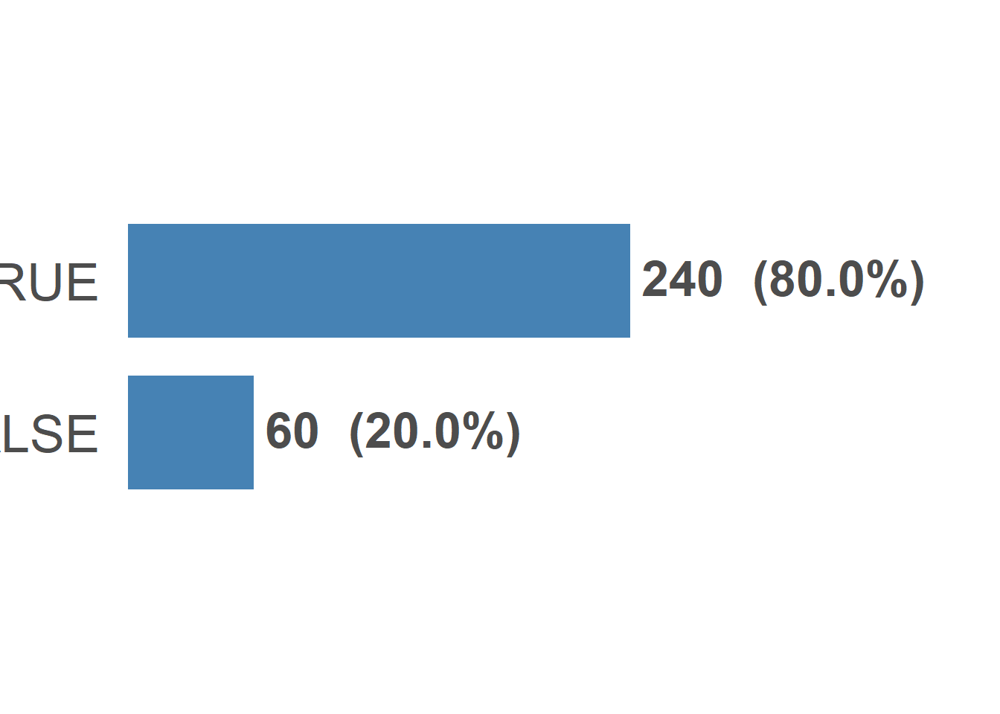{width=672}

::: 

::: {.div9} 

::: 

:::::  

## Factor

 

::: {.div1} 

#### ntee_program

::: 

::::: {.parent} 

::: {.div2} 

ntee_program 

::: 

::: {.div3} 

DATA TYPEcategorical

MAX NCHAR14

::: 

::: {.div4} 

DESCRIPTION

::: 

::: {.div5} 

**PREVIEW**:

::: 

::: {.div6} 

<pre class="dg-preview">
Environment · Health · Human Services · Arts · Education

</pre>

::: 

::: {.div7} 

**PROPERTIES**: 

|STAT     | VAL|    PER| 
 |:--------|---:|------:| 
 |Rows     | 300|       | 
 |Distinct |   5| (1.7%)| 

::: 

::: {.div8} 

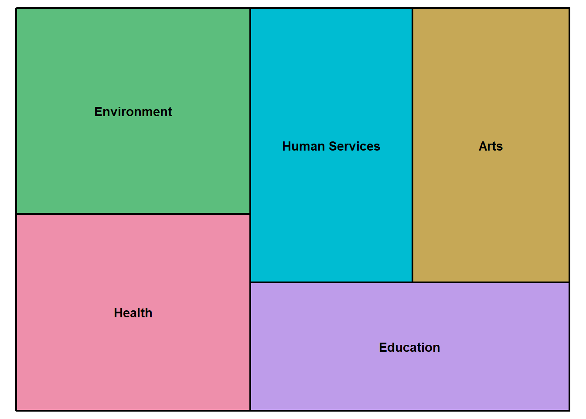{width=672}

::: 

::: {.div9} 

**FACTOR LEVELS**:

| Frequency|     (%)|Label          | 
 |---------:|-------:|:--------------| 
 |        65| (21.7%)|Environment    | 
 |        62| (20.7%)|Health         | 
 |        60| (20.0%)|Human Services | 
 |        58| (19.3%)|Arts           | 
 |        55| (18.3%)|Education      | 

::: 

:::::  

 

::: {.div1} 

#### num_programs

::: 

::::: {.parent} 

::: {.div2} 

num_programs 

::: 

::: {.div3} 

DATA TYPEcategorical

MAX NCHAR 2

::: 

::: {.div4} 

DESCRIPTION

::: 

::: {.div5} 

**PREVIEW**:

::: 

::: {.div6} 

<pre class="dg-preview">
5 · 7 · 8 · 4 · 6 · 10 · 9 · 3 · 2 · 1 · 12 · 11 · 13

</pre>

::: 

::: {.div7} 

**PROPERTIES**: 

|STAT     | VAL|    PER| 
 |:--------|---:|------:| 
 |Rows     | 300|       | 
 |Distinct |  13| (4.3%)| 

::: 

::: {.div8} 

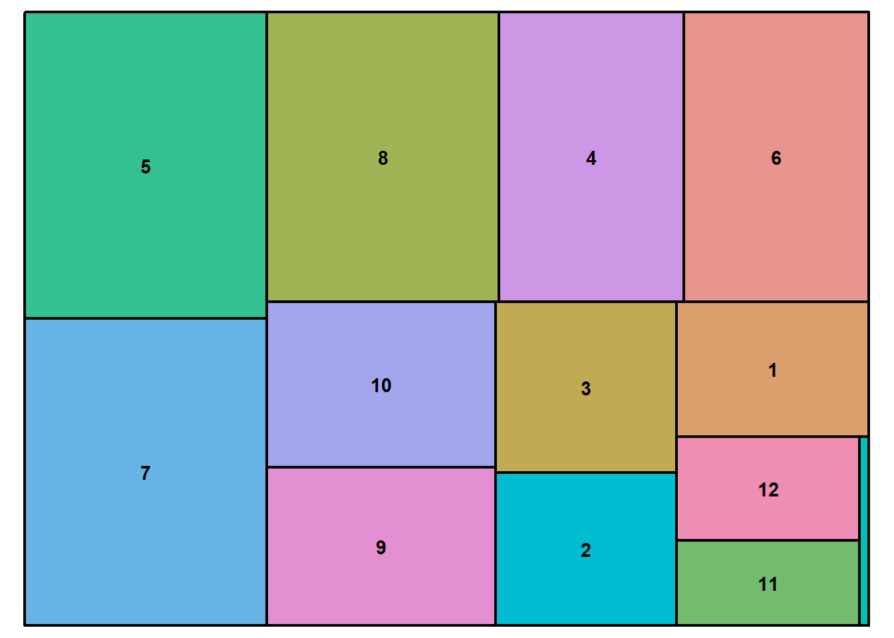{width=672}

::: 

::: {.div9} 

**FACTOR LEVELS**:

| Frequency|     (%)|Label | 
 |---------:|-------:|:-----| 
 |        43| (14.3%)|5     | 
 |        43| (14.3%)|7     | 
 |        39| (13.0%)|8     | 
 |        31| (10.3%)|4     | 
 |        31| (10.3%)|6     | 
 |        22|  (7.3%)|10    | 
 |        21|  (7.0%)|9     | 
 |        18|  (6.0%)|3     | 
 |        16|  (5.3%)|2     | 
 |        15|  (5.0%)|1     | 
 |        11|  (3.7%)|12    | 
 |         9|  (3.0%)|11    | 
 |         1|  (0.3%)|13    | 

::: 

:::::  

## Numeric 

## Character

 

::: {.div1} 

#### org_name

::: 

::::: {.parent} 

::: {.div2} 

org_name 

::: 

::: {.div3} 

DATA TYPEstring

MAX NCHAR18

::: 

::: {.div4} 

DESCRIPTION

::: 

::: {.div5} 

**PREVIEW**:

::: 

::: {.div6} 

<pre class="dg-preview">
Organization A 158 · Organization A 202 · Organization A 276
Organization A 279 · Organization A 412 · Organization A 530
Organization A 589 · Organization A 604 · Organization A 605
Organization A 657 · Organization A 735 · Organization A 74

</pre>

::: 

::: {.div7} 

**PROPERTIES**: 

|STAT     | VAL|      PER| 
 |:--------|---:|--------:| 
 |Rows     | 300|         | 
 |Distinct | 300| (100.0%)| 

::: 

::: {.div8} 

{width=768}

::: 

::: {.div9} 

**MOST COMMON VALUES**: 

|Value              | Frequency|    (%)| 
 |:------------------|---------:|------:| 
 |Organization A 158 |         1| (0.3%)| 
 |Organization A 202 |         1| (0.3%)| 
 |Organization A 276 |         1| (0.3%)| 
 |Organization A 279 |         1| (0.3%)| 
 |Organization A 412 |         1| (0.3%)| 
 |Organization A 530 |         1| (0.3%)| 

::: 

:::::  

## Identifier

 

::: {.div1} 

#### ein

::: 

::::: {.parent} 

::: {.div2} 

ein 

::: 

::: {.div3} 

DATA TYPEidentifier

MAX NCHAR9

::: 

::: {.div4} 

DESCRIPTION

::: 

::: {.div5} 

**PREVIEW**:

::: 

::: {.div6} 

<pre class="dg-preview">
101578358 · 105981903 · 106643114 · 107326985 · 108277070
113137014 · 113200319 · 116652886 · 118561463 · 122903686
123933062 · 130282978 · 132536339 · 133339764 · 146739486
151775857 · 155493354 · 155704899 · 155760701 · 160743970

</pre>

::: 

::: {.div7} 

**PROPERTIES**: 

|STAT     | VAL|      PER| 
 |:--------|---:|--------:| 
 |Rows     | 300|         | 
 |Distinct | 300| (100.0%)| 

::: 

::: {.div8} 

**MOST COMMON VALUES**: 

|Value     | Frequency|    (%)| 
 |:---------|---------:|------:| 
 |101578358 |         1| (0.3%)| 
 |105981903 |         1| (0.3%)| 
 |106643114 |         1| (0.3%)| 
 |107326985 |         1| (0.3%)| 
 |108277070 |         1| (0.3%)| 
 |113137014 |         1| (0.3%)| 

::: 

:::::  

## Temporal

 

::: {.div1} 

#### day_of_week

::: 

::::: {.parent} 

::: {.div2} 

day_of_week 

::: 

::: {.div3} 

DATA TYPEtemporal

UNITdow

::: 

::: {.div4} 

DESCRIPTION

::: 

::: {.div5} 

**PREVIEW**:

::: 

::: {.div6} 

<pre class="dg-preview">
TUE · WED · MON · THU · FRI · SAT · SUN

</pre>

::: 

::: {.div7} 

**PROPERTIES**: 

|STAT     | VAL|    PER| 
 |:--------|---:|------:| 
 |Rows     | 300|       | 
 |Distinct |   7| (2.3%)| 

::: 

::: {.div8} 

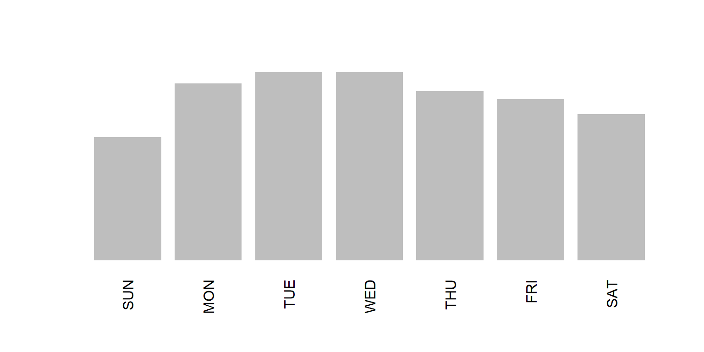{width=768}

::: 

:::::  

 

::: {.div1} 

#### date_mdy

::: 

::::: {.parent} 

::: {.div2} 

date_mdy 

::: 

::: {.div3} 

DATA TYPEtemporal

UNITdate

::: 

::: {.div4} 

DESCRIPTION

::: 

::: {.div5} 

**PREVIEW**:

::: 

::: {.div6} 

<pre class="dg-preview">
01-01-2017 · 01-24-2015 · 02-18-2015 · 02-24-2018 · 05-17-2017
05-22-2018 · 06-05-2018 · 06-09-2016 · 06-30-2017 · 07-10-2017
07-14-2016 · 08-01-2018 · 08-02-2017 · 08-08-2017 · 08-08-2018
08-26-2017 · 08-27-2016 · 09-10-2017 · 09-11-2017 · 09-19-2015

</pre>

::: 

::: {.div7} 

**PROPERTIES**: 

|STAT     | VAL|     PER| 
 |:--------|---:|-------:| 
 |Rows     | 300|        | 
 |Distinct | 274| (91.3%)| 

::: 

::: {.div8} 

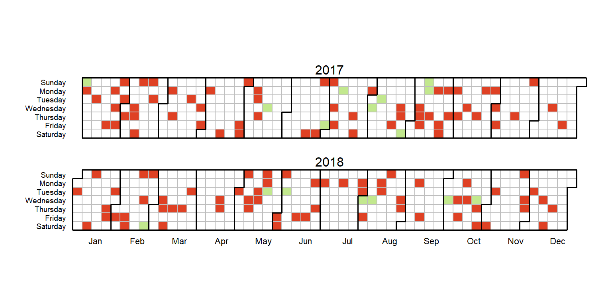{width=768}

::: 

:::::  

 

::: {.div1} 

#### date_dmy

::: 

::::: {.parent} 

::: {.div2} 

date_dmy 

::: 

::: {.div3} 

DATA TYPEtemporal

UNITdate

::: 

::: {.div4} 

DESCRIPTION

::: 

::: {.div5} 

**PREVIEW**:

::: 

::: {.div6} 

<pre class="dg-preview">
01-01-17 · 01-08-18 · 02-08-17 · 03-10-18 · 05-06-18 · 06-12-16
08-08-17 · 08-08-18 · 09-06-16 · 10-07-17 · 10-09-17 · 11-09-17
14-07-16 · 17-05-17 · 18-02-15 · 19-09-15 · 20-12-16 · 22-05-18
24-01-15 · 24-02-18 · 24-10-18 · 25-09-15 · 26-08-17 · 26-10-15

</pre>

::: 

::: {.div7} 

**PROPERTIES**: 

|STAT     | VAL|     PER| 
 |:--------|---:|-------:| 
 |Rows     | 300|        | 
 |Distinct | 274| (91.3%)| 

::: 

::: {.div8} 

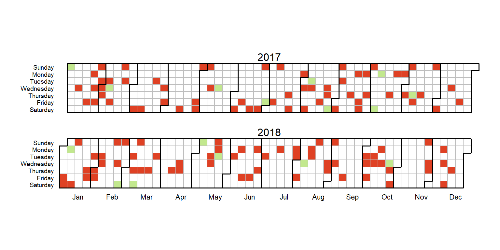{width=768}

::: 

:::::  

 

::: {.div1} 

#### month_abbr

::: 

::::: {.parent} 

::: {.div2} 

month_abbr 

::: 

::: {.div3} 

DATA TYPEtemporal

UNITmonth

::: 

::: {.div4} 

DESCRIPTION

::: 

::: {.div5} 

**PREVIEW**:

::: 

::: {.div6} 

<pre class="dg-preview">
SEP · JUN · OCT · AUG · FEB · JAN · JUL · MAR · MAY · APR · NOV
DEC

</pre>

::: 

::: {.div7} 

**PROPERTIES**: 

|STAT     | VAL|    PER| 
 |:--------|---:|------:| 
 |Rows     | 300|       | 
 |Distinct |  12| (4.0%)| 

::: 

::: {.div8} 

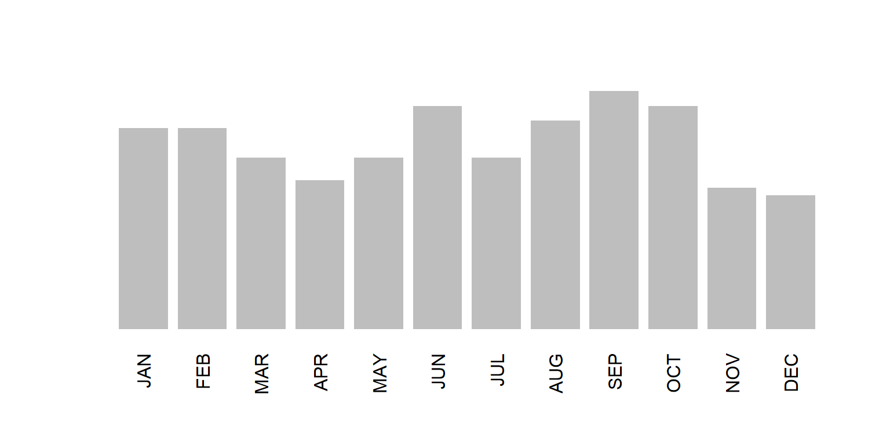{width=768}

::: 

:::::  

 

::: {.div1} 

#### month_ym

::: 

::::: {.parent} 

::: {.div2} 

month_ym 

::: 

::: {.div3} 

DATA TYPEtemporal

UNITmonth

::: 

::: {.div4} 

DESCRIPTION

::: 

::: {.div5} 

**PREVIEW**:

::: 

::: {.div6} 

<pre class="dg-preview">
2017-09 · 2017-01 · 2018-05 · 2018-08 · 2018-10 · 2015-06 · 2015-10
2016-09 · 2016-12 · 2017-08 · 2018-06 · 2015-02 · 2015-09 · 2017-07
2018-02 · 2015-03 · 2015-07 · 2016-04 · 2016-06 · 2017-02 · 2015-04
2016-01 · 2016-08 · 2017-10 · 2018-01 · 2018-03 · 2015-01 · 2015-11

</pre>

::: 

::: {.div7} 

**PROPERTIES**: 

|STAT     | VAL|     PER| 
 |:--------|---:|-------:| 
 |Rows     | 300|        | 
 |Distinct |  48| (16.0%)| 

::: 

::: {.div8} 

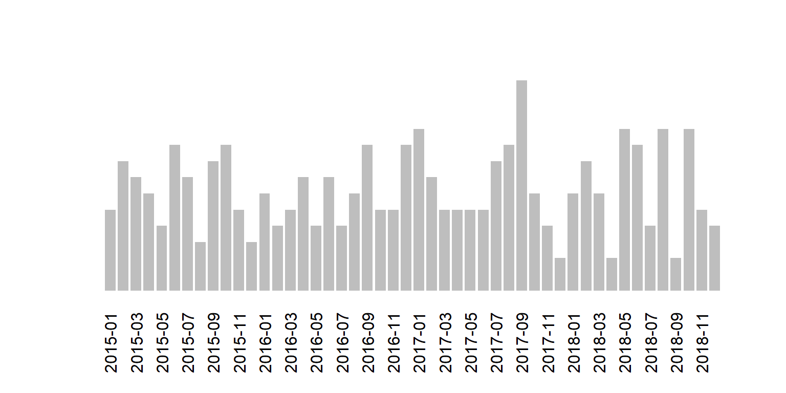{width=768}

::: 

:::::  

 

::: {.div1} 

#### hour_ampm

::: 

::::: {.parent} 

::: {.div2} 

hour_ampm 

::: 

::: {.div3} 

DATA TYPEtemporal

UNIThour

::: 

::: {.div4} 

DESCRIPTION

::: 

::: {.div5} 

**PREVIEW**:

::: 

::: {.div6} 

<pre class="dg-preview">
00:36:00 · 01:51:00 · 02:16:00 · 02:32:00 · 02:38:00 · 02:55:00
04:09:00 · 04:18:00 · 04:52:00 · 05:07:00 · 05:59:00 · 07:06:00
07:39:00 · 08:08:00 · 08:15:00 · 08:22:00 · 09:52:00 · 10:26:00
13:27:00 · 14:26:00 · 14:48:00 · 15:02:00 · 15:12:00 · 15:26:00

</pre>

::: 

::: {.div7} 

**PROPERTIES**: 

|STAT     | VAL|     PER| 
 |:--------|---:|-------:| 
 |Rows     | 300|        | 
 |Distinct | 268| (89.3%)| 

::: 

::: {.div8} 

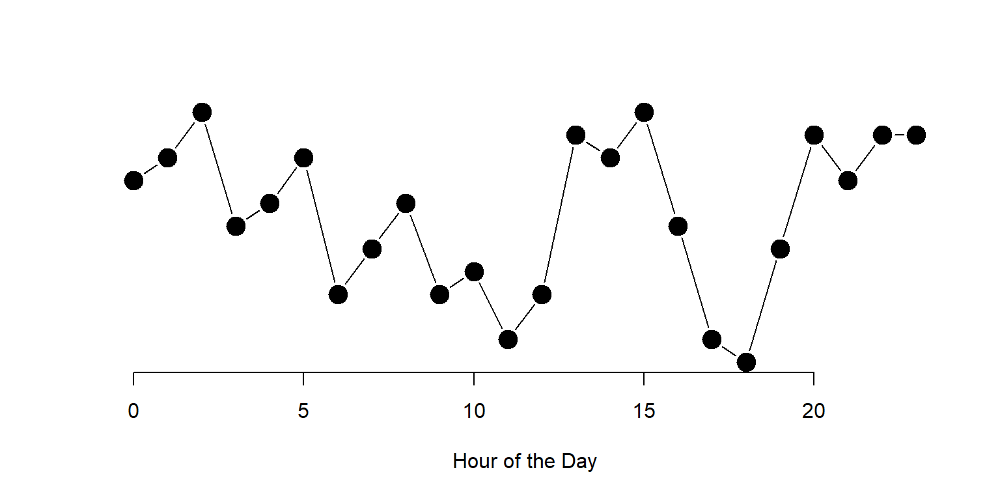{width=768}

::: 

:::::  

 

::: {.div1} 

#### event_ts

::: 

::::: {.parent} 

::: {.div2} 

event_ts 

::: 

::: {.div3} 

DATA TYPEtemporal

UNITweek

::: 

::: {.div4} 

DESCRIPTION

::: 

::: {.div5} 

**PREVIEW**:

::: 

::: {.div6} 

<pre class="dg-preview">
2015-01-02 11:02:24 MST · 2015-01-16 17:17:50 MST
2015-01-24 01:18:30 MST · 2015-01-24 10:05:07 MST
2015-01-25 14:20:16 MST · 2015-02-02 14:48:47 MST
2015-02-06 01:48:49 MST · 2015-02-09 15:18:51 MST

</pre>

::: 

::: {.div7} 

**PROPERTIES**: 

|STAT     | VAL|      PER| 
 |:--------|---:|--------:| 
 |Rows     | 300|         | 
 |Distinct | 300| (100.0%)| 

::: 

::: {.div8} 

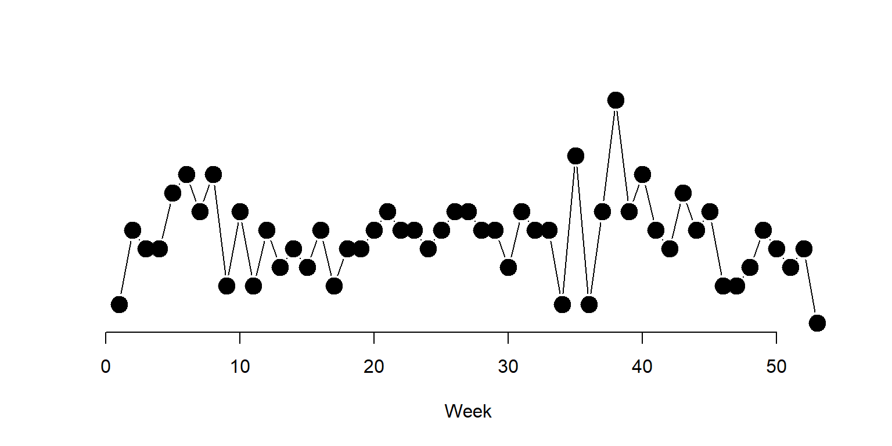{width=768}

::: 

:::::  

 

::: {.div1} 

#### rule_year

::: 

::::: {.parent} 

::: {.div2} 

rule_year 

::: 

::: {.div3} 

DATA TYPEtemporal

UNITyear

::: 

::: {.div4} 

DESCRIPTION

::: 

::: {.div5} 

**PREVIEW**:

::: 

::: {.div6} 

<pre class="dg-preview">
1999 · 1964 · 2000 · 1977 · 1992 · 1996 · 2005 · 1957 · 1974 · 1993
1997 · 1998 · 2012 · 1979 · 1987 · 2015 · 1960 · 1962 · 1963 · 1965
1970 · 1972 · 1973 · 1976 · 1981 · 1982 · 1985 · 1988 · 2009 · 2010
2011 · 2014 · 1958 · 1969 · 1975 · 1980 · 1983 · 1984 · 1986 · 1995

</pre>

::: 

::: {.div7} 

**PROPERTIES**: 

|STAT     | VAL|     PER| 
 |:--------|---:|-------:| 
 |Rows     | 300|        | 
 |Distinct |  61| (20.3%)| 

::: 

::: {.div8} 

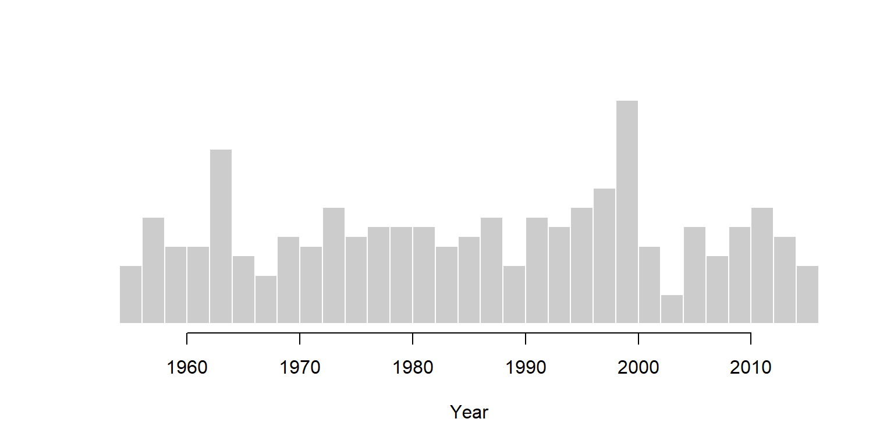{width=768}

::: 

:::::  

 

::: {.div1} 

#### age_years

::: 

::::: {.parent} 

::: {.div2} 

age_years 

::: 

::: {.div3} 

DATA TYPEtemporal

UNITyear

::: 

::: {.div4} 

DESCRIPTION

::: 

::: {.div5} 

**PREVIEW**:

::: 

::: {.div6} 

<pre class="dg-preview">
27 · 62 · 26 · 21 · 30 · 34 · 49 · 14 · 28 · 29 · 33 · 52 · 69 · 11
39 · 47 · 12 · 15 · 16 · 17 · 38 · 41 · 44 · 45 · 50 · 53 · 54 · 56
61 · 63 · 64 · 66 · 13 · 19 · 24 · 25 · 31 · 40 · 42 · 43 · 46 · 51
57 · 68 · 18 · 32 · 35 · 36 · 37 · 55 · 59 · 65 · 67 · 70 · 71 · 20

</pre>

::: 

::: {.div7} 

**PROPERTIES**: 

|STAT     | VAL|     PER| 
 |:--------|---:|-------:| 
 |Rows     | 300|        | 
 |Distinct |  61| (20.3%)| 

::: 

::: {.div8} 

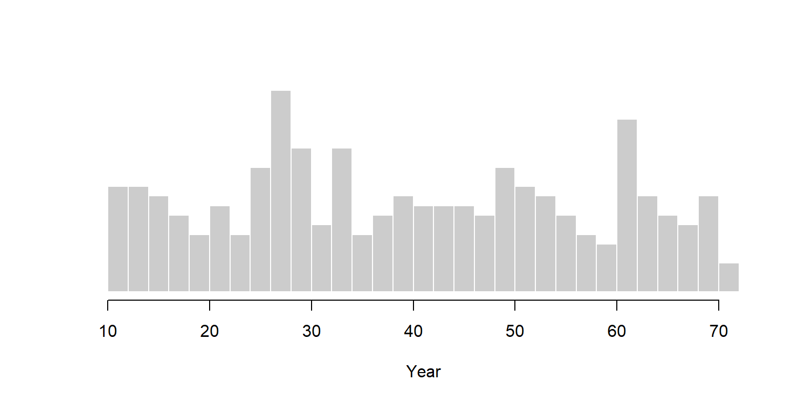{width=768}

::: 

:::::  

<!-- datagoodr-render-record {"datagoodr":"0.1.0","rendered_utc":"2026-07-18T20:31:36Z","r":"4.5.1","quarto":"1.8.25","dgf_file":"DGF-temporal-demo.xlsx","dgf_hash":"30d2510094ca584b30615d9180331906","dgf_variables":14} -->
