<!-- datagoodr research guide template.

     Customize without editing the package:
       - DG.R           custom functions & layout overrides
       - datagoodr.css  the page grid, fonts, and colors
     See vignette("customizing", package = "datagoodr").

     Render from the console with:  quarto::quarto_render("research-guide.qmd")
     or re-render against a different DGF/dataset without editing this file:
       datagoodr::update_rg("research-guide.qmd", DGF = "DGF-V2.xlsx") -->

 

  

## Logical

 

::: {.div1} 

#### F9_05_UBIZ_IMCOME_OVER_LIMIT_X

::: 

::::: {.parent} 

::: {.div2} 

UBI over filing threshold 

::: 

::: {.div3} 

DATA TYPEboolean

MAX NCHAR1

::: 

::: {.div4} 

DESCRIPTIONWhether unrelated business income exceeded the $1,000 filing threshold.

::: 

::: {.div5} 

**PREVIEW**:

::: 

::: {.div6} 

<pre class="dg-preview">
N · Y

</pre>

::: 

::: {.div7} 

**PROPERTIES**: 

|STAT     |    VAL|    PER| 
 |:--------|------:|------:| 
 |Rows     | 25,000|       | 
 |Distinct |      2| (0.0%)| 

::: 

::: {.div8} 

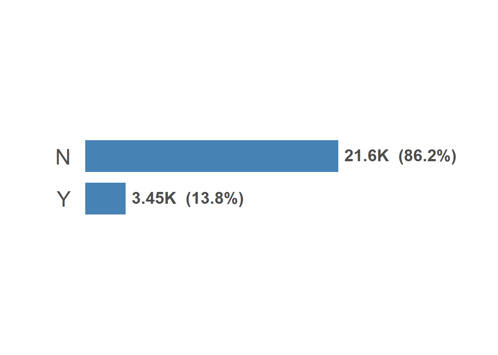{width=672}

::: 

::: {.div9} 

**CATEGORY LABELS**:

|N  |Y   | 
 |:--|:---| 
 |No |Yes | 

::: 

:::::  

 

::: {.div1} 

#### OUTNCCS

::: 

::::: {.parent} 

::: {.div2} 

In / out of NCCS core 

::: 

::: {.div3} 

DATA TYPEboolean

MAX NCHAR3

::: 

::: {.div4} 

DESCRIPTIONWhether the organization is included in the NCCS core file.

::: 

::: {.div5} 

**PREVIEW**:

::: 

::: {.div6} 

<pre class="dg-preview">
IN · OUT

</pre>

::: 

::: {.div7} 

**PROPERTIES**: 

|STAT       |    VAL|    PER| 
 |:----------|------:|------:| 
 |Rows       | 25,000|       | 
 |Distinct   |      3| (0.0%)| 
 |Missing/NA |  2,361| (9.4%)| 

::: 

::: {.div8} 

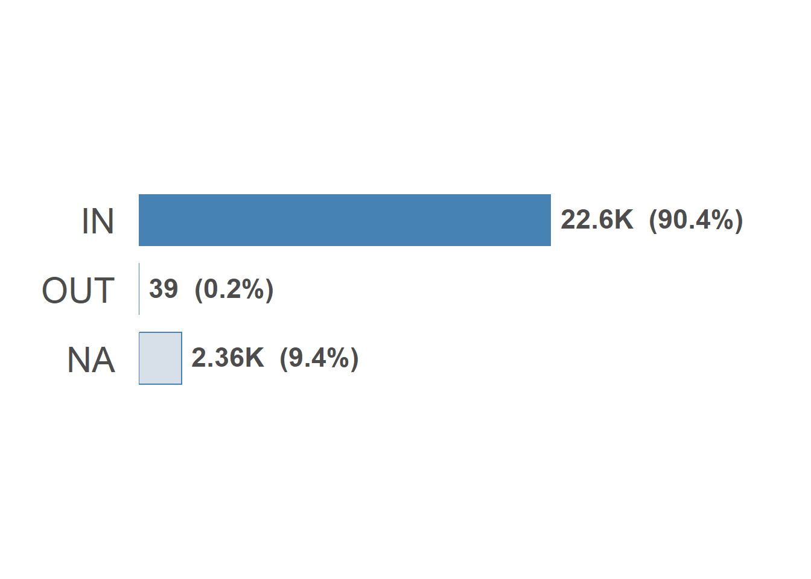{width=672}

::: 

::: {.div9} 

**CATEGORY LABELS**:

|IN                |OUT                   | 
 |:-----------------|:---------------------| 
 |In NCCS core file |Out of NCCS core file | 

::: 

:::::  

## Factor

 

::: {.div1} 

#### SUBSECCD

::: 

::::: {.parent} 

::: {.div2} 

IRS subsection code 

::: 

::: {.div3} 

DATA TYPEcategorical

SUBTYPEnominal

CLASSadministrative_code

FORMATcode

MAX NCHAR2

::: 

::: {.div4} 

DESCRIPTION501(c) subsection under which the organization is tax-exempt.

::: 

::: {.div5} 

**PREVIEW**:

::: 

::: {.div6} 

<pre class="dg-preview">
6 · 4 · 7 · 5 · 8 · 19 · 9 · 12 · 13 · 2 · 10 · 14 · 25 · 15 · 17
23 · 11 · 26 · 16 · 18 · 24 · 27 · 29

</pre>

::: 

::: {.div7} 

**PROPERTIES**: 

|STAT     |    VAL|    PER| 
 |:--------|------:|------:| 
 |Rows     | 25,000|       | 
 |Distinct |     23| (0.1%)| 

::: 

::: {.div8} 

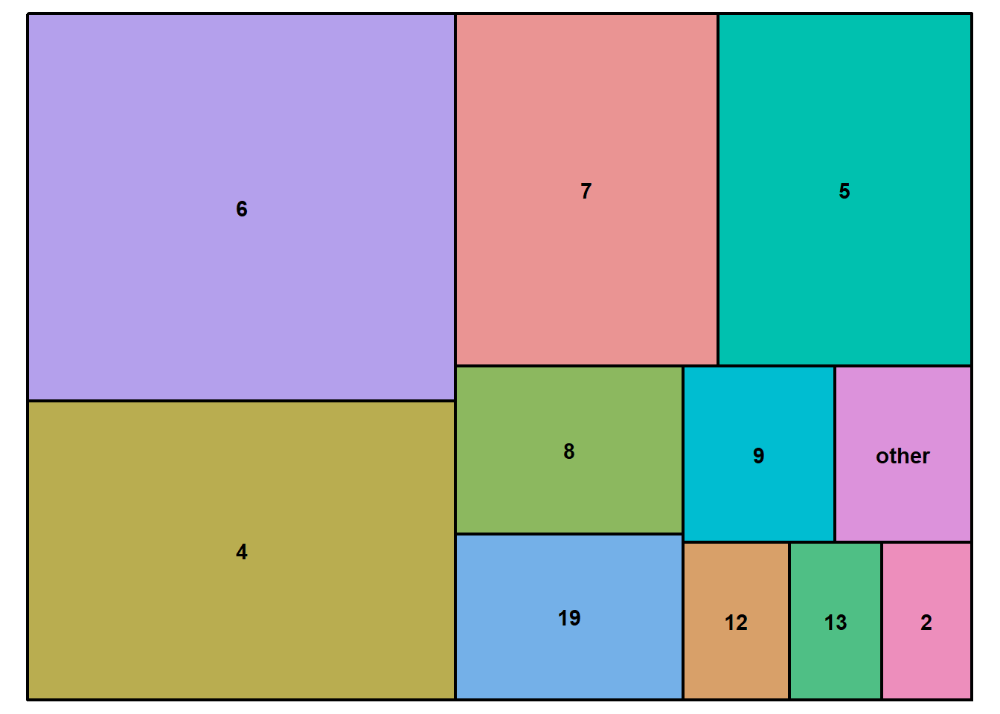{width=672}

::: 

::: {.div9} 

**FACTOR LEVELS**:

| Frequency|     (%)|Label |Meaning                                               | 
 |---------:|-------:|:-----|:-----------------------------------------------------| 
 |     6,391| (25.6%)|6     |501(c)(6) Business league                             | 
 |     4,936| (19.7%)|4     |501(c)(4) Social welfare organization                 | 
 |     3,571| (14.3%)|7     |501(c)(7) Social & recreational club                  | 
 |     3,449| (13.8%)|5     |501(c)(5) Labor / agricultural org                    | 
 |     1,479|  (5.9%)|8     |501(c)(8) Fraternal beneficiary society               | 
 |     1,459|  (5.8%)|19    |501(c)(19) Veterans' organization                     | 
 |     1,033|  (4.1%)|9     |501(c)(9) Voluntary employees' beneficiary assoc.     | 
 |       642|  (2.6%)|12    |501(c)(12) Benevolent life insurance / utility co-op  | 
 |       561|  (2.2%)|13    |501(c)(13) Cemetery company                           | 
 |       545|  (2.2%)|2     |501(c)(2) Title-holding corporation                   | 
 |       466|  (1.9%)|10    |501(c)(10) Domestic fraternal society                 | 
 |       311|  (1.2%)|14    |501(c)(14) State-chartered credit union               | 
 |        88|  (0.4%)|25    |501(c)(25) Title-holding corp (multiple parents)      | 
 |        32|  (0.1%)|15    |501(c)(15) Mutual insurance company                   | 
 |        22|  (0.1%)|17    |501(c)(17) Supplemental unemployment benefit trust    | 
 |         6|  (0.0%)|23    |501(c)(23) Veterans' association                      | 
 |         2|  (0.0%)|11    |501(c)(11) Teachers' retirement fund                  | 
 |         2|  (0.0%)|26    |501(c)(26) State high-risk health coverage org        | 
 |         1|  (0.0%)|16    |501(c)(16) Crop-financing corporation                 | 
 |         1|  (0.0%)|18    |501(c)(18) Employee-funded pension trust              | 
 |         1|  (0.0%)|24    |501(c)(24) Section 4049 ERISA trust                   | 
 |         1|  (0.0%)|27    |501(c)(27) State workers' comp reinsurance org        | 
 |         1|  (0.0%)|29    |501(c)(29) Qualified nonprofit health insurer (CO-OP) | 

::: 

:::::  

 

::: {.div1} 

#### NTMAJ12

::: 

::::: {.parent} 

::: {.div2} 

NTEE major group (12-category) 

::: 

::: {.div3} 

DATA TYPEcategorical

SUBTYPEnominal

CLASSclassification_code

FORMATcode

MAX NCHAR2

::: 

::: {.div4} 

DESCRIPTIONNCCS 12-category summary of the organization's NTEE classification.

::: 

::: {.div5} 

**PREVIEW**:

::: 

::: {.div6} 

<pre class="dg-preview">
PU · HU · MU · ED · UN · HE · AR · EN · IN · EH · RE · BH

</pre>

::: 

::: {.div7} 

**PROPERTIES**: 

|STAT     |    VAL|    PER| 
 |:--------|------:|------:| 
 |Rows     | 25,000|       | 
 |Distinct |     12| (0.0%)| 

::: 

::: {.div8} 

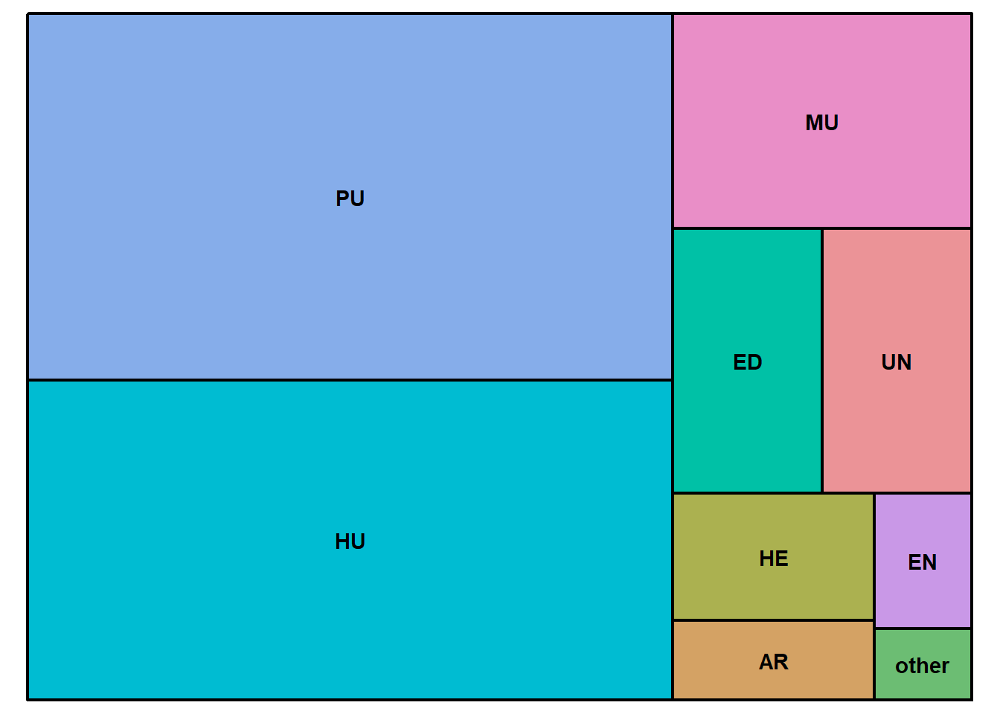{width=672}

::: 

::: {.div9} 

**FACTOR LEVELS**:

| Frequency|     (%)|Label |Meaning                         | 
 |---------:|-------:|:-----|:-------------------------------| 
 |     9,128| (36.5%)|PU    |Public & societal benefit       | 
 |     7,955| (31.8%)|HU    |Human services                  | 
 |     2,480|  (9.9%)|MU    |Mutual / membership benefit     | 
 |     1,528|  (6.1%)|ED    |Education (excl. higher ed)     | 
 |     1,524|  (6.1%)|UN    |Unknown / unclassified          | 
 |       994|  (4.0%)|HE    |Health (excl. hospitals)        | 
 |       615|  (2.5%)|AR    |Arts, culture & humanities      | 
 |       508|  (2.0%)|EN    |Environment & animals           | 
 |       101|  (0.4%)|IN    |International & foreign affairs | 
 |        79|  (0.3%)|EH    |Hospitals & primary care        | 
 |        64|  (0.3%)|RE    |Religion-related                | 
 |        24|  (0.1%)|BH    |Higher education                | 

::: 

:::::  

 

::: {.div1} 

#### NTEE1

::: 

::::: {.parent} 

::: {.div2} 

NTEE major group 

::: 

::: {.div3} 

DATA TYPEcategorical

SUBTYPEnominal

CLASSclassification_code

FORMATcode

MAX NCHAR1

::: 

::: {.div4} 

DESCRIPTIONFirst letter of the National Taxonomy of Exempt Entities code - the broad activity area.

::: 

::: {.div5} 

**PREVIEW**:

::: 

::: {.div6} 

<pre class="dg-preview">
S · N · W · Y · J · B · M · L · A · K · E · I · G · C · P · D · U
R · T · F · Q · O · X · Z · H · V

</pre>

::: 

::: {.div7} 

**PROPERTIES**: 

|STAT       |    VAL|    PER| 
 |:----------|------:|------:| 
 |Rows       | 25,000|       | 
 |Distinct   |     27| (0.1%)| 
 |Missing/NA |  1,497| (6.0%)| 

::: 

::: {.div8} 

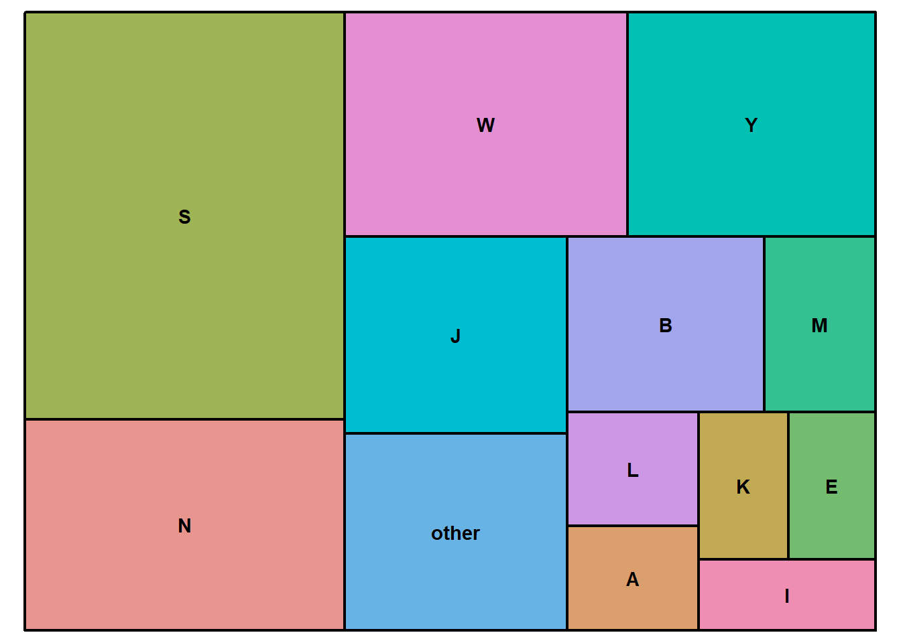{width=672}

::: 

::: {.div9} 

**FACTOR LEVELS**:

| Frequency|     (%)|Label |Meaning                             | 
 |---------:|-------:|:-----|:-----------------------------------| 
 |     5,817| (23.3%)|S     |Community Improvement               | 
 |     3,018| (12.1%)|N     |Recreation & Sports                 | 
 |     2,835| (11.3%)|W     |Public & Societal Benefit           | 
 |     2,480|  (9.9%)|Y     |Mutual & Membership Benefit         | 
 |     1,961|  (7.8%)|J     |Employment                          | 
 |     1,552|  (6.2%)|B     |Education                           | 
 |       876|  (3.5%)|M     |Public Safety & Disaster Relief     | 
 |       669|  (2.7%)|L     |Housing & Shelter                   | 
 |       615|  (2.5%)|A     |Arts, Culture & Humanities          | 
 |       590|  (2.4%)|K     |Food, Agriculture & Nutrition       | 
 |       574|  (2.3%)|E     |Health Care                         | 
 |       557|  (2.2%)|I     |Crime & Legal-Related               | 
 |       382|  (1.5%)|G     |Voluntary Health Associations       | 
 |       338|  (1.4%)|C     |Environmental Quality               | 
 |       210|  (0.8%)|P     |Human Services                      | 
 |       170|  (0.7%)|D     |Animal-Related                      | 
 |       166|  (0.7%)|U     |Science & Technology                | 
 |       164|  (0.7%)|R     |Civil Rights & Advocacy             | 
 |       142|  (0.6%)|T     |Philanthropy & Grantmaking          | 
 |       103|  (0.4%)|F     |Mental Health & Crisis Intervention | 
 |       101|  (0.4%)|Q     |International & Foreign Affairs     | 
 |        74|  (0.3%)|O     |Youth Development                   | 
 |        64|  (0.3%)|X     |Religion-Related                    | 
 |        27|  (0.1%)|Z     |Unknown                             | 
 |        14|  (0.1%)|H     |Medical Research                    | 
 |         4|  (0.0%)|V     |Social Science                      | 

::: 

:::::  

 

::: {.div1} 

#### NTEESRC

::: 

::::: {.parent} 

::: {.div2} 

NTEE source 

::: 

::: {.div3} 

DATA TYPEcategorical

SUBTYPEnominal

CLASScategory

FORMATcode

MAX NCHAR4

::: 

::: {.div4} 

DESCRIPTIONMethod or source by which the NTEE code was assigned.

::: 

::: {.div5} 

**PREVIEW**:

::: 

::: {.div6} 

<pre class="dg-preview">
BEST · WORD · NEW · IRS · SOI · ZZ · SUB · SUB2 · SUB3 · ACT1 · VER
ntCO · HIED · END2 · thp

</pre>

::: 

::: {.div7} 

**PROPERTIES**: 

|STAT       |    VAL|    PER| 
 |:----------|------:|------:| 
 |Rows       | 25,000|       | 
 |Distinct   |     16| (0.1%)| 
 |Missing/NA |  1,378| (5.5%)| 

::: 

::: {.div8} 

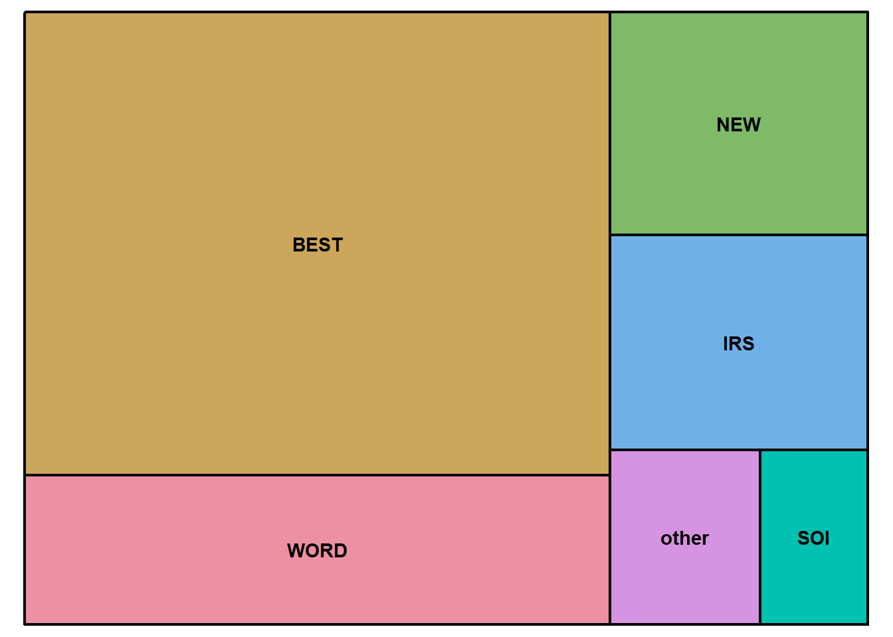{width=672}

::: 

::: {.div9} 

**FACTOR LEVELS**:

| Frequency|     (%)|Label |Meaning                           | 
 |---------:|-------:|:-----|:---------------------------------| 
 |    12,410| (49.6%)|BEST  |Best available assignment         | 
 |     4,000| (16.0%)|WORD  |Keyword / text-based              | 
 |     2,621| (10.5%)|NEW   |Newly assigned                    | 
 |     2,540| (10.2%)|IRS   |IRS-assigned                      | 
 |       855|  (3.4%)|SOI   |IRS Statistics of Income          | 
 |       454|  (1.8%)|ZZ    |Unassigned                        | 
 |       306|  (1.2%)|SUB   |Subsector reassignment            | 
 |       140|  (0.6%)|SUB2  |Subsector reassignment (2nd pass) | 
 |        86|  (0.3%)|SUB3  |Subsector reassignment (3rd pass) | 
 |        84|  (0.3%)|ACT1  |Assigned from activity code       | 
 |        48|  (0.2%)|VER   |Manually verified                 | 
 |        46|  (0.2%)|ntCO  |NCCS core assignment              | 
 |        19|  (0.1%)|HIED  |Higher-education override         | 
 |        11|  (0.0%)|END2  |End-of-process assignment         | 
 |         2|  (0.0%)|thp   |Third-party source                | 

::: 

:::::  

 

::: {.div1} 

#### DEDUCTCD

::: 

::::: {.parent} 

::: {.div2} 

Deductibility code 

::: 

::: {.div3} 

DATA TYPEcategorical

SUBTYPEnominal

CLASSadministrative_code

FORMATcode

MAX NCHAR1

::: 

::: {.div4} 

DESCRIPTIONWhether contributions to the organization are tax-deductible.

::: 

::: {.div5} 

**PREVIEW**:

::: 

::: {.div6} 

<pre class="dg-preview">
2 · 1 · 0 · 4

</pre>

::: 

::: {.div7} 

**PROPERTIES**: 

|STAT       |    VAL|    PER| 
 |:----------|------:|------:| 
 |Rows       | 25,000|       | 
 |Distinct   |      5| (0.0%)| 
 |Missing/NA |  1,887| (7.5%)| 

::: 

::: {.div8} 

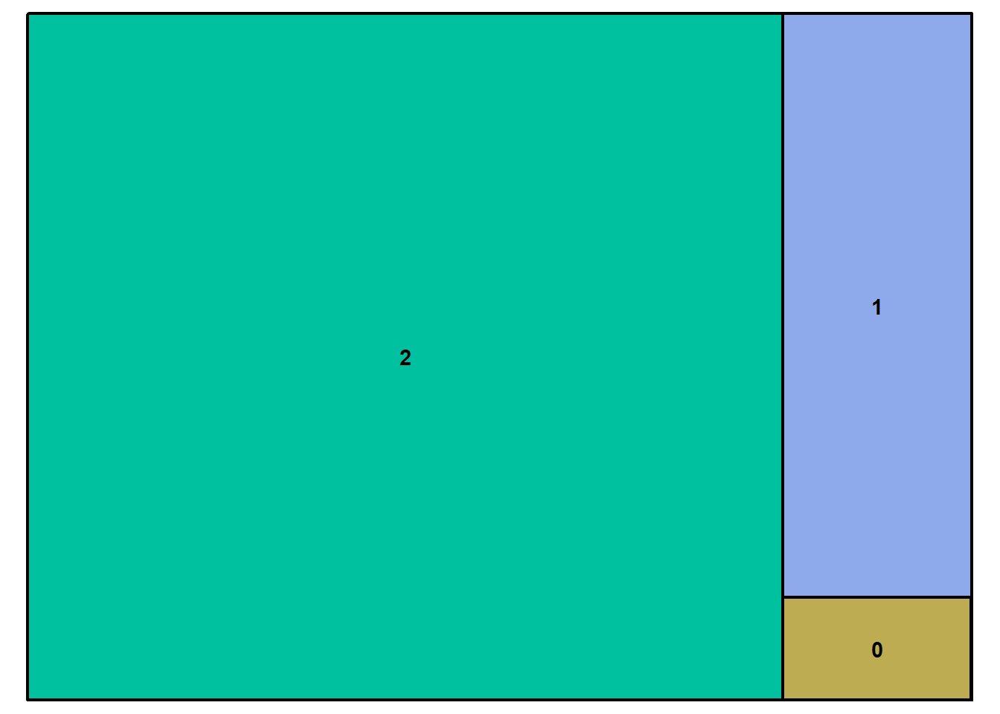{width=672}

::: 

::: {.div9} 

**FACTOR LEVELS**:

| Frequency|     (%)|Label |Meaning                              | 
 |---------:|-------:|:-----|:------------------------------------| 
 |    18,494| (74.0%)|2     |Contributions are not tax-deductible | 
 |     3,932| (15.7%)|1     |Contributions are tax-deductible     | 
 |       685|  (2.7%)|0     |Not specified                        | 
 |         2|  (0.0%)|4     |Deductible by treaty (foreign org)   | 

::: 

:::::  

 

::: {.div1} 

#### OUTREAS

::: 

::::: {.parent} 

::: {.div2} 

Out-of-scope reason 

::: 

::: {.div3} 

DATA TYPEcategorical

SUBTYPEnominal

CLASScategory

FORMATcode

MAX NCHAR1

::: 

::: {.div4} 

DESCRIPTIONReason the organization is excluded from the NCCS core file.

::: 

::: {.div5} 

**PREVIEW**:

::: 

::: {.div6} 

<pre class="dg-preview">
T · F · S · N

</pre>

::: 

::: {.div7} 

**PROPERTIES**: 

|STAT       |    VAL|     PER| 
 |:----------|------:|-------:| 
 |Rows       | 25,000|        | 
 |Distinct   |      5|  (0.0%)| 
 |Missing/NA | 24,961| (99.8%)| 

::: 

::: {.div8} 

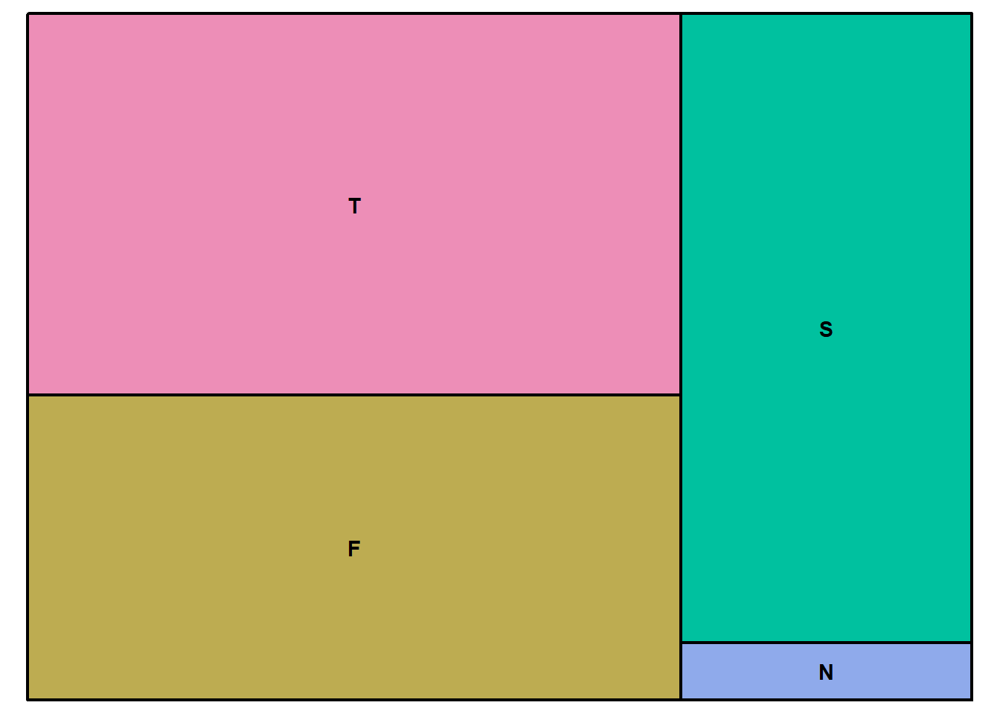{width=672}

::: 

::: {.div9} 

**FACTOR LEVELS**:

| Frequency|    (%)|Label |Meaning                        | 
 |---------:|------:|:-----|:------------------------------| 
 |        15| (0.1%)|T     |Terminated / defunct           | 
 |        12| (0.0%)|F     |Foreign / non-US               | 
 |        11| (0.0%)|S     |Small (below filing threshold) | 
 |         1| (0.0%)|N     |Not a reporting public charity | 

::: 

:::::  

 

::: {.div1} 

#### F9_00_TAX_PERIOD_END_DATE

::: 

::::: {.parent} 

::: {.div2} 

Tax period end 

::: 

::: {.div3} 

DATA TYPEcategorical

SUBTYPEnominal

CLASSreporting_period

FORMATcode

MAX NCHAR6

::: 

::: {.div4} 

DESCRIPTIONYear and month (YYYYMM) the reporting tax period ended.

::: 

::: {.div5} 

**PREVIEW**:

::: 

::: {.div6} 

<pre class="dg-preview">
201912 · 201812 · 201906 · 201712 · 202006 · 201806 · 201909
201908 · 201706 · 201903 · 202003 · 201905 · 201904 · 201910
202005 · 201809 · 202004 · 201907 · 201805 · 201808 · 201911
201709 · 201803 · 201804 · 201810 · 202007 · 202008 · 202009

</pre>

::: 

::: {.div7} 

**PROPERTIES**: 

|STAT     |    VAL|    PER| 
 |:--------|------:|------:| 
 |Rows     | 25,000|       | 
 |Distinct |     47| (0.2%)| 

::: 

::: {.div8} 

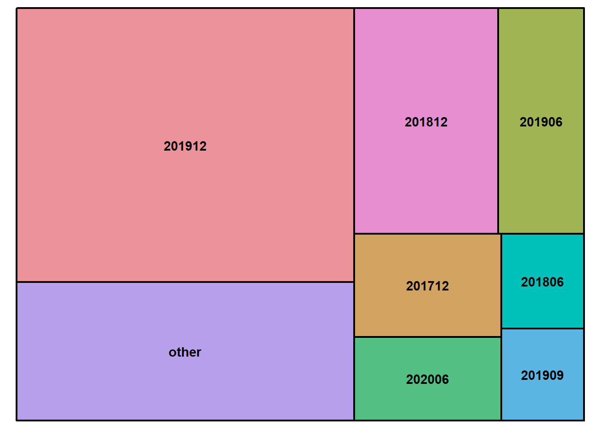{width=672}

::: 

::: {.div9} 

**FACTOR LEVELS**:

| Frequency|     (%)|Label  | 
 |---------:|-------:|:------| 
 |     9,884| (39.5%)|201912 | 
 |     3,477| (13.9%)|201812 | 
 |     2,064|  (8.3%)|201906 | 
 |     1,626|  (6.5%)|201712 | 
 |     1,312|  (5.2%)|202006 | 
 |       840|  (3.4%)|201806 | 
 |       812|  (3.2%)|201909 | 
 |       406|  (1.6%)|201908 | 
 |       362|  (1.4%)|201706 | 
 |       356|  (1.4%)|201903 | 
 |       352|  (1.4%)|202003 | 
 |       326|  (1.3%)|201905 | 
 |       278|  (1.1%)|201904 | 
 |       272|  (1.1%)|201910 | 
 |       252|  (1.0%)|202005 | 
 |       244|  (1.0%)|201809 | 
 |       183|  (0.7%)|202004 | 
 |       161|  (0.6%)|201907 | 
 |       154|  (0.6%)|201805 | 
 |       139|  (0.6%)|201808 | 
 |       123|  (0.5%)|201911 | 
 |       121|  (0.5%)|201709 | 
 |       110|  (0.4%)|201803 | 
 |       102|  (0.4%)|201804 | 
 |        94|  (0.4%)|201810 | 
 |        91|  (0.4%)|202007 | 
 |        79|  (0.3%)|202008 | 
 |        74|  (0.3%)|202009 | 
 |        66|  (0.3%)|202001 | 
 |        65|  (0.3%)|201807 | 
 |        64|  (0.3%)|201705 | 
 |        64|  (0.3%)|201708 | 
 |        59|  (0.2%)|202002 | 
 |        57|  (0.2%)|201902 | 
 |        46|  (0.2%)|201704 | 
 |        46|  (0.2%)|201710 | 
 |        46|  (0.2%)|201811 | 
 |        34|  (0.1%)|201901 | 
 |        32|  (0.1%)|201707 | 
 |        32|  (0.1%)|201802 | 
 |        31|  (0.1%)|201703 | 
 |        25|  (0.1%)|201711 | 
 |        13|  (0.1%)|202010 | 
 |         9|  (0.0%)|201801 | 
 |         8|  (0.0%)|201701 | 
 |         8|  (0.0%)|201702 | 
 |         1|  (0.0%)|202011 | 

::: 

:::::  

 

::: {.div1} 

#### F9_00_TAX_PERIOD_END_DATE_PY

::: 

::::: {.parent} 

::: {.div2} 

Tax period end (prior year) 

::: 

::: {.div3} 

DATA TYPEcategorical

SUBTYPEnominal

CLASSreporting_period

FORMATcode

MAX NCHAR6

::: 

::: {.div4} 

DESCRIPTIONYear and month the prior-year tax period ended.

::: 

::: {.div5} 

**PREVIEW**:

::: 

::: {.div6} 

<pre class="dg-preview">
201812 · 201712 · 201806 · 201906 · 201809 · 201706 · 201612
201808 · 201803 · 201903 · 201805 · 201810 · 201804 · 201905
201709 · 201606 · 201904 · 201807 · 201811 · 201708 · 201705
201710 · 201704 · 201901 · 201907 · 201703 · 201902 · 201802

</pre>

::: 

::: {.div7} 

**PROPERTIES**: 

|STAT       |    VAL|     PER| 
 |:----------|------:|-------:| 
 |Rows       | 25,000|        | 
 |Distinct   |     47|  (0.2%)| 
 |Missing/NA |  4,344| (17.4%)| 

::: 

::: {.div8} 

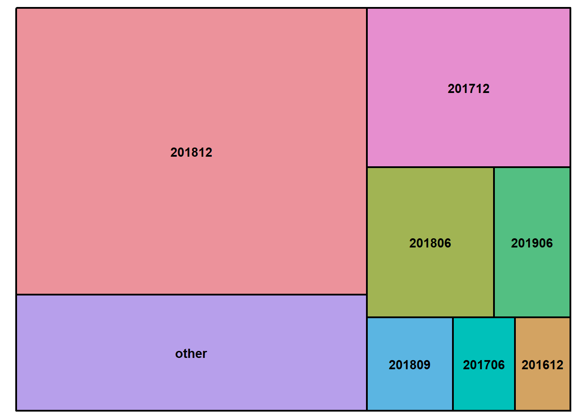{width=672}

::: 

::: {.div9} 

**FACTOR LEVELS**:

| Frequency|     (%)|Label  | 
 |---------:|-------:|:------| 
 |     9,298| (37.2%)|201812 | 
 |     3,002| (12.0%)|201712 | 
 |     1,767|  (7.1%)|201806 | 
 |     1,060|  (4.2%)|201906 | 
 |       744|  (3.0%)|201809 | 
 |       539|  (2.2%)|201706 | 
 |       478|  (1.9%)|201612 | 
 |       370|  (1.5%)|201808 | 
 |       321|  (1.3%)|201803 | 
 |       319|  (1.3%)|201903 | 
 |       265|  (1.1%)|201805 | 
 |       255|  (1.0%)|201810 | 
 |       246|  (1.0%)|201804 | 
 |       206|  (0.8%)|201905 | 
 |       195|  (0.8%)|201709 | 
 |       164|  (0.7%)|201606 | 
 |       162|  (0.6%)|201904 | 
 |       123|  (0.5%)|201807 | 
 |       122|  (0.5%)|201811 | 
 |       101|  (0.4%)|201708 | 
 |        90|  (0.4%)|201705 | 
 |        88|  (0.4%)|201710 | 
 |        64|  (0.3%)|201704 | 
 |        61|  (0.2%)|201901 | 
 |        58|  (0.2%)|201907 | 
 |        51|  (0.2%)|201703 | 
 |        49|  (0.2%)|201902 | 
 |        46|  (0.2%)|201802 | 
 |        44|  (0.2%)|201908 | 
 |        42|  (0.2%)|201909 | 
 |        41|  (0.2%)|201711 | 
 |        39|  (0.2%)|201707 | 
 |        36|  (0.1%)|201605 | 
 |        34|  (0.1%)|201609 | 
 |        29|  (0.1%)|201801 | 
 |        27|  (0.1%)|201604 | 
 |        23|  (0.1%)|201608 | 
 |        22|  (0.1%)|201702 | 
 |        18|  (0.1%)|201603 | 
 |        16|  (0.1%)|201607 | 
 |        13|  (0.1%)|201610 | 
 |         9|  (0.0%)|201611 | 
 |         7|  (0.0%)|201910 | 
 |         5|  (0.0%)|201601 | 
 |         4|  (0.0%)|201602 | 
 |         3|  (0.0%)|201701 | 

::: 

:::::  

 

::: {.div1} 

#### F9_00_TAX_PERIOD_BEGIN_DATE

::: 

::::: {.parent} 

::: {.div2} 

Tax period begin 

::: 

::: {.div3} 

DATA TYPEcategorical

SUBTYPEnominal

CLASSreporting_period

FORMATcode

MAX NCHAR5

::: 

::: {.div4} 

DESCRIPTIONFiscal-period start code for the reporting year.

::: 

::: {.div5} 

**PREVIEW**:

::: 

::: {.div6} 

<pre class="dg-preview">
20190 · 20189 · 20180 · 20199 · 20179 · 20170 · 20169 · 20191
20200 · 20181 · 20171 · 20201

</pre>

::: 

::: {.div7} 

**PROPERTIES**: 

|STAT     |    VAL|    PER| 
 |:--------|------:|------:| 
 |Rows     | 25,000|       | 
 |Distinct |     12| (0.0%)| 

::: 

::: {.div8} 

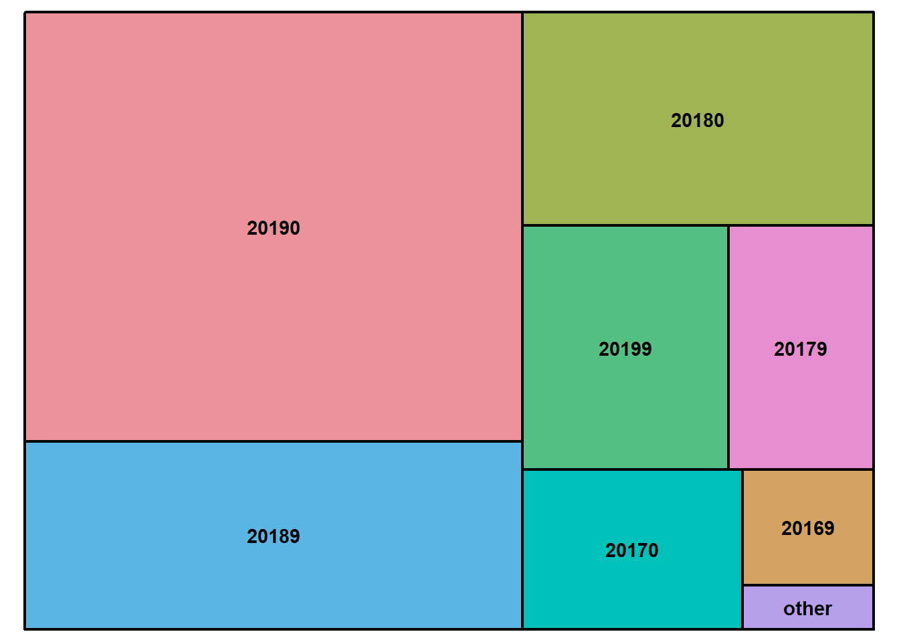{width=672}

::: 

::: {.div9} 

**FACTOR LEVELS**:

| Frequency|     (%)|Label | 
 |---------:|-------:|:-----| 
 |    10,190| (40.8%)|20190 | 
 |     4,460| (17.8%)|20189 | 
 |     3,580| (14.3%)|20180 | 
 |     2,402|  (9.6%)|20199 | 
 |     1,686|  (6.7%)|20179 | 
 |     1,680|  (6.7%)|20170 | 
 |       728|  (2.9%)|20169 | 
 |       123|  (0.5%)|20191 | 
 |        79|  (0.3%)|20200 | 
 |        46|  (0.2%)|20181 | 
 |        25|  (0.1%)|20171 | 
 |         1|  (0.0%)|20201 | 

::: 

:::::  

 

::: {.div1} 

#### F9_00_TAX_ACCPER

::: 

::::: {.parent} 

::: {.div2} 

Accounting period 

::: 

::: {.div3} 

DATA TYPEcategorical

SUBTYPEordinal

CLASSmonth_of_year

FORMATcode

MAX NCHAR2

::: 

::: {.div4} 

DESCRIPTIONMonth in which the organization's fiscal year ends.

::: 

::: {.div5} 

**PREVIEW**:

::: 

::: {.div6} 

<pre class="dg-preview">
12 · 6 · 9 · 3 · 5 · 8 · 4 · 10 · 7 · 11 · 2 · 1

</pre>

::: 

::: {.div7} 

**PROPERTIES**: 

|STAT     |    VAL|    PER| 
 |:--------|------:|------:| 
 |Rows     | 25,000|       | 
 |Distinct |     12| (0.0%)| 

::: 

::: {.div8} 

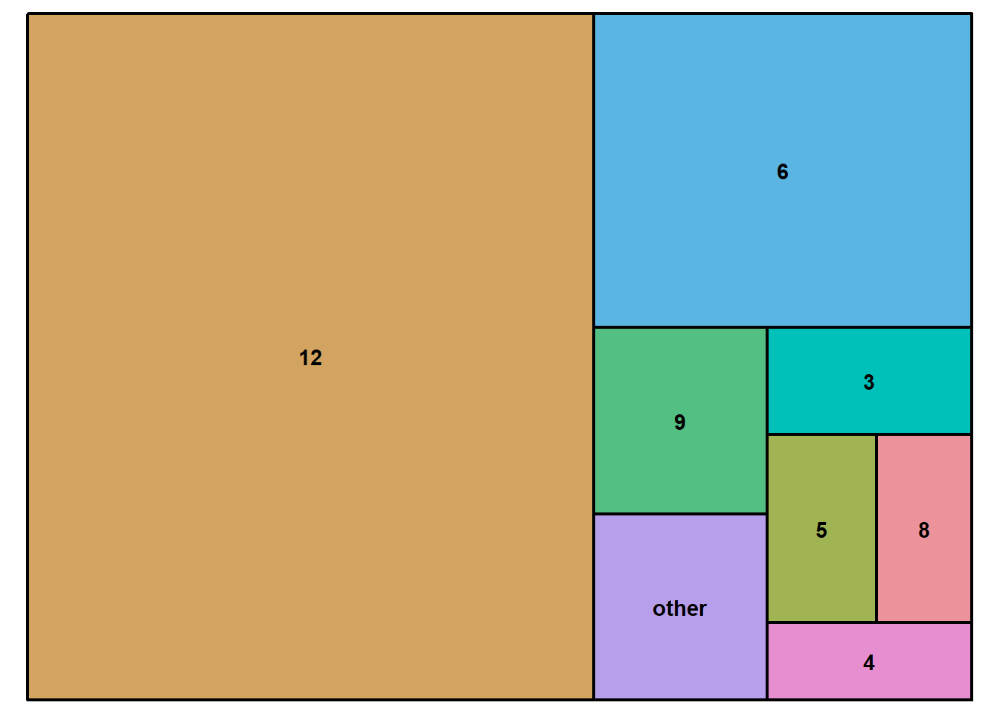{width=672}

::: 

::: {.div9} 

**FACTOR LEVELS**:

| Frequency|     (%)|Label |Meaning   | 
 |---------:|-------:|:-----|:---------| 
 |    14,987| (59.9%)|12    |December  | 
 |     4,578| (18.3%)|6     |June      | 
 |     1,251|  (5.0%)|9     |September | 
 |       849|  (3.4%)|3     |March     | 
 |       796|  (3.2%)|5     |May       | 
 |       688|  (2.8%)|8     |August    | 
 |       609|  (2.4%)|4     |April     | 
 |       425|  (1.7%)|10    |October   | 
 |       349|  (1.4%)|7     |July      | 
 |       195|  (0.8%)|11    |November  | 
 |       156|  (0.6%)|2     |February  | 
 |       117|  (0.5%)|1     |January   | 

::: 

:::::  

## Numeric 

 

::: {.div1} 

#### BMF_ACTIV1

::: 

::::: {.parent} 

::: {.div2} 

BMF activity code 

::: 

::: {.div3} 

DATA TYPEnumber

MAX NCHAR 3

::: 

::: {.div4} 

DESCRIPTIONPrimary IRS Business Master File activity code (legacy numeric code).

::: 

::: {.div5} 

**PREVIEW**:

::: 

::: {.div6} 

<pre class="dg-preview">
0 · 263 · 200 · 907 · 36 · 279 · 205 · 319 · 59 · 318 · 407 · 520
900 · 265 · 264 · 280 · 260 · 250 · 999 · 920 · 30 · 912 · 261 · 230
65 · 998 · 229 · 317 · 201 · 403 · 908 · 288 · 911 · 399 · 286 · 161
922 · 281 · 350 · 123 · 287 · 382 · 401 · 921 · 34 · 119 · 408 · 602

</pre>

::: 

::: {.div7} 

**PROPERTIES**: 

|STAT       |    VAL|     PER| 
 |:----------|------:|-------:| 
 |Rows       | 25,000|        | 
 |Distinct   |    230|  (0.9%)| 
 |Missing/NA |  1,887|  (7.5%)| 
 |Zero       |  5,807| (23.2%)| 

::: 

::: {.div8} 

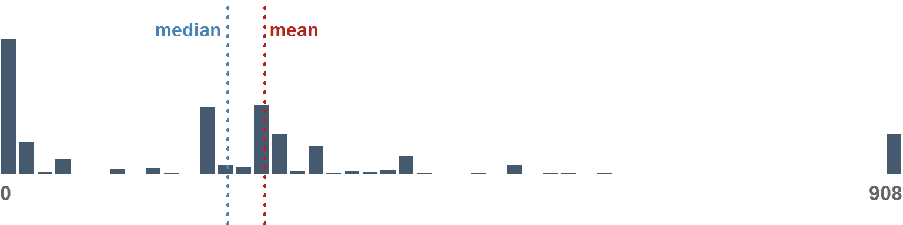{width=768}

::: 

::: {.div9} 

**STATS**:

| MIN| MAX|   MEAN| Q05| Q25| Q50| Q75| Q95| 
 |---:|---:|------:|---:|---:|---:|---:|---:| 
 |   0| 999| 266.51|   0|   0| 229| 318| 908| 

**DISTRIBUTION SHAPE**:

::: {.dg-shape}

|stat     |  num|interpretation | 
 |:--------|----:|:--------------| 
 |Skew     | 1.32|HIGH           | 
 |Kurtosis | 0.86|LOW            | 

::: 

::: 

:::::  

 

::: {.div1} 

#### CEO_CENSUSTRACT

::: 

::::: {.parent} 

::: {.div2} 

Census tract (GEOID) 

::: 

::: {.div3} 

DATA TYPEnumber

MAX NCHAR11

::: 

::: {.div4} 

DESCRIPTION11-digit Census tract identifier of the organization's location.

::: 

::: {.div5} 

**PREVIEW**:

::: 

::: {.div6} 

<pre class="dg-preview">
11001010700 · 48201531700 · 6037294421 · 11001010100 · 11001005800
17031839100 · 6067001101 · 6073020809 · 48113020300 · 11001005900
18097391000 · 4013941000 · 51510201900 · 6085512100 · 36061016100
42003020100 · 48453000102 · 48453001100 · 6075011700 · 11001006202

</pre>

::: 

::: {.div7} 

**PROPERTIES**: 

|STAT       |    VAL|     PER| 
 |:----------|------:|-------:| 
 |Rows       | 25,000|        | 
 |Distinct   | 14,265| (57.1%)| 
 |Missing/NA |  3,110| (12.4%)| 

::: 

::: {.div8} 

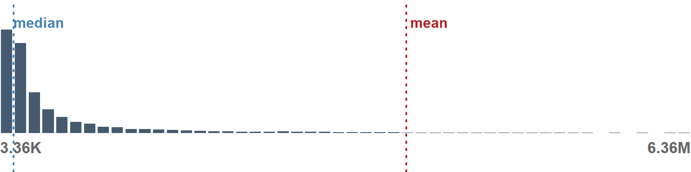{width=768}

::: 

::: {.div9} 

**STATS**:

|           MIN|        MAX|           MEAN|           Q05|            Q25|            Q50|            Q75|            Q95| 
 |-------------:|----------:|--------------:|-------------:|--------------:|--------------:|--------------:|--------------:| 
 | 1,001,020,500| 5.6043e+10| 28,488,147,053| 6,029,003,250| 17,031,320,100| 28,012,950,350| 41,051,008,202| 53,033,008,055| 

**DISTRIBUTION SHAPE**:

::: {.dg-shape}

|stat     |   num|interpretation | 
 |:--------|-----:|:--------------| 
 |Skew     | -0.02|LOW            | 
 |Kurtosis | -1.17|MED            | 

::: 

::: 

:::::  

 

::: {.div1} 

#### F9_08_REV_TOT_TOT

::: 

::::: {.parent} 

::: {.div2} 

Total revenue 

::: 

::: {.div3} 

DATA TYPEnumber

SUBTYPEcontinuous

CLASScurrency

FORMATcurrency

MAX NCHAR10

::: 

::: {.div4} 

DESCRIPTIONTotal revenue for the year (Form 990, Part VIII).

::: 

::: {.div5} 

**PREVIEW**:

::: 

::: {.div6} 

<pre class="dg-preview">
0 · 100 · 1000 · 250000 · 2000 · 2250 · 50 · 200 · 45000 · 4 · 1500
5000 · 6000 · 8800 · 25000 · 25500 · 75000 · 1e+05 · 101225 · 1 · 3
8 · 9 · 101 · 575 · 600 · 1200 · 1800 · 2074 · 2400 · 4125 · 5400
6800 · 9465 · 9500 · 10000 · 15000 · 19611 · 20000 · 20649 · 26873

</pre>

::: 

::: {.div7} 

**PROPERTIES**: 

|STAT     |    VAL|     PER| 
 |:--------|------:|-------:| 
 |Rows     | 25,000|        | 
 |Distinct | 23,817| (95.3%)| 
 |Zero     |    413|  (1.7%)| 

::: 

::: {.div8} 

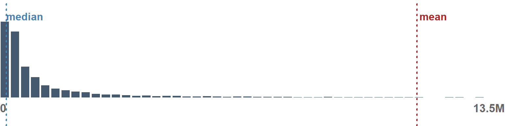{width=768}

::: 

::: {.div9} 

**STATS**:

|         MIN|           MAX|      MEAN|     Q05|      Q25|     Q50|       Q75|       Q95| 
 |-----------:|-------------:|---------:|-------:|--------:|-------:|---------:|---------:| 
 | -61,467,591| 4,178,522,311| 3,740,777| 3,359.8| 51,012.5| 130,545| 441,954.5| 6,355,357| 

**DISTRIBUTION SHAPE**:

::: {.dg-shape}

|stat     |      num|interpretation | 
 |:--------|--------:|:--------------| 
 |Skew     |    44.03|HIGH           | 
 |Kurtosis | 2,557.92|HIGH           | 

::: 

::: 

:::::  

 

::: {.div1} 

#### F9_10_ASSET_TOT_BOY

::: 

::::: {.parent} 

::: {.div2} 

Total assets (BOY) 

::: 

::: {.div3} 

DATA TYPEnumber

SUBTYPEcontinuous

CLASScurrency

FORMATcurrency

MAX NCHAR11

::: 

::: {.div4} 

DESCRIPTIONTotal assets at the beginning of the year (Form 990, Part X).

::: 

::: {.div5} 

**PREVIEW**:

::: 

::: {.div6} 

<pre class="dg-preview">
0 · 1 · 300 · 161 · 1593 · 10571 · 20855 · 21915 · 43506 · 49481 · 2
97 · 212 · 219 · 343 · 388 · 500 · 718 · 1000 · 1020 · 1222 · 1535
1547 · 1607 · 1642 · 2155 · 2745 · 3068 · 3073 · 3087 · 3708 · 4412
4414 · 4612 · 5251 · 5501 · 5619 · 5761 · 6141 · 6267 · 6812 · 6865

</pre>

::: 

::: {.div7} 

**PROPERTIES**: 

|STAT       |    VAL|     PER| 
 |:----------|------:|-------:| 
 |Rows       | 25,000|        | 
 |Distinct   | 20,195| (80.8%)| 
 |Missing/NA |  1,377|  (5.5%)| 
 |Zero       |  3,011| (12.0%)| 

::: 

::: {.div8} 

{width=768}

::: 

::: {.div9} 

**STATS**:

|     MIN|            MAX|       MEAN| Q05|      Q25|     Q50|       Q75|        Q95| 
 |-------:|--------------:|----------:|---:|--------:|-------:|---------:|----------:| 
 | -69,049| 11,226,543,829| 11,116,959|   0| 31,558.5| 169,734| 729,844.5| 13,488,117| 

**DISTRIBUTION SHAPE**:

::: {.dg-shape}

|stat     |      num|interpretation | 
 |:--------|--------:|:--------------| 
 |Skew     |    41.82|HIGH           | 
 |Kurtosis | 2,117.75|HIGH           | 

::: 

::: 

:::::  

 

::: {.div1} 

#### F9_10_ASSET_TOT_EOY

::: 

::::: {.parent} 

::: {.div2} 

Total assets (EOY) 

::: 

::: {.div3} 

DATA TYPEnumber

SUBTYPEcontinuous

CLASScurrency

FORMATcurrency

MAX NCHAR11

::: 

::: {.div4} 

DESCRIPTIONTotal assets at the end of the year (Form 990, Part X).

::: 

::: {.div5} 

**PREVIEW**:

::: 

::: {.div6} 

<pre class="dg-preview">
1 · 0 · 100 · 1000 · 15000 · 21 · 480 · 529 · 680 · 1257 · 1374
1932 · 2000 · 2076 · 2280 · 2680 · 2965 · 3000 · 10000 · 24731
24753 · 37977 · 40760 · 25 · 30 · 39 · 90 · 99 · 140 · 149 · 200
212 · 230 · 248 · 249 · 281 · 314 · 340 · 415 · 459 · 478 · 627

</pre>

::: 

::: {.div7} 

**PROPERTIES**: 

|STAT     |    VAL|     PER| 
 |:--------|------:|-------:| 
 |Rows     | 25,000|        | 
 |Distinct | 24,122| (96.5%)| 
 |Zero     |    110|  (0.4%)| 

::: 

::: {.div8} 

{width=768}

::: 

::: {.div9} 

**STATS**:

|        MIN|            MAX|       MEAN|      Q05|       Q25|     Q50|     Q75|        Q95| 
 |----------:|--------------:|----------:|--------:|---------:|-------:|-------:|----------:| 
 | -1,119,570| 38,468,314,242| 13,755,826| 4,421.45| 55,668.25| 212,649| 837,286| 14,639,755| 

**DISTRIBUTION SHAPE**:

::: {.dg-shape}

|stat     |      num|interpretation | 
 |:--------|--------:|:--------------| 
 |Skew     |    85.67|HIGH           | 
 |Kurtosis | 9,676.68|HIGH           | 

::: 

::: 

:::::  

 

::: {.div1} 

#### F9_10_NAFB_TOT_BOY

::: 

::::: {.parent} 

::: {.div2} 

Net assets (BOY) 

::: 

::: {.div3} 

DATA TYPEnumber

SUBTYPEcontinuous

CLASScurrency

FORMATcurrency

MAX NCHAR10

::: 

::: {.div4} 

DESCRIPTIONNet assets or fund balances at the beginning of the year.

::: 

::: {.div5} 

**PREVIEW**:

::: 

::: {.div6} 

<pre class="dg-preview">
0 · 300 · 1593 · 8311 · 20855 · 24587 · 29596 · 56803 · -21474
-6426 · -989 · -826 · 97 · 161 · 212 · 334 · 388 · 500 · 718 · 1000
1020 · 1547 · 1642 · 2745 · 2870 · 3068 · 3073 · 3087 · 3306 · 3554
3708 · 4412 · 4414 · 4612 · 4772 · 5318 · 5501 · 5619 · 6141 · 6267

</pre>

::: 

::: {.div7} 

**PROPERTIES**: 

|STAT       |    VAL|     PER| 
 |:----------|------:|-------:| 
 |Rows       | 25,000|        | 
 |Distinct   | 20,145| (80.6%)| 
 |Missing/NA |  4,344| (17.4%)| 
 |Zero       |    203|  (0.8%)| 

::: 

::: {.div8} 

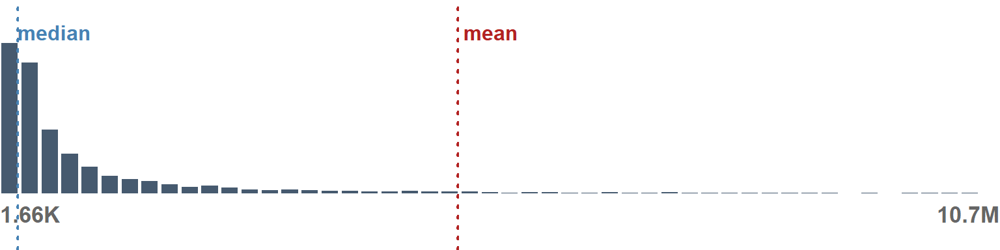{width=768}

::: 

::: {.div9} 

**STATS**:

|          MIN|           MAX|      MEAN|     Q05|      Q25|       Q50|       Q75|        Q95| 
 |------------:|-------------:|---------:|-------:|--------:|---------:|---------:|----------:| 
 | -333,005,908| 6,323,689,488| 4,921,982| 1,659.5| 52,689.5| 192,629.5| 720,262.5| 10,744,071| 

**DISTRIBUTION SHAPE**:

::: {.dg-shape}

|stat     |      num|interpretation | 
 |:--------|--------:|:--------------| 
 |Skew     |    61.69|HIGH           | 
 |Kurtosis | 5,412.22|HIGH           | 

::: 

::: 

:::::  

 

::: {.div1} 

#### F9_09_EXP_TOT_TOT

::: 

::::: {.parent} 

::: {.div2} 

Total expenses 

::: 

::: {.div3} 

DATA TYPEnumber

SUBTYPEcontinuous

CLASScurrency

FORMATcurrency

MAX NCHAR10

::: 

::: {.div4} 

DESCRIPTIONTotal functional expenses for the year (Form 990, Part IX).

::: 

::: {.div5} 

**PREVIEW**:

::: 

::: {.div6} 

<pre class="dg-preview">
0 · 100 · 1000 · 10 · 50 · 600 · 4056 · 7500 · 25 · 200 · 400 · 539
786 · 1140 · 5000 · 10000 · 11085 · 13669 · 16927 · 16993 · 19327
28348 · 36264 · 40526 · 45638 · 48401 · 50154 · 60157 · 62391
80427 · 83368 · 83437 · 105341 · 153299 · 41 · 60 · 129 · 130 · 143

</pre>

::: 

::: {.div7} 

**PROPERTIES**: 

|STAT     |    VAL|     PER| 
 |:--------|------:|-------:| 
 |Rows     | 25,000|        | 
 |Distinct | 23,740| (95.0%)| 
 |Zero     |    489|  (2.0%)| 

::: 

::: {.div8} 

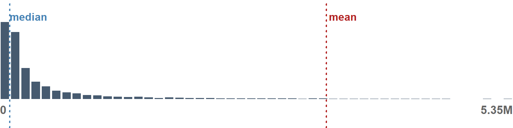{width=768}

::: 

::: {.div9} 

**STATS**:

|     MIN|           MAX|      MEAN|      Q05|    Q25|       Q50|       Q75|       Q95| 
 |-------:|-------------:|---------:|--------:|------:|---------:|---------:|---------:| 
 | -11,719| 4,256,605,589| 3,531,376| 3,886.95| 46,845| 121,792.5| 411,837.2| 5,832,724| 

**DISTRIBUTION SHAPE**:

::: {.dg-shape}

|stat     |      num|interpretation | 
 |:--------|--------:|:--------------| 
 |Skew     |    46.21|HIGH           | 
 |Kurtosis | 2,819.69|HIGH           | 

::: 

::: 

:::::  

 

::: {.div1} 

#### F9_01_EXP_TOT_PY

::: 

::::: {.parent} 

::: {.div2} 

Total expenses (prior year) 

::: 

::: {.div3} 

DATA TYPEnumber

SUBTYPEcontinuous

CLASScurrency

FORMATcurrency

MAX NCHAR10

::: 

::: {.div4} 

DESCRIPTIONTotal expenses reported for the prior year.

::: 

::: {.div5} 

**PREVIEW**:

::: 

::: {.div6} 

<pre class="dg-preview">
0 · 10 · 36 · 600 · 1450 · 2279 · 3200 · 4742 · 8214 · 14221 · 25853
32965 · 43809 · 44039 · 44951 · 54368 · 55199 · 56378 · 78821
126182 · 20 · 400 · 656 · 736 · 827 · 859 · 1220 · 1540 · 1938
2206 · 2487 · 2489 · 2505 · 2831 · 3371 · 3400 · 3433 · 3552 · 4500

</pre>

::: 

::: {.div7} 

**PROPERTIES**: 

|STAT       |    VAL|     PER| 
 |:----------|------:|-------:| 
 |Rows       | 25,000|        | 
 |Distinct   | 19,931| (79.7%)| 
 |Missing/NA |  1,377|  (5.5%)| 
 |Zero       |  3,257| (13.0%)| 

::: 

::: {.div8} 

{width=768}

::: 

::: {.div9} 

**STATS**:

|        MIN|           MAX|      MEAN| Q05|    Q25|     Q50|       Q75|       Q95| 
 |----------:|-------------:|---------:|---:|------:|-------:|---------:|---------:| 
 | -5,437,471| 4,624,922,368| 3,407,085|   0| 29,933| 102,618| 362,012.5| 5,357,595| 

**DISTRIBUTION SHAPE**:

::: {.dg-shape}

|stat     |      num|interpretation | 
 |:--------|--------:|:--------------| 
 |Skew     |    48.26|HIGH           | 
 |Kurtosis | 3,041.41|HIGH           | 

::: 

::: 

:::::  

## Character

 

::: {.div1} 

#### F9_00_ORG_NAME_L1

::: 

::::: {.parent} 

::: {.div2} 

Organization name 

::: 

::: {.div3} 

DATA TYPEtext

SUBTYPEphrase

CLASSorganization_name

FORMATplain

MAX NCHAR97

::: 

::: {.div4} 

DESCRIPTIONLegal name of the filing organization (Form 990, header).

::: 

::: {.div5} 

**PREVIEW**:

::: 

::: {.div6} 

<pre class="dg-preview">
AMERICAN LEGION · ROTARY INTERNATIONAL
BENEVOLENT &amp; PROTECTIVE ORDER OF ELKS OF THE USA
VETERANS OF FOREIGN WARS OF THE UNITED STATES DE
INTERNATIONAL ASSOCIATION OF LIONS CLUBS · KNIGHTS OF COLUMBUS

</pre>

::: 

::: {.div7} 

**PROPERTIES**: 

|STAT       |    VAL|     PER| 
 |:----------|------:|-------:| 
 |Rows       | 25,000|        | 
 |Distinct   | 17,455| (69.8%)| 
 |Missing/NA |  1,378|  (5.5%)| 

::: 

::: {.div8} 

{width=768}

::: 

::: {.div9} 

**MOST COMMON VALUES**: 

|Value                                            | Frequency|    (%)| 
 |:------------------------------------------------|---------:|------:| 
 |AMERICAN LEGION                                  |       573| (2.3%)| 
 |ROTARY INTERNATIONAL                             |       493| (2.0%)| 
 |BENEVOLENT & PROTECTIVE ORDER OF ELKS OF THE USA |       302| (1.2%)| 
 |INTERNATIONAL ASSOCIATION OF LIONS CLUBS         |       250| (1.0%)| 
 |KNIGHTS OF COLUMBUS                              |       236| (0.9%)| 
 |FRATERNAL ORDER OF EAGLES                        |       195| (0.8%)| 

::: 

:::::  

 

::: {.div1} 

#### F0_00_ORG_CONTACT

::: 

::::: {.parent} 

::: {.div2} 

Contact person 

::: 

::: {.div3} 

DATA TYPEtext

SUBTYPEphrase

CLASSperson_name

FORMATplain

MAX NCHAR33

::: 

::: {.div4} 

DESCRIPTIONName of the organization's principal officer or contact.

::: 

::: {.div5} 

**PREVIEW**:

::: 

::: {.div6} 

<pre class="dg-preview">
TREASURER · FINANCIAL SECRETARY · THE ORGANIZATION
SORORITY SOLUTIONS · WORTHY SECRETARY · COMMERCE · PEO TREASURER
PRESIDENT · SECRETARY · THE BANK OF NEW YORK MELLON · COMMANDER
SECRETARY TREASURER · AGRECORDS · SCIARABBA WALKER · AIPSO

</pre>

::: 

::: {.div7} 

**PROPERTIES**: 

|STAT       |    VAL|     PER| 
 |:----------|------:|-------:| 
 |Rows       | 25,000|        | 
 |Distinct   | 10,990| (44.0%)| 
 |Missing/NA | 13,392| (53.6%)| 

::: 

::: {.div8} 

{width=768}

::: 

::: {.div9} 

**MOST COMMON VALUES**: 

|Value               | Frequency|    (%)| 
 |:-------------------|---------:|------:| 
 |TREASURER           |        67| (0.3%)| 
 |FINANCIAL SECRETARY |        66| (0.3%)| 
 |THE ORGANIZATION    |        44| (0.2%)| 
 |SORORITY SOLUTIONS  |        27| (0.1%)| 
 |WORTHY SECRETARY    |        24| (0.1%)| 
 |COMMERCE            |        18| (0.1%)| 

::: 

:::::  

 

::: {.div1} 

#### F9_00_ORG_ADDR_L1

::: 

::::: {.parent} 

::: {.div2} 

Street address 

::: 

::: {.div3} 

DATA TYPEtext

SUBTYPEline

CLASSaddress

FORMATplain

MAX NCHAR35

::: 

::: {.div4} 

DESCRIPTIONMailing street address of the organization.

::: 

::: {.div5} 

**PREVIEW**:

::: 

::: {.div6} 

<pre class="dg-preview">
9717 ELK GROVE FLORIN RD STE B · 1154 TOWN AND COUNTRY COMMONS DR
PO BOX 1 · PO BOX 2 · PO BOX 5 · PO BOX 66 · PO BOX 86 · PO BOX 111
PO BOX 217 · PO BOX 26 · PO BOX 6 · 695 PRO MED LN STE 300
PO BOX 187 · PO BOX 123 · PO BOX 40 · PO BOX 535007 · PO BOX 8

</pre>

::: 

::: {.div7} 

**PROPERTIES**: 

|STAT       |    VAL|     PER| 
 |:----------|------:|-------:| 
 |Rows       | 25,000|        | 
 |Distinct   | 18,785| (75.1%)| 
 |Missing/NA |  1,378|  (5.5%)| 

::: 

::: {.div8} 

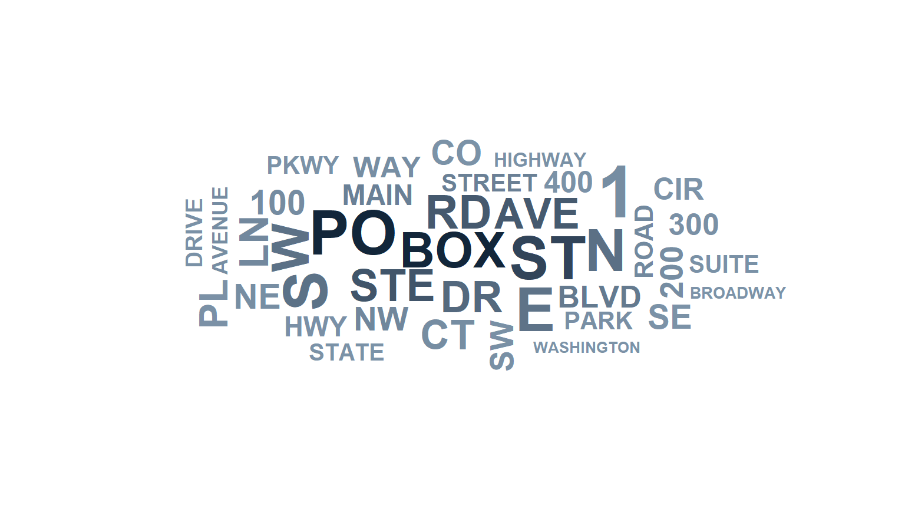{width=768}

::: 

::: {.div9} 

**MOST COMMON VALUES**: 

|Value                            | Frequency|    (%)| 
 |:--------------------------------|---------:|------:| 
 |9717 ELK GROVE FLORIN RD STE B   |        37| (0.1%)| 
 |1154 TOWN AND COUNTRY COMMONS DR |        23| (0.1%)| 
 |PO BOX 1                         |        20| (0.1%)| 
 |PO BOX 2                         |        19| (0.1%)| 
 |PO BOX 5                         |        19| (0.1%)| 
 |PO BOX 66                        |        18| (0.1%)| 

::: 

:::::  

 

::: {.div1} 

#### F9_00_ORG_ADDR_CITY

::: 

::::: {.parent} 

::: {.div2} 

City 

::: 

::: {.div3} 

DATA TYPEtext

SUBTYPEphrase

CLASSplace_name

FORMATplain

MAX NCHAR22

::: 

::: {.div4} 

DESCRIPTIONCity of the organization's mailing address.

::: 

::: {.div5} 

**PREVIEW**:

::: 

::: {.div6} 

<pre class="dg-preview">
WASHINGTON · NEW YORK · CHICAGO · HOUSTON · COLUMBUS · INDIANAPOLIS
SPRINGFIELD · SACRAMENTO · AUSTIN · LOS ANGELES · PITTSBURGH
ATLANTA · DALLAS · SAN FRANCISCO · SAN DIEGO · SEATTLE · PORTLAND
COLUMBIA · ALEXANDRIA · PHILADELPHIA · DENVER · SAINT LOUIS

</pre>

::: 

::: {.div7} 

**PROPERTIES**: 

|STAT       |    VAL|     PER| 
 |:----------|------:|-------:| 
 |Rows       | 25,000|        | 
 |Distinct   |  5,986| (23.9%)| 
 |Missing/NA |  1,378|  (5.5%)| 

::: 

::: {.div8} 

{width=768}

::: 

::: {.div9} 

**MOST COMMON VALUES**: 

|Value        | Frequency|    (%)| 
 |:------------|---------:|------:| 
 |WASHINGTON   |       331| (1.3%)| 
 |NEW YORK     |       262| (1.0%)| 
 |CHICAGO      |       187| (0.7%)| 
 |HOUSTON      |       184| (0.7%)| 
 |COLUMBUS     |       143| (0.6%)| 
 |INDIANAPOLIS |       133| (0.5%)| 

::: 

:::::  

 

::: {.div1} 

#### NTEEFINAL

::: 

::::: {.parent} 

::: {.div2} 

NTEE code 

::: 

::: {.div3} 

DATA TYPEtext

SUBTYPEtoken

CLASSclassification_code

FORMATcode

MAX NCHAR 5

::: 

::: {.div4} 

DESCRIPTIONFull National Taxonomy of Exempt Entities code assigned to the organization.

::: 

::: {.div5} 

**PREVIEW**:

::: 

::: {.div6} 

<pre class="dg-preview">
S41 · J40 · W30 · S80 · N50 · M24 · B83 · W80 · N60 · Y42 · Y50
Y41 · K28 · S20 · Y43 · S47 · B03 · L50 · W61 · N61 · Y40 · S03
Y20 · S30 · S01 · S40 · G90 · I03 · I0360 · N52 · S99 · A23 · S22
N67 · N6A · E11 · N68 · K20 · N69 · L99 · S46 · N32 · U42 · S21

</pre>

::: 

::: {.div7} 

**PROPERTIES**: 

|STAT       |    VAL|    PER| 
 |:----------|------:|------:| 
 |Rows       | 25,000|       | 
 |Distinct   |    654| (2.6%)| 
 |Missing/NA |  1,497| (6.0%)| 

::: 

::: {.div8} 

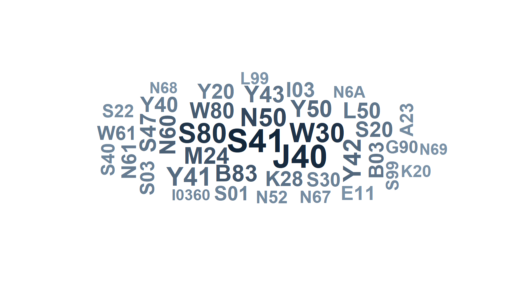{width=768}

::: 

::: {.div9} 

**MOST COMMON VALUES**: 

|Value | Frequency|    (%)| 
 |:-----|---------:|------:| 
 |S41   |      1947| (7.8%)| 
 |J40   |      1815| (7.3%)| 
 |W30   |      1582| (6.3%)| 
 |S80   |      1515| (6.1%)| 
 |N50   |      1088| (4.4%)| 
 |M24   |       810| (3.2%)| 

::: 

:::::  

## Identifier

 

::: {.div1} 

#### EIN

::: 

::::: {.parent} 

::: {.div2} 

Employer Identification Number 

::: 

::: {.div3} 

DATA TYPEidentifier

SUBTYPEnumeric_id

CLASSadministrative_id

FORMATplain

MAX NCHAR9

::: 

::: {.div4} 

DESCRIPTIONIRS-assigned 9-digit taxpayer ID; the unique key for the organization.

::: 

::: {.div5} 

**PREVIEW**:

::: 

::: {.div6} 

<pre class="dg-preview">
10100593 · 10218055 · 10220588 · 10266289 · 10273431 · 10286963
10440702 · 10468398 · 10523313 · 10524078 · 10573723 · 10715375
10744517 · 10815981 · 10852125 · 10874048 · 10961458 · 16011483
16012302 · 16019950 · 16022337 · 16123853 · 20172119 · 20187390

</pre>

::: 

::: {.div7} 

**PROPERTIES**: 

|STAT     |    VAL|     PER| 
 |:--------|------:|-------:| 
 |Rows     | 25,000|        | 
 |Distinct | 24,794| (99.2%)| 

::: 

::: {.div8} 

**MOST COMMON VALUES**: 

|Value    | Frequency|    (%)| 
 |:--------|---------:|------:| 
 |10100593 |         2| (0.0%)| 
 |10218055 |         2| (0.0%)| 
 |10220588 |         2| (0.0%)| 
 |10266289 |         2| (0.0%)| 
 |10273431 |         2| (0.0%)| 
 |10286963 |         2| (0.0%)| 

::: 

:::::  

 

::: {.div1} 

#### COUNTY_FIPS

::: 

::::: {.parent} 

::: {.div2} 

County (FIPS) 

::: 

::: {.div3} 

DATA TYPEidentifier

SUBTYPEnumeric_id

CLASSgeographic_id

FORMATplain

MAX NCHAR5

::: 

::: {.div4} 

DESCRIPTION5-digit Census county FIPS code of the organization's location.

::: 

::: {.div5} 

**PREVIEW**:

::: 

::: {.div6} 

<pre class="dg-preview">
6037 · 17031 · 11001 · 36061 · 48201 · 53033 · 6067 · 42003 · 39049
6073 · 6059 · 25017 · 4013 · 27053 · 48113 · 36103 · 18097 · 48453
39035 · 36059 · 6085 · 6001 · 25025 · 51059 · 9003 · 36119 · 13121
26163 · 19153 · 26125 · 6075 · 9001 · 48439 · 42101 · 9009 · 17043

</pre>

::: 

::: {.div7} 

**PROPERTIES**: 

|STAT       |    VAL|    PER| 
 |:----------|------:|------:| 
 |Rows       | 25,000|       | 
 |Distinct   |  2,411| (9.6%)| 
 |Missing/NA |  2,389| (9.6%)| 

::: 

::: {.div8} 

**MOST COMMON VALUES**: 

|Value | Frequency|    (%)| 
 |:-----|---------:|------:| 
 |6037  |       402| (1.6%)| 
 |17031 |       339| (1.4%)| 
 |11001 |       294| (1.2%)| 
 |36061 |       243| (1.0%)| 
 |48201 |       213| (0.9%)| 
 |53033 |       186| (0.7%)| 

::: 

:::::  

## Temporal

<!-- datagoodr-render-record {"datagoodr":"0.1.0","rendered_utc":"2026-07-25T00:42:26Z","r":"4.5.1","quarto":"1.8.25","dgf_file":"DGF-V2.xlsx","dgf_hash":"06f5b47e18cc5cc22a1be5fe8d5f903e","dgf_variables":27} -->
